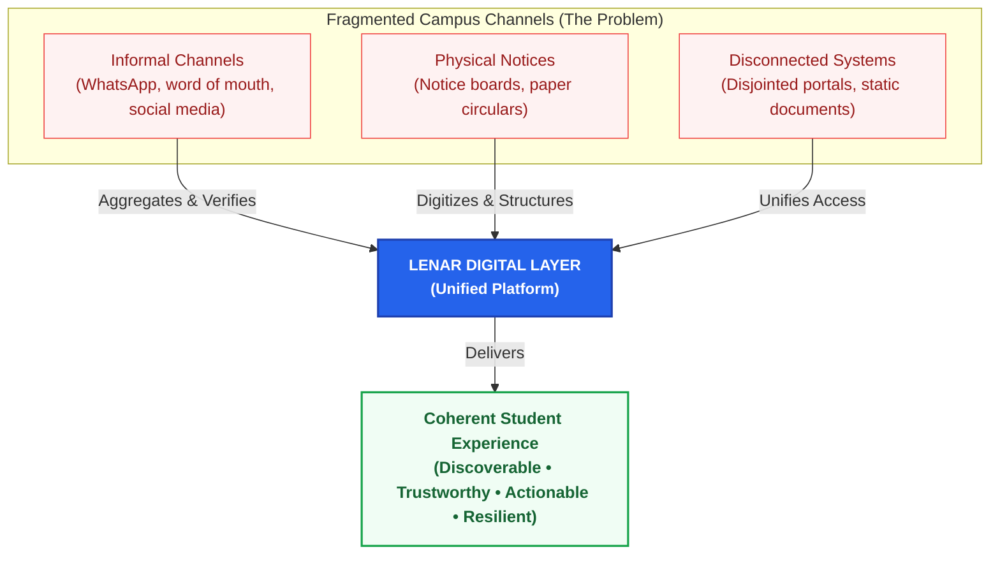
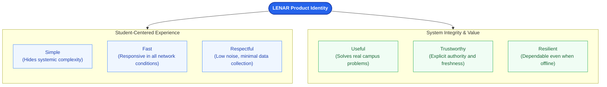
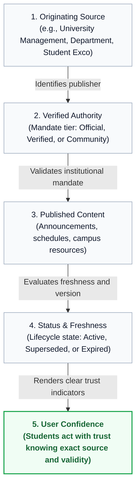

# Lenar — Foundation


## At a Glance
**Lenar is a student-centered digital platform designed to make university life more informed, connected, organized, and resilient.** 

It unifies important student-facing information, services, opportunities, and communications into one coherent digital layer, initially focused on **FUTA**. Lenar is not simply a notice board, social network, or timetable app; it is a unified digital experience intended to reduce the friction between students and the campus resources they rely on.

---

## 1. Why Lenar Exists

University information and services are often deeply fragmented. Important details are scattered across WhatsApp groups, physical notices, departmental channels, social media, disjointed portals, and word of mouth. 

This fragmentation causes real problems:
- Information is hard to discover or verify.
- Details are often inconsistent or outdated.
- Students miss out on opportunities.
- Campus problems are difficult to report and track.
- Disconnected systems confuse university communication.
- Digital services collapse exactly when network access is poor.

Lenar exists to reduce this fragmentation. It makes useful university information and services **discoverable, trustworthy, accessible, actionable, and resilient**.

### Diagram: From Campus Fragmentation to a Coherent Experience
*Lenar unifies fragmented campus communication channels into a single, reliable digital experience.*



---

## 2. Vision & Mission

### Vision
> **To become a trusted digital layer through which students can meaningfully navigate university life.**

Students shouldn't have to continuously wonder where to find information, who to report issues to, or whether a notice is still valid. Lenar progressively becomes a reliable hub for students to discover opportunities, interact with campus services, and retain useful information even when offline. The vision is simply a more coherent digital experience of university life.

### Mission
> **To simplify access to trustworthy university information, services, opportunities, and communication through a unified, student-centered, resilient digital platform.**

Our mission emphasizes five pillars:
1. **Simplification:** Reduce unnecessary fragmentation and friction.
2. **Trust:** Make the source and authority of information clear.
3. **Access:** Make useful university experiences easier to reach.
4. **Student-centeredness:** Design around actual student needs and contexts.
5. **Resilience:** Remain useful despite imperfect network and device conditions.

---

## 3. Product Identity

Lenar is defined by six core qualities that separate it from a generic software tool. It must feel dependable enough to become a normal part of university life.

### Diagram: The Six Core Qualities of Lenar
*Lenar's identity balances student-centered experience with institutional trust and resilience.*



| Quality | Description |
| :--- | :--- |
| **Useful** | Solves real problems rather than existing merely because the technology is possible. |
| **Trustworthy** | Clearly indicates where information came from, its authority, and its freshness. |
| **Simple** | Hides systemic complexity so users experience a straightforward interface. |
| **Fast** | Feels highly responsive, even under imperfect network conditions. |
| **Resilient** | Keeps critical experiences functional when connectivity drops. |
| **Respectful** | Minimizes intrusive notifications, unnecessary friction, and excessive data collection. |

---

## 4. Trust & Resilience

### The Trust Model
Trust is central to Lenar. A visually attractive platform is useless if students cannot trust its content. Users must be able to distinguish between official announcements, verified information, user-generated content, and potentially stale data.

### Diagram: The Information Trust Pipeline
*How Lenar evaluates source, authority, and freshness to establish transparent user trust.*



### The Resilience Model
Lenar must degrade safely. It is designed to progressively tolerate weak networks, zero connectivity, request failures, and temporary backend outages.

> [!IMPORTANT]  
> **Failures should be recoverable without unnecessary loss of user work, data integrity, or trust.**

For detailed implementation of offline and sync behavior, see [08-Offline-Sync-Resilience.md](../04-architecture/08-Offline-Sync-Resilience.md).

---

## 5. Core Principles (Non-Negotiables)

These principles govern Lenar. They are decision-making rules, not decorative statements.

| Principle | Decision Rule |
| :--- | :--- |
| **Student Value** | Build for meaningful outcomes, not feature count. Small and effective is better than large and weak. |
| **Simplicity** | Complexity must earn its place. Start simple (e.g., PostgreSQL search) before scaling up. |
| **Security** | Never trust the client for authorization. Security must be architectural, not a later audit. |
| **Privacy** | Minimize unnecessary data collection. Always ask: *"Why do we need this?"* |
| **Truth** | The server remains authoritative for shared data, while the mobile client may maintain durable local state, cached data, drafts, and pending operations that represent user intent awaiting synchronization. |
| **Offline** | Design offline capabilities where they create real user value without compromising correctness. |
| **Correctness** | Prefer correctness over cleverness. A predictable system beats a clever one that loses data. |
| **Modularity** | Keep responsibilities and boundaries explicit to make future changes easier. |
| **Evidence** | Measure before major optimization or architectural reversal. Avoid intuition-based scaling. |
| **Evolution** | Prepare boundaries for the future, but don't over-engineer for every hypothetical feature today. |
| **Accessibility** | Critical experiences should be broadly usable, supporting various assistive needs. |
| **Resilience** | Optional failures should not unnecessarily destroy core functionality; degrade gracefully. |
| **Documentation**| Important system knowledge must be preserved in the official documentation, not just chat history. |
| **AI Alignment** | AI must follow documented architectural boundaries and not invent unresolved product decisions. |

> [!NOTE]  
> **The Decision Philosophy:**
> Understand the problem → Define requirements → Identify constraints → Consider options → Compare trade-offs → Use evidence → Choose → Document → Review when evidence changes.

---

## 6. Scope & Boundaries

Lenar is focused on **FUTA students**. It aims to deliver a coherent digital platform encompassing announcements, campus services, opportunities, and relevant student experiences.

**What Lenar Is Not:**
- A replacement for every official university system.
- A general-purpose social media platform.
- An unrestricted file-sharing or messaging platform.
- A generic enterprise management system.
- A technology showcase built for its own sake.

Whenever scope expansion is considered, it must be evaluated against **User value, Strategic fit, Complexity, Security, Privacy, and Operational cost.**

---

## 7. Core Mental Model

The simplest way to understand Lenar's functional flow is:

```text
                    LENAR
                      │
        ┌─────────────┼─────────────┐
        ↓             ↓             ↓
     DISCOVER       ACCESS        ACT
        │             │             │
        ↓             ↓             ↓
    Information    Services      Outcomes
        │             │             │
        └─────────────┼─────────────┘
                      ↓
                   TRUST
                      ↓
                 RESILIENCE
```

Lenar should help students **discover what matters, access what they need, act when necessary, and do so through a trustworthy and resilient system.**

---

## 8. Initial Technical Philosophy

Technology exists to serve the product. A technically impressive feature with no meaningful user value is a bad feature. Lenar's current technical direction is:

- **Web:** React + TypeScript + Vite *(Productivity and management)*
- **Mobile:** Flutter + Dart *(Primary student experience)*
- **Backend:** FastAPI + Python
- **Database:** PostgreSQL
- **Architecture:** Modular monolith
- **Resilience:** Offline-first + server-authoritative synchronization (SQLite-based local architecture)

> [!NOTE]  
> For authoritative technology decisions and their rationale, see [10-Technology-Stack.md](../04-architecture/10-Technology-Stack.md).

---

## 9. Related Documentation

This document establishes what Lenar is and how decisions are made. For detailed specifications, refer to the following canonical documents:

- **[02-Problem-Users-Domain.md](02-Problem-Users-Domain.md)**: Who are we serving and what world are we modeling?
- **[03-Product-Requirements.md](03-Product-Requirements.md)**: Exactly what are we building?
- **[04-UX-UI.md](04-UX-UI.md)**: How should users experience it?
- **[05-Platform.md](../04-architecture/05-Platform.md)**: Where does it exist?
- **[08-Offline-Sync-Resilience.md](../04-architecture/08-Offline-Sync-Resilience.md)**: How does it remain reliable under poor connectivity?
- **[09-System-Architecture.md](../04-architecture/09-System-Architecture.md)**: How are the technical pieces structured?
- **[10-Technology-Stack.md](../04-architecture/10-Technology-Stack.md)**: What technologies implement the architecture?
- **[17-Decisions-Risks-Evolution.md](../decisions/17-Decisions-Risks-Evolution.md)**: Why did we choose this and when should it change?
