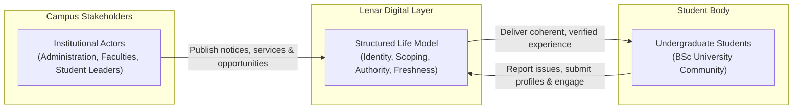
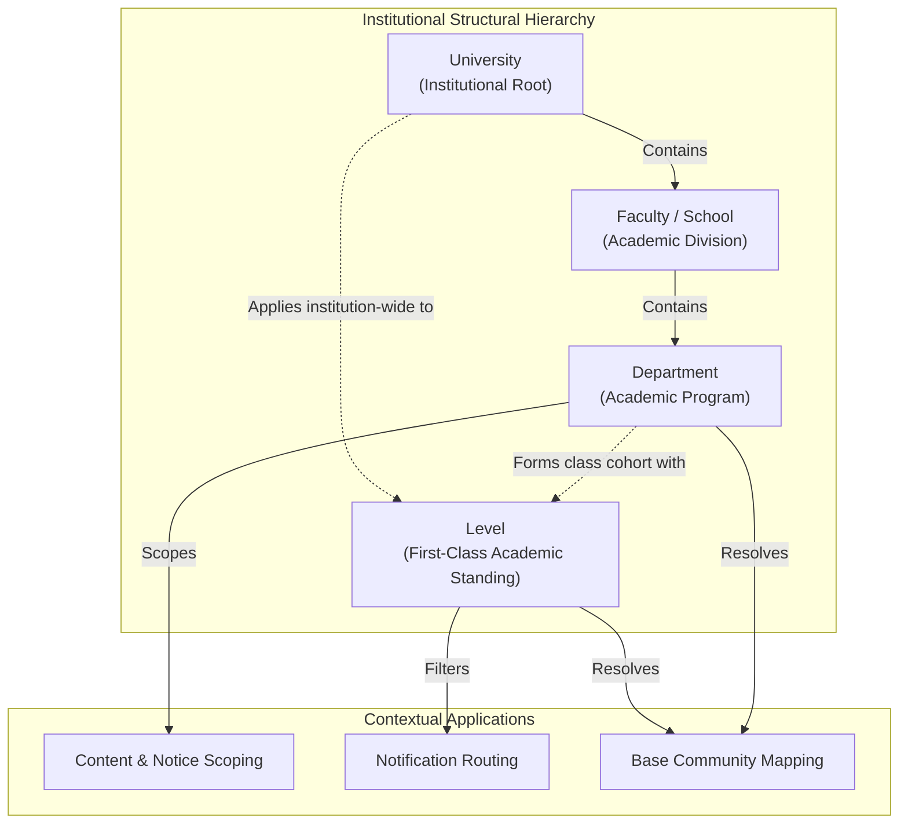
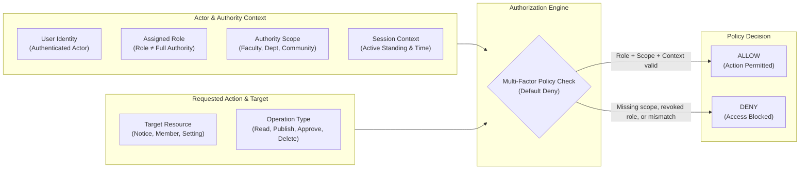
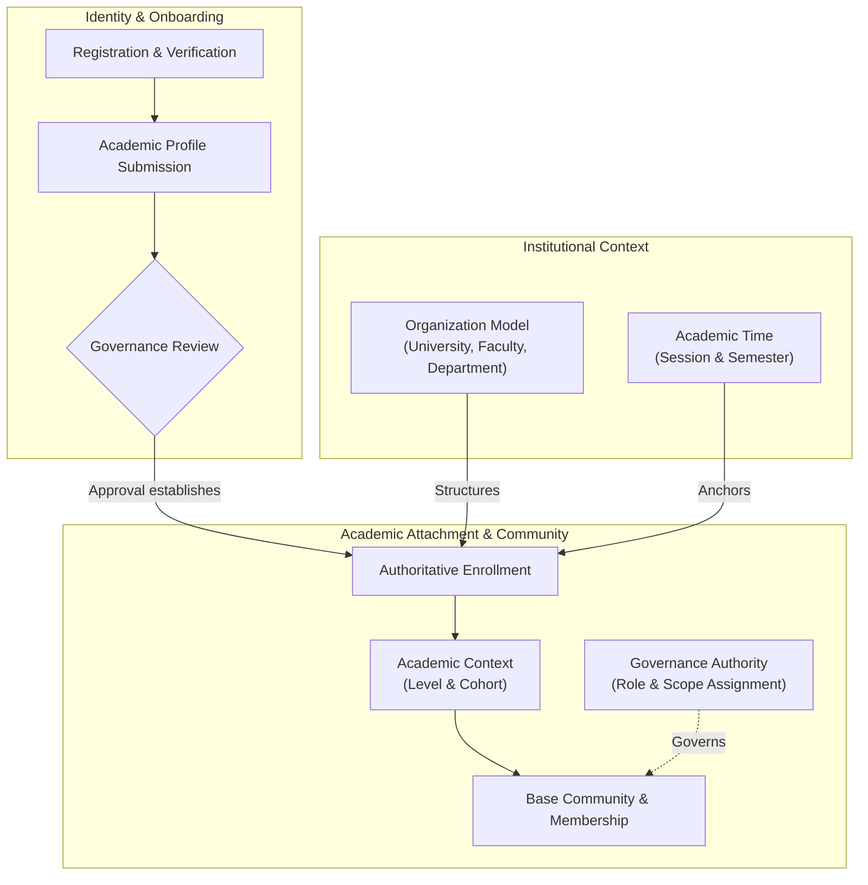
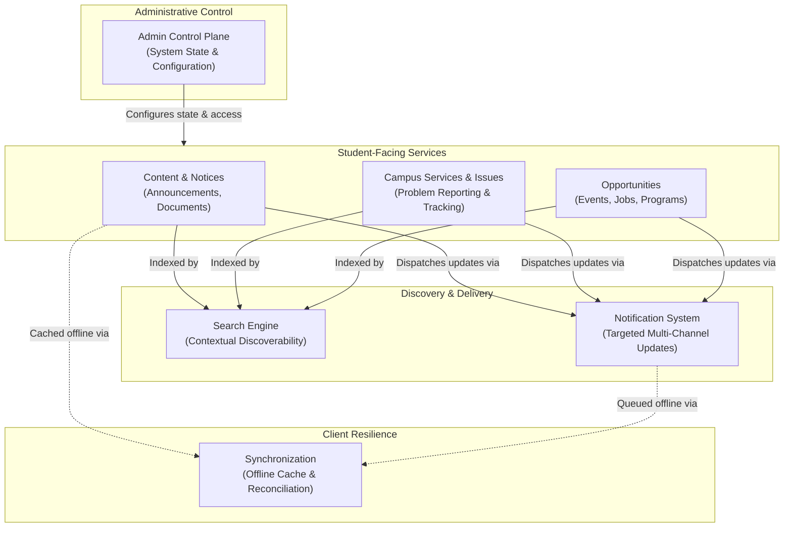

# Lenar — Problem, Users & Domain

> [!NOTE]  
> **Purpose:** Defines the specific campus problems being solved, the distinct user personas (students vs. institutional actors), and the organizational context.  
> **Prerequisites:** `01-Lenar-Foundation.md`  
> **Primary Audience:** Product Managers, Engineers, Designers.

---

## At a Glance

Lenar exists to reduce the fragmentation between students and the information, services, opportunities, and institutional interactions they need throughout university life.

To do that well, Lenar must model more than users.

It must understand:
- the problems students experience;
- the different people and groups involved;
- the organizational structure around them;
- the authority each role has;
- the resources those roles interact with;
- the relationships between those resources;
- the rules that determine what can happen.

The central domain idea is:
> **Lenar connects students to university information, services, opportunities, and organizational actors through a structured model of university life.**

The initial domain context is **FUTA** and a **BSc university environment**, while the architecture should avoid hard-coding assumptions that would make future institutional expansion unnecessarily difficult.

### Core Platform Interaction Model
Lenar acts as a structured digital bridge between institutional stakeholders and undergraduate students, unifying scattered notices, services, and opportunities into a single verified experience.

---

## 1. The Problems Lenar Addresses

### 1.1 Fragmented Information
Students frequently encounter important information through multiple disconnected channels:
- WhatsApp groups
- departmental channels
- student associations
- physical notices
- social media
- separate portals
- word of mouth
- personal contacts
- scattered documents

The problem is not simply that there are many channels. The deeper problem is that the student must continuously determine:

> **Where should I look?**  
> **Which source should I trust?**  
> **Is this information current?**  
> **Is this relevant to me?**

### 1.2 Information Discovery Friction
Important information can exist without being easy to discover. A student may know that a piece of information exists but still have difficulty locating it. This creates unnecessary search effort and increases the likelihood that useful information is missed. Lenar therefore treats **discoverability** as part of the product problem.

### 1.3 Information Trust and Freshness
A student may encounter multiple versions of apparently similar information. This produces uncertainty about:
- source;
- authority;
- current status;
- validity;
- freshness;
- applicability.

Lenar must therefore model information as more than text. Where meaningful, information should have context such as:
- source
- authority
- scope
- status
- publication state
- effective period
- freshness

---

## 2. University Organizational Context

Lenar operates within a structured university environment. However, this structure acts primarily as a contextual hierarchy, not an absolute authorization model.

### University Organizational Context Hierarchy
The organizational hierarchy establishes contextual boundaries (University, Faculty, Department, and Level) to scope information and notifications without acting as a rigid authorization gate.

This hierarchy helps Lenar organize content, route notifications, and determine relevance. It ensures that students see information scoped to their specific faculty, department, or level.

---

## 3. Role Model, Authority, and Scope

Roles within Lenar represent the different actors interacting with the system. Roles are explicitly decoupled from pure authority—a role alone is insufficient to grant access without an accompanying scope.

### 3.1 Established Roles

The currently established roles are:

| Role | Scope / Responsibility |
|---|---|
| **Student** | The primary consumer of information, services, and opportunities. |
| **Writer** | Base Community context. Assigned by Leader. |
| **Manager** | Base Community context. Assigned by Leader. |
| **Sub-Leader** | Base Community context. Assigned by Leader. |
| **Leader** | Base Community context. Approves applicable user submissions. Assigns Sub-Leader, Manager, and Writer. (Class Leader refers to this same role). |
| **Admin** | University-level authority. Can approve from anywhere within scope, create Communities, and assign Leaders. |
| **Super Admin** | Platform-wide capabilities and oversight. |

### 3.2 The Authorization Model

Lenar does not rely on simple role-based access control (RBAC). A user's ability to perform an action is determined by a combination of their identity, their assigned role, the scope of that role, the specific resource, and the action requested.

### Contextual Authorization Evaluation Model
Authorization requires evaluating identity, role, scope, context, resource, and action together; a role alone never grants permission without a valid matching scope.

---

## 4. Major Domain Concepts

To function as a cohesive digital layer, Lenar models several distinct domains. These domains are logically divided into two tiers:
1. **Foundational Domains**: Authoritative domains that govern user identity, academic hierarchy, enrollment context, and administrative authority.
2. **Functional Domains**: Operational domains that deliver scoped content, services, issue reporting, and opportunities to students.

### Diagram A: Foundational Domain Relationships
Authoritative domains establish verified user identity, institutional academic structure, community membership, and administrative governance.

### Diagram B: Functional Services & Delivery Architecture
Functional domains deliver scoped content, services, and opportunities to students, supported by discovery engines and offline synchronization.

### 4.1 Foundational Domains

- **User Identity:** The base authentication persona established via **Registration** and **Verification**.
- **Academic Profile:** The collection of user-supplied academic claims entered via **Profile Completion** and moved to **Profile Submission**.
- **Governance Review:** The process where an authorized role (**Pending Review** → **Approval** or **Rejection**) validates the Academic Profile.
- **Enrollment:** The formal authoritative academic attachment established upon Approval. Registration ≠ Enrollment. Approval ≠ Enrollment.
- **Academic Context:** The contextual academic state (e.g., Level, Session, Semester) established by Enrollment.
- **Academic Time:** Authoritative tracking of time (Academic Session, Semester) maintained by the Admin Control Plane.
- **Organization:** The institutional structural hierarchy of the university (University, Faculty, Department, Level).
- **Community:** Represents participation and belonging (distinct from formal Organization). Every active user must have a **Base Community**.
- **Membership:** The participation relationship to a Community. Base Community membership is automatic from approved Academic Context. Membership ≠ Governance Assignment.
- **Governance:** Manages Creator Roles, Assignments, Revocation, and Transfer. Creator Assignment dictates Authorization (which uses RBAC + Scope + Context).

### 4.2 Functional Domains

- **Content:** The announcements, notices, and documentation distributed to users.
- **Issue:** The structured reporting of campus problems and tracking of their resolution.
- **Opportunity:** Events, jobs, or programs relevant to students.
- **Notification:** The system for delivering timely updates across channels.
- **Search:** The discoverability engine connecting users to information.
- **Admin Control Plane:** Governs authoritative system state including Organization, Academic Time, and Governance. It also participates in establishing the user's enrollment attachment.
- **Synchronization:** The mechanisms handling offline-first capabilities and state reconciliation.

*(Note: "Campus Services" acts as the broader umbrella encompassing Issues and other service interactions).*

---

## 39. What Is Still Intentionally Unresolved

To prevent inventing requirements, the following items remain explicitly unresolved and will be defined in later specifications:

- **Manager & Leader Permissions:** The exact permissions and capabilities for the Manager and Leader roles.
- **Multiple Roles:** Whether users can concurrently hold multiple conflicting or overlapping roles.
- **Organizational Membership Rules:** The exact rules and lifecycle for how a user is assigned to or removed from organizational contexts.

---

## Related Documentation

For detailed specifications, refer to the following canonical documents:
- [03 — Product & Requirements](03-Product-Requirements.md)
- [04 — UX & UI](04-UX-UI.md)
- [06 — Data & Content](06-Data-Content.md)
- [07 — Security, Privacy & Governance](07-Security-Privacy-Governance.md)
- [08 — Offline, Sync & Resilience](../04-architecture/08-Offline-Sync-Resilience.md)
- [09 — System Architecture](../04-architecture/09-System-Architecture.md)
- [12 — Testing & Quality](../04-architecture/12-Testing-Quality.md)
- [17 — Decisions, Risks & Evolution](../decisions/17-Decisions-Risks-Evolution.md)
