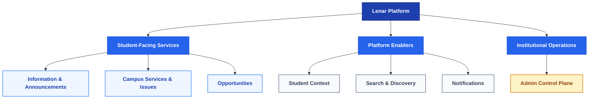
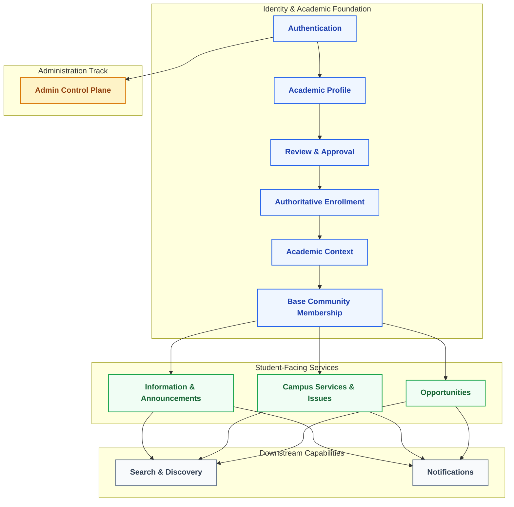
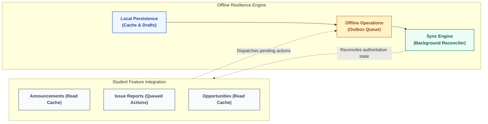
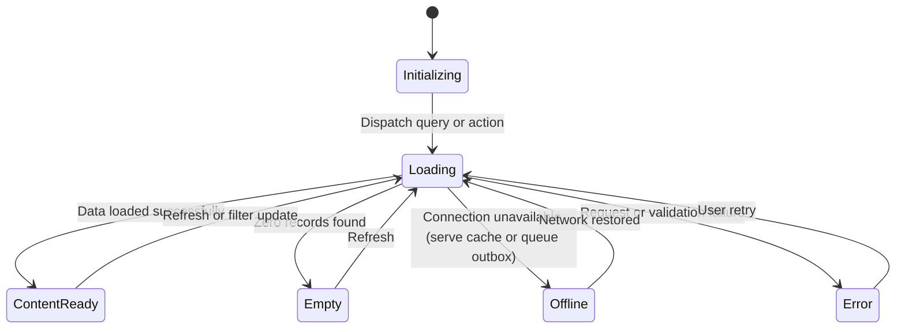

# Lenar — Product & Requirements

> **Status:** Product Reference
> **Document:** 03 — Product & Requirements
> **Purpose:** Define what Lenar is intended to provide, what belongs in the current product scope, how features are prioritized, what the system must do, how quality is measured, and what remains outside the current scope.

---

## At a Glance

Lenar is being built to reduce the fragmentation between students and the information, services, opportunities, and institutional interactions they need throughout university life.

This document translates that purpose into a product definition.

It establishes:
- the major product areas;
- the current V1 boundary;
- feature priorities;
- functional requirements;
- non-functional requirements;
- important user journeys and use cases;
- edge and failure conditions;
- acceptance criteria;
- dependencies between capabilities;
- explicit exclusions.

The objective is not to maximize the number of features. The objective is to define the **smallest complete product that meaningfully solves the most important problems Lenar is intended to solve**.

> [!IMPORTANT]
> **Product rule:** A feature belongs in Lenar because it creates meaningful value within the product's purpose and scope—not simply because it is technically possible to build.

---

## 1. Product Definition

### 1.1 What Lenar Provides

At a high level, Lenar provides a unified student-facing experience around:

1. **University information and announcements**
2. **Campus services and issue reporting**
3. **Student opportunities**
4. **Relevant student-facing experiences and services**
5. **Personalized access to information based on institutional context**
6. **Reliable operation across imperfect network conditions**

The exact implementation of each area is defined throughout the remainder of this document and its supporting specifications.

### 1.2 Product Outcome

The intended outcome is not merely:
> *"Students use another university application."*

The intended outcome is:
> **Students can more easily discover what matters, access what they need, act when necessary, and understand what happens next.**

That means product success depends on:

```text
Discoverability
+
Relevance
+
Trust
+
Actionability
+
Resilience
+
Ease of use
```

---

## 2. Major Product Areas

Lenar groups its functionality into distinct, focused product areas. Each area serves a clear segment of the student experience while connecting to the same unified platform identity.

*(Reference Diagram: Major Product Areas Hierarchy)*



---

## 3. The V1 Scope Boundary

The current V1 scope restricts feature expansion to ensure a stable, dependable initial release.

### In Scope for V1:
- **Authentication & Onboarding:** The complete lifecycle recognizing that account creation is not equivalent to active platform participation. Includes: Registration, Email Verification, Academic Profile Completion, Profile Submission, Pending Review, Approval (or Rejection & correction), Enrollment, Academic Context, Base Community, and Active Access.
- **Information & Announcements:** Surfacing official university, faculty, and departmental notices.
- **Campus Services & Issues:** Standardized reporting mechanisms for campus problems (e.g., maintenance).
- **Opportunities:** Aggregation of relevant events, programs, and opportunities.
- **Offline Reliability:** Core read operations and pending action queues must survive connectivity drops.

### Explicitly Excluded from V1:
- Advanced social networking or chat capabilities.
- Integrated financial or tuition payment processing.
- Unrestricted peer-to-peer file sharing.
- Complex administrative workflows unrelated to content publishing or basic issue triage.

> [!WARNING]
> Future features must remain clearly separated from the current V1 scope. Do not add speculative capabilities simply because they might be useful later.

---

## 4. Feature Dependencies

Capabilities in Lenar do not exist in isolation. Many user-facing features rely on shared foundational models and resilience services.

### Diagram A: Functional Capability Dependencies
Foundational identity and academic context must be established before student-facing services become accessible, which in turn feed cross-cutting search and notifications.

*(Reference Diagram:)*



### Diagram B: Offline Resilience Pipeline
Client-side persistence and action queueing ensure that student features remain dependable even during intermittent or absent network connectivity.

*(Reference Diagram:)*



---

## 5. Traceability and Product State

### 5.1 Requirement Traceability

Lenar ensures every line of code traces back to a genuine user need. We do not invent features in isolation.

*(Reference Diagram: End-to-End Requirement Traceability Pipeline)*

```mermaid
flowchart LR
    classDef phase1 fill:#eff6ff,stroke:#2563eb,stroke-width:1.5px,color:#1e40af,font-weight:bold
    classDef phase2 fill:#f0fdf4,stroke:#16a34a,stroke-width:1.5px,color:#166534,font-weight:bold
    classDef phase3 fill:#fef3c7,stroke:#d97706,stroke-width:1.5px,color:#92400e,font-weight:bold
    classDef phase4 fill:#f1f5f9,stroke:#64748b,stroke-width:1.5px,color:#0f172a,font-weight:bold

    subgraph P1 ["1. Product Definition"]
        direction TB
        P["Problem"]:::phase1
        UN["User Need"]:::phase1
        PR["Product Requirement"]:::phase1
        F["Feature"]:::phase1
        P --> UN --> PR --> F
    end

    subgraph P2 ["2. Experience Design"]
        direction TB
        UC["Use Case"]:::phase2
        UX["UX Flow"]:::phase2
        S["Screen / UI"]:::phase2
        UC --> UX --> S
    end

    subgraph P3 ["3. Technical Architecture"]
        direction TB
        API["API / Domain"]:::phase3
        D["Data Model"]:::phase3
        Sec["Security"]:::phase3
        OB["Offline Behavior"]:::phase3
        API --> D --> Sec --> OB
    end

    subgraph P4 ["4. Quality & Observability"]
        direction TB
        T["Automated Tests"]:::phase4
        A["Analytics & Telemetry"]:::phase4
        T --> A
    end

    F --> UC
    S --> API
    OB --> T
```



*(Note: Not every feature requires a heavy artifact at every layer, but the logical traceability must remain intact).*

### 5.2 Generalized Product State Model

Every feature in Lenar must account for the reality of mobile usage, unpredictable networks, and missing data. Features should progressively adapt their state.

*(Reference Diagram: Universal UI and Feature State Transitions)*



---

## 6. Functional Requirements and Acceptance Criteria

Acceptance criteria in Lenar describe **verifiable behavior**, not technical implementation instructions.

### 6.1 Discoverability & Relevance
- **Requirement:** A student should only see announcements relevant to their organizational context (e.g., Faculty, Department, Level) unless an announcement is university-wide.
- **Acceptance:** If a student switches their departmental context, the feed correctly filters out the previous department's exclusive content.

### 6.2 Offline Behavior & Resilience
- **Requirement:** User intent must not be silently lost during network failures.
- **Acceptance:** If a user submits an issue report while offline, the system queues the action. Closing and reopening the application must preserve the pending operation until connectivity is restored.

### 6.3 Trust & Authority
- **Requirement:** The source of any content must be visually distinct and verifiable.
- **Acceptance:** Official departmental announcements clearly display the authorized publisher and the timestamp of creation.

---

## 7. Non-Functional Requirements

- **Performance:** Information feeds should load gracefully. Search results should return without disruptive latency.
- **Reliability:** Data displayed to the user must accurately reflect the server's authoritative state when connected.
- **Accessibility:** Text must remain legible at OS-level scaled font sizes. Touch targets must accommodate standard accessibility guidelines.

---

## Related Documentation

For how these product requirements translate into specific domain models, designs, and architectures, refer to the following canonical documents:

- [02-Problem-Users-Domain.md](02-Problem-Users-Domain.md)
- [04-UX-UI.md](04-UX-UI.md)
- [../architecture/05-Platform.md](../architecture/05-Platform.md)
- [06-Data-Content.md](06-Data-Content.md)
- [07-Security-Privacy-Governance.md](07-Security-Privacy-Governance.md)
- [../architecture/08-Offline-Sync-Resilience.md](../architecture/08-Offline-Sync-Resilience.md)
- [../architecture/09-System-Architecture.md](../architecture/09-System-Architecture.md)
- [../architecture/10-Technology-Stack.md](../architecture/10-Technology-Stack.md)
- [../architecture/11-Performance-Reliability.md](../architecture/11-Performance-Reliability.md)
- [../architecture/12-Testing-Quality.md](../architecture/12-Testing-Quality.md)
- [../architecture/13-Analytics-Observability.md](../architecture/13-Analytics-Observability.md)
- [../architecture/16-Development-Release.md](../architecture/16-Development-Release.md)
- [../decisions/17-Decisions-Risks-Evolution.md](../decisions/17-Decisions-Risks-Evolution.md)
