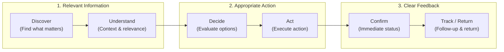
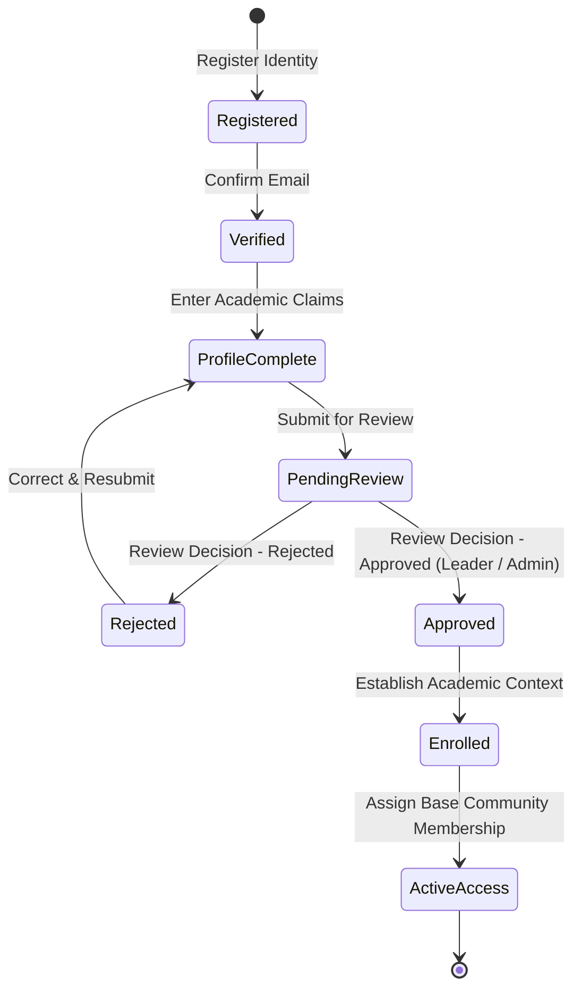
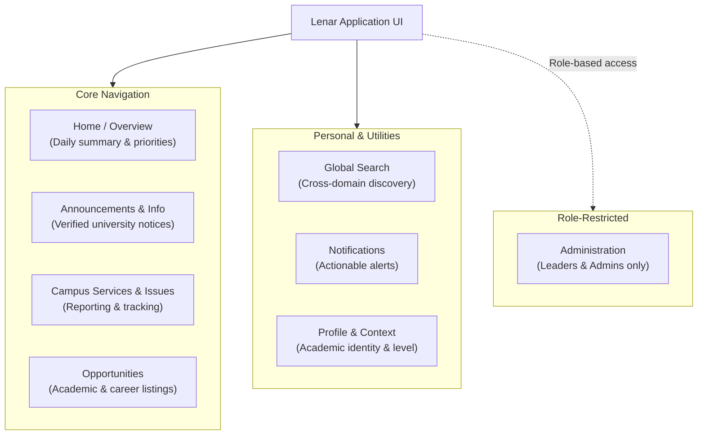
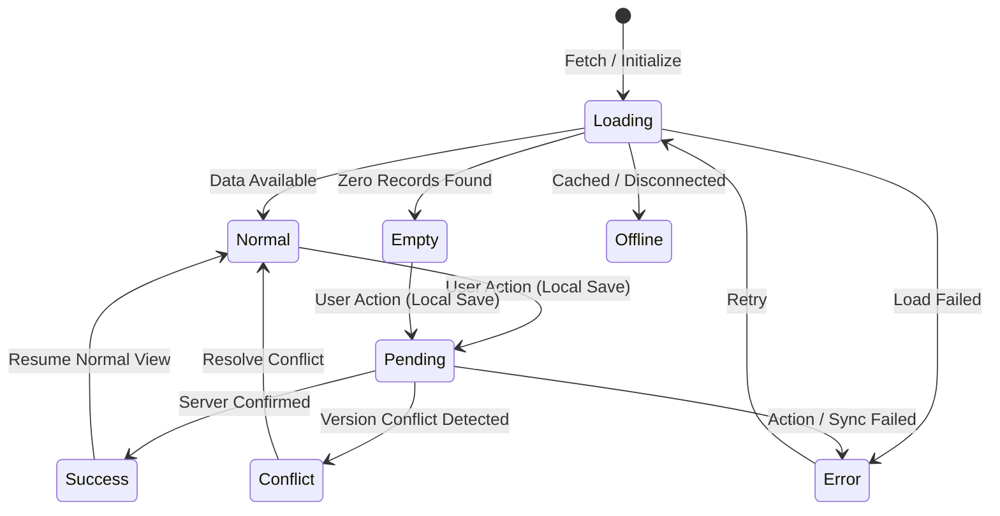
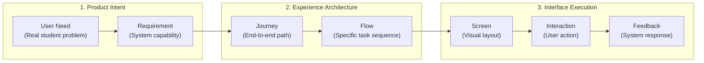

# Lenar — UX & UI

> **Status:** Product Experience Reference
> **Document:** 04 — UX & UI
> **Purpose:** Define how Lenar should be experienced by users, including its experience principles, information architecture, navigation, user journeys, interaction patterns, interface states, accessibility expectations, and cross-platform experience philosophy.

---

## At a Glance

Lenar should feel like a product that makes university life **simpler to understand and easier to act on**.

The interface should not expose the complexity of the underlying system.

A student should be able to:
- quickly understand what matters;
- find relevant information;
- know what can be done;
- complete important actions without unnecessary friction;
- understand system state;
- recover when something goes wrong;
- continue supported work when offline;
- trust what the interface is telling them.

The core UX objective is therefore:
> **Reduce cognitive and operational friction without hiding important information or system state.**

UX decisions must remain connected to the product requirements defined in [03-Product-Requirements.md](03-Product-Requirements.md) and to the foundational principles defined in [01-Lenar-Foundation.md](01-Lenar-Foundation.md).

---

## 1. UX Philosophy & Principles

Lenar's interface must faithfully reflect the core principles of the product. 

| Principle | UX Meaning |
|---|---|
| **Useful** | Important actions and information should be easy to reach. |
| **Simple** | Users should not need to understand system complexity. |
| **Trustworthy** | Source, status, context, and consequences should be understandable. |
| **Fast** | Common interactions should feel responsive. |
| **Resilient** | Supported experiences should behave sensibly when connectivity fails. |
| **Respectful** | Avoid unnecessary interruptions, permissions, and cognitive load. |
| **Accessible** | Important experiences should work for diverse users and interaction needs. |
| **Consistent** | Similar concepts should behave similarly across the product. |

### The Core UX Question

Every important screen and flow should answer:
> **What does this user need to know or do here?**

A screen should not exist merely because the underlying system has a database entity. Likewise, a feature should not require a complicated interface merely because the implementation behind it is complex.

```text
System complexity
       ↓
Application logic
       ↓
Simple user experience
```

---

## 2. The Lenar Experience Model

The UX is built around a sequential journey of interaction.

*(Sequential interaction journey guiding users from discovery through action to feedback and return)*




### 2.1 The Onboarding Journey

The user onboarding journey follows a precise progression of distinct product states that must be accurately reflected in the user experience:

*(User onboarding state lifecycle from initial registration through review to active access)*



1. **Registration:** User provides initial identity information (e.g., email/password).
2. **Verification:** User verifies their identity (e.g., email confirmation).
3. **Profile Completion:** User inputs their academic profile claims (Full Name, Matric No, Level, Faculty, Department).
4. **Submission:** User submits the profile for review.
5. **Pending Review:** The system informs the user they are waiting for a Leader or Admin to approve their submission.
6. **Review Outcome:**
   - **Rejected:** The user is informed of the rejection and returns to Profile Completion to correct and resubmit.
   - **Approved:** The profile is formally accepted.
7. **Enrollment & Context:** Approval triggers Enrollment, establishing the user's Academic Context.
8. **Community & Membership:** The Academic Context automatically establishes Base Community Membership.
9. **Active Access:** The user enters the main application experience.

These product onboarding states (Verified, Profile Complete, Submitted, Pending Review, Rejected, Approved, Enrolled, Active) must remain conceptually and visually distinct in the UI from technical network states (Offline, Pending Sync, Syncing, Server Confirmed, Conflict). They represent the user's institutional status, not merely data synchronization status.

---

## 3. Information Architecture

The information architecture structures the major user-facing areas of Lenar.

*(Information architecture structural map organizing core navigation, personal utilities, and admin spaces)*



*(Note: Administration is role-dependent and not universally available to all users).*

---

## 4. Interaction Principles & Interface States

The interface must accurately communicate system state at all times. 

*(Component interface lifecycle and data state transitions from initialization to confirmation)*



### 4.1 Important State Distinctions

A critical UX requirement is the accurate representation of data state. UI complexity should not unnecessarily mirror technical complexity, but the interface must never lie to the user about their data.

Do not collapse these concepts merely to make the UI simpler:

- **LOCAL SAVE:** Data is safely preserved on the device.
- **PENDING:** A local operation exists but has not yet received server confirmation.
- **SERVER CONFIRMED:** The authoritative backend state has confirmed the operation.
- **ERROR:** The operation or retrieval failed according to its defined semantics. User-facing errors should be useful rather than technical.
- **CONFLICT:** Requires the appropriate synchronization/conflict behavior.

> [!WARNING]
> Local save, pending synchronization, and server confirmation must not be falsely presented as the same state. Client-side visibility is not authorization.

### 4.2 Offline Behavior

Offline behavior must be designed intentionally per feature. User feedback should be proportional to the importance of the action.

---

## 5. Accessibility

Accessibility is treated as a fundamental component of product quality. Critical workflows must account for:

- Screen readers
- Text scaling
- Sufficient contrast
- Focus/navigation
- Semantic labels
- Touch targets
- Alternative interaction modes
- Motion sensitivity

---

## 6. Cross-Platform Experience Philosophy

Lenar will be accessible across different platforms (Web, PWA, Android, iOS). The guiding principle is:

> **SAME PRODUCT SEMANTICS + PLATFORM-APPROPRIATE INTERACTION**

Do not require Web, PWA, Android, and iOS to have identical layouts. Do not create separate product meanings for different platforms.

---

## 7. UX Traceability & Relationships

UX is derived from product needs, not isolated visual design. 

*(UX traceability chain deriving interface screens and interactions from underlying product needs)*



### 7.1 Documentation Boundaries

This document sits within a broader architectural context. The boundaries are strictly defined:

- **[03 — Product & Requirements](03-Product-Requirements.md):** What users need the product to accomplish.
- **04 — UX & UI:** How those needs should be experienced.
- **[05 — Platform](../architecture/05-Platform.md):** How the experience adapts to platforms.
- **[06 — Data & Content](06-Data-Content.md):** What information is represented.
- **[07 — Security, Privacy & Governance](07-Security-Privacy-Governance.md):** How access and protection are enforced.
- **[08 — Offline, Sync & Resilience](../architecture/08-Offline-Sync-Resilience.md):** How disconnected behavior works.
- **[09 — System Architecture](../architecture/09-System-Architecture.md):** How the system implements the experience.
- **[12 — Testing & Quality](../architecture/12-Testing-Quality.md):** How the experience is validated.
- **[13 — Analytics & Observability](../architecture/13-Analytics-Observability.md):** How useful product behavior and system health are measured.
