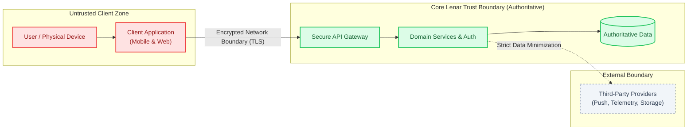
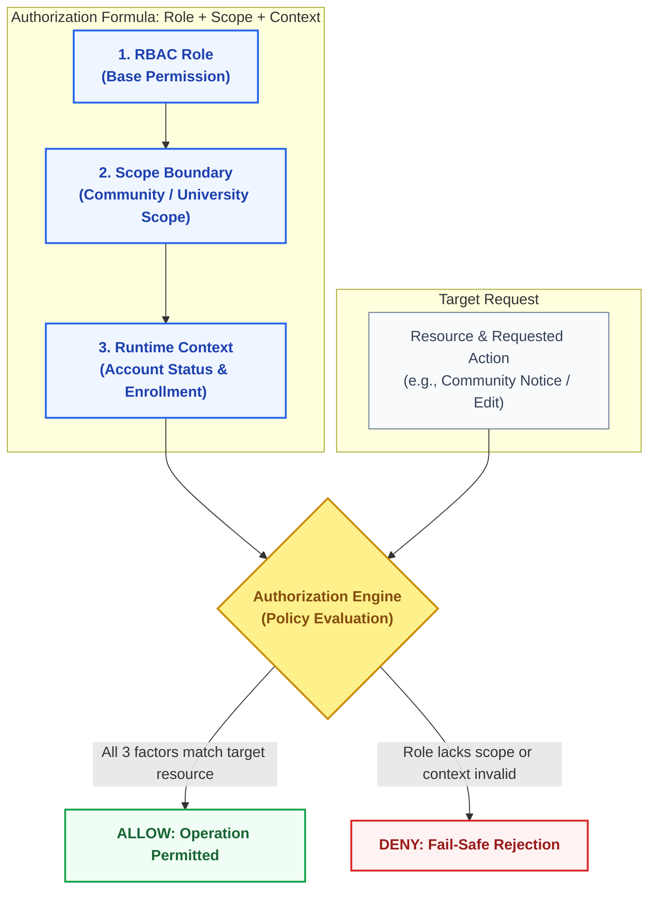
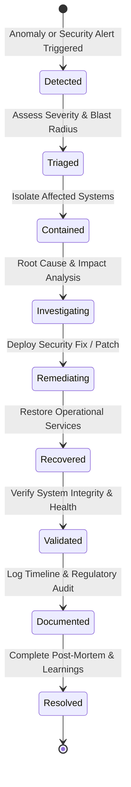

# Lenar — Security, Privacy & Governance

> [!NOTE]  
> **Purpose:** Defines the non-negotiable boundaries for system trust, request verification, and incident response.  
> **Prerequisites:** `01-Lenar-Foundation.md`  
> **Primary Audience:** Security Engineers, Backend Engineers, Operations.


---

## At a Glance

Security is a foundational property of Lenar. It is not something added after the product works.

Lenar handles:
- user identities;
- institutional context;
- potentially sensitive student information;
- official and user-generated content;
- administrative capabilities;
- campus issue reports;
- files and media;
- authentication state;
- audit information;
- analytics and operational telemetry.

The system therefore needs to protect:
```text
Confidentiality
+
Integrity
+
Availability
+
Privacy
+
Accountability
+
Trust
```

---

## 1. Trust Boundaries & Mental Model

The security of Lenar relies on explicit trust boundaries. Clients (mobile, web) are strictly classified as **untrusted**.

### Diagram: System Trust Boundaries
This diagram illustrates the explicit trust boundaries separating untrusted client environments, the authoritative Lenar core, and external third-party services.



Every interaction must proceed through a systemic verification path.

### Diagram: Request Verification Pipeline
This pipeline illustrates the mandatory, sequential verification gates every client request must pass before reading or modifying authoritative data.

```mermaid
flowchart LR
    classDef client fill:#fee2e2,stroke:#ef4444,stroke-width:2px,color:#991b1b
    classDef gate fill:#eff6ff,stroke:#2563eb,stroke-width:2px,color:#1e40af
    classDef execute fill:#f0fdf4,stroke:#16a34a,stroke-width:2px,color:#166534
    classDef audit fill:#f8fafc,stroke:#64748b,stroke-width:1px,color:#334155

    subgraph Stage1 ["1. Client Request"]
        Client["Untrusted Client\n(Mobile / Web)"]
    end

    subgraph Stage2 ["2. Verification Gates"]
        direction TB
        AuthN["Authentication\n(Verify Identity)"]
        AuthZ["Authorization\n(RBAC + Scope + Context)"]
        AuthN --> AuthZ
    end

    subgraph Stage3 ["3. Execution & Storage"]
        direction TB
        Domain["Domain Rules\n(Validate Invariants)"]
        DataStore[("Authoritative Data\n(Commit State)")]
        Domain --> DataStore
    end

    subgraph Stage4 ["4. Accountability"]
        Audit["Audit & Monitoring\n(Immutable Log)"]
    end

    Client -->|"Encrypted Request"| AuthN
    AuthZ -->|"Authorized Intent"| Domain
    DataStore -->|"State Change Event"| Audit

    class Client client;
    class AuthN,AuthZ gate;
    class Domain,DataStore execute;
    class Audit audit;
```



---

## 2. Critical Security Principles

Every technical and product decision in Lenar must abide by these authoritative principles:

1. **The client is untrusted.**
2. **UI visibility is not authorization.**
3. **Authorization is server-enforced.**
4. **Authentication and authorization are distinct.**
5. **Role and scope are distinct.**
6. **Resource-level authorization matters where required.**
7. **Client-supplied roles/scopes must not automatically be trusted.**
8. **Offline functionality must not bypass server authority.**
9. **Search must respect authorization.**
10. **Notifications do not grant authorization.**
11. **Analytics must never be an authority mechanism.**
12. **Third-party providers should receive only necessary data.**
13. **Important privileged actions should be auditable.**
14. **Personal data should be minimized.**
15. **Security-sensitive failures should fail safely.**

*(Note: Lenar relies on specific engineering controls. We do not make unsupported claims such as "fully secure" or "military grade.")*

---

## 3. Identity, Roles, and Authorization

**Authentication** determines *who* is accessing the system. **Authorization** determines *what* they are permitted to do. 

Lenar separates these concepts to maintain a secure and scalable architecture.

### 3.1 The Role Model

Students represent the primary user category. Beyond the base student experience, the system recognizes specific administrative roles:

| Role | Known Scope Facts |
|---|---|
| **Writer** | Base Community-scoped. Assigned by Leader. |
| **Manager** | Base Community-scoped. Assigned by Leader. |
| **Sub-Leader** | Base Community-scoped. Assigned by Leader. |
| **Leader** | Base Community-scoped. Approves applicable user submissions. Assigns Sub-Leader, Manager, and Writer. |
| **Admin** | Assigned at the university-level. Can approve from anywhere within scope, create Communities, and assign Leaders. |
| **Super Admin** | Assigned platform-wide. |

### 3.2 Role vs. Authorization

Holding a role is insufficient for authorization without matching scope and resource validation.
**Authorization = RBAC + Scope + Context.**

Creator Assignment dictates what a user is authorized to manage, while Membership simply represents participation or belonging. Governance manages Creator Roles, Assignments, Revocation, and Transfer.

### Diagram: Authorization Decision Model
This model illustrates how the authorization engine evaluates the combination of identity, role, scope, and context against a target resource operation to yield an allow or deny decision.



---

## 4. Operational Boundaries

### 4.1 Privacy Philosophy
Privacy is conceptually distinct from security. While security protects the system from intrusion and tampering, privacy controls what personal information is collected, used, retained, and disclosed. Lenar adheres to strict data minimization.

### 4.2 Offline Intent vs. Server Authority
While the offline client may preserve durable user intent (e.g., a drafted issue report), the server strictly remains authoritative for shared state and authorization. A locally stored operation must never be presented as an authoritative server success before it is securely confirmed.

### 4.3 Search, Files, and Notifications
- **Search:** Indexing must never bypass authorization. Users can only search what they are permitted to see.
- **Files:** Knowing a file URL does not automatically grant access; access is enforced based on the parent resource's rules.
- **Notifications / Deep Links:** Deep-linking directly into a protected resource via a push notification still requires normal authentication and authorization checks.

### 4.4 External Providers
Third-party services (e.g., analytics, push notification networks) operate outside the core Lenar trust boundary and should receive only the strict minimum of information required for their purpose.

### 4.5 Logs vs Audit vs Analytics
These systemic streams are conceptually separated:
- **Logs:** Provide system diagnostics and crash data.
- **Audit:** Provides non-repudiable accountability for significant administrative or privileged actions.
- **Analytics:** Provides product and system measurement.

---

## 5. Incident Response Lifecycle

When security incidents or widespread failures occur, Lenar operations follow a structured response lifecycle.

### Diagram: Incident Response State Lifecycle
This state diagram defines the formal lifecycle states of an operational or security incident, from initial detection through containment, remediation, and final resolution.



---

## 6. What Is Still Intentionally Unresolved

To avoid inventing unvalidated security mechanisms, the following items remain explicitly unresolved for later specification:
- Exact technical mechanisms (e.g., specific token standards like JWT structures).
- Final RBAC (Role-Based Access Control) matrix and permissions for Manager/Leader roles.
- The mechanics of multi-role assignment.
- Exact retention periods and jurisdiction-specific legal bases.
- Exact provider data flows and vendor contracts.

---

## Related Documentation

For how these security rules intersect with other system concerns, refer to:

- [03-Product-Requirements.md](03-Product-Requirements.md)
- [06-Data-Content.md](06-Data-Content.md)
- [../architecture/08-Offline-Sync-Resilience.md](../04-architecture/08-Offline-Sync-Resilience.md)
- [../architecture/09-System-Architecture.md](../04-architecture/09-System-Architecture.md)
- [../architecture/10-Technology-Stack.md](../04-architecture/10-Technology-Stack.md)
- [../architecture/12-Testing-Quality.md](../04-architecture/12-Testing-Quality.md)
- [../architecture/13-Analytics-Observability.md](../04-architecture/13-Analytics-Observability.md)
- [../architecture/14-Infrastructure-Operations.md](../04-architecture/14-Infrastructure-Operations.md)
- [15-Legal-Business.md](15-Legal-Business.md)
- [../decisions/17-Decisions-Risks-Evolution.md](../decisions/17-Decisions-Risks-Evolution.md)
