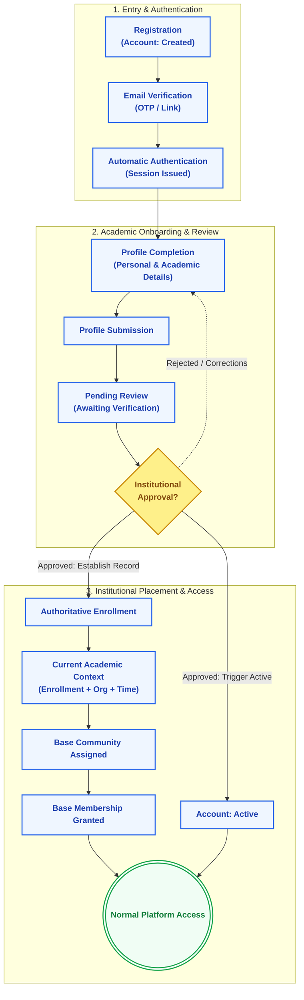
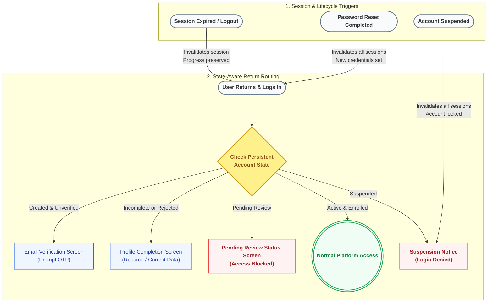

# Master User Journey

> [!NOTE]  
> **Purpose:** Maps detailed state diagrams charting a user's path through the system.  
> **Prerequisites:** `03-nine-domain-map.md`  
> **Primary Audience:** Engineers, Product Managers, Designers.

This document outlines the standard path a user takes from first contact to normal platform access, alongside critical return behaviors.

To ensure clarity and avoid visual overload, the journey is separated into two focused diagrams:
1. **The Standard Onboarding Journey**: The chronological progression from initial registration to normal platform access.
2. **Return & Resume Routing**: How login routing, status checkpoints, and session interruptions behave.

### Diagram A: The Standard Onboarding Journey
This diagram illustrates the chronological progression of a user from registration through verification, institutional review, and community placement to normal platform access.

*(Reference Diagram:)*

### Diagram B: State-Aware Return and Resume Behavior
This diagram illustrates how login attempts and lifecycle events route returning users to their exact state without resetting progress.

*(Reference Diagram:)*

## 1. The Standard Journey

**Registration**
The user submits initial identity credentials. The system creates the Account in a `Created` state.

**Verification**
An OTP or link is sent. The user proves ownership of the credential.

**Automatic Authentication**
Upon successful verification, the system issues an authenticated session, seamlessly transitioning the user into onboarding.

**Profile Completion**
The user provides required academic and personal information to build their Academic Profile.

**Submission**
The completed profile is submitted to the system, officially moving the onboarding state.

**Pending Review**
The profile awaits institutional verification.

**Approval**
An authorized reviewer (or automated institutional gate) approves the profile.

**Account Active**
The Approval triggers the Account Lifecycle to move the account state to `Active`.

**Enrollment**
The Approval simultaneously establishes the user's authoritative Enrollment record (academic attachment).

**Academic Context**
The Enrollment combines with Organization and Academic Time to form the user's Current Academic Context (e.g., University + Department + Level + Time).

**Base Community**
The system identifies the Community that matches the user's Academic Context.

**Base Membership**
The user is automatically granted membership in that Base Community.

**Normal Access**
With an Active Account, valid Session, authoritative Enrollment, established Academic Context, and Base Membership all in place, the user is granted Normal Platform Access.

---

## 2. Return & Resume Behavior

The system utilizes persistent, state-aware returns to ensure users are placed exactly where they left off, without destroying existing context.

- **Unverified return:** If a user registers but leaves before verifying, attempting to log in or return later will prompt the Verification step.
- **Incomplete return:** If a user verifies but drops off during profile completion, logging in resumes directly at Profile Completion.
- **Pending Review return:** If a user logs in while their profile is Pending Review, they see a status screen. They cannot access the normal platform.
- **Rejected return:** If a profile is rejected, logging in places the user back at Profile Completion (to make corrections), rather than suspending the account.
- **Active login:** A fully onboarded user logs in and goes straight to the normal platform experience.
- **Session expiration:** If a session expires, the user is logged out. Upon next login, their onboarding/enrollment state is perfectly preserved. Session expiration does **not** reset Onboarding or Enrollment.
- **Logout:** Explicit logout invalidates the session. Next login behaves like an Active login.
- **Password recovery:** "Forgot Password" triggers email OTP → user verifies OTP → sets New Password → confirms. **All existing sessions are invalidated.** The user must then Login with the new password.
- **Suspension:** If an Active Account is suspended, any active sessions are invalidated. The user is logged out. Future login attempts are explicitly denied with a suspension notice.
