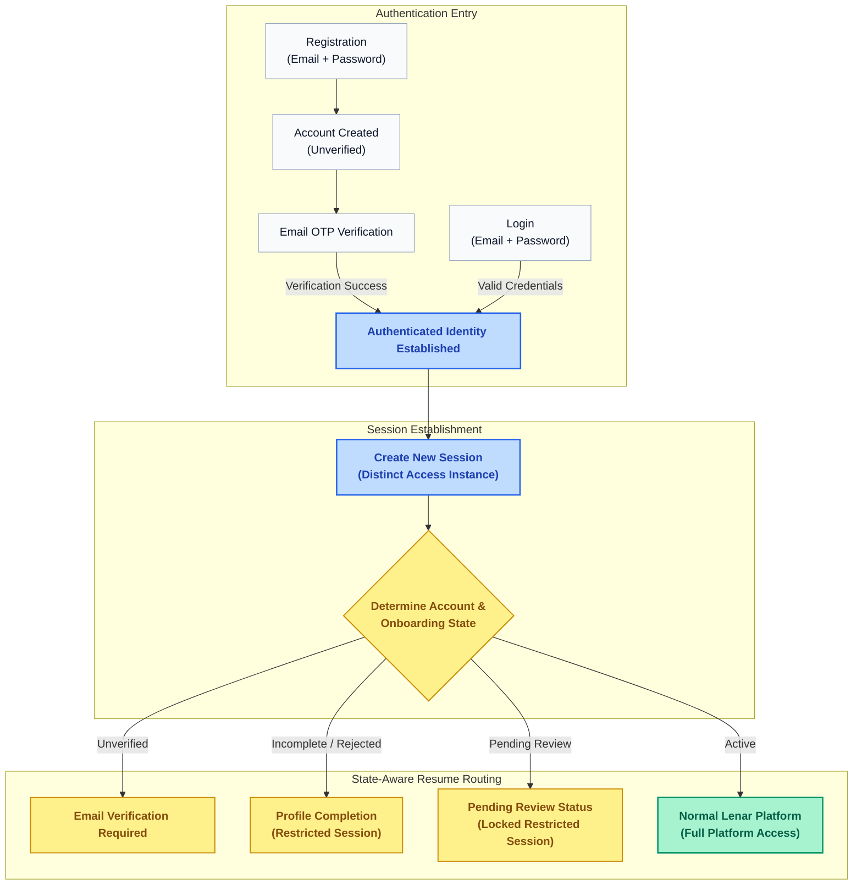
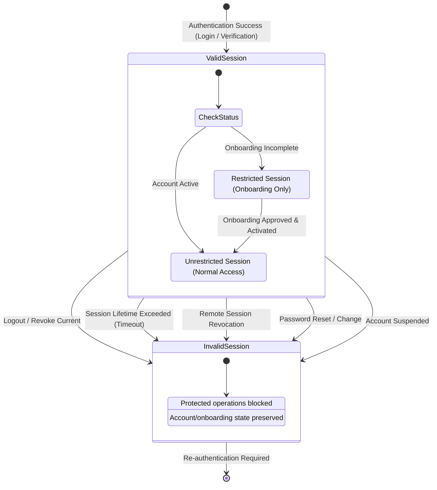
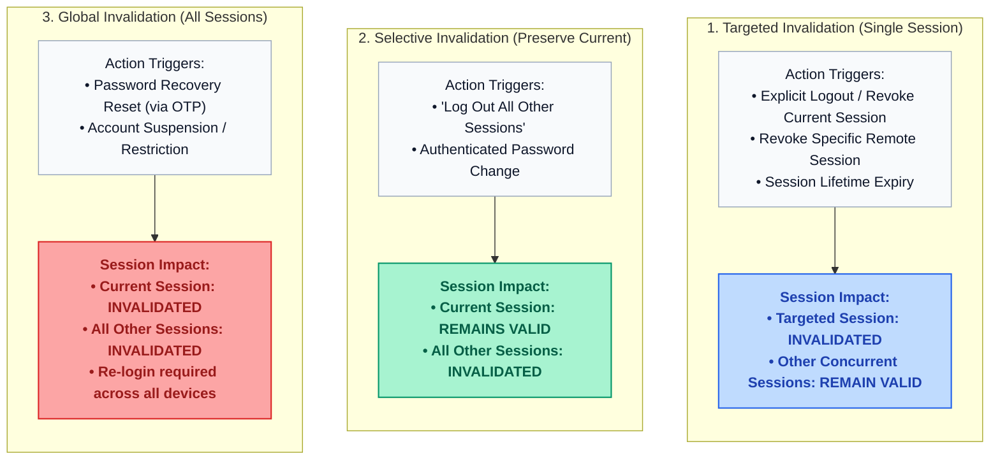

# Lenar — Authentication Specification

> [!NOTE]  
> **Purpose:** Defines the strict rules, token strategies, and validation mechanisms for Authentication.  
> **Prerequisites:** `../01-user-requirements/07-Security-Privacy-Governance.md`  
> **Primary Audience:** Security Engineers, Backend Engineers.

> **Maturity:** BEHAVIORAL
> **Version:** 0.1
> **Owner:** TBD
> **Last Reviewed:** 2026-08-31

---

## 1. Purpose

This specification defines the behavioral contract for credential-based authentication in Lenar, including email verification, login, logout, session creation and eligibility, session termination, password recovery, password change, account-email change, and state-aware return/resume behavior.

It preserves the clear conceptual boundaries:
- **Authentication** → establishes and validates authenticated identity and session eligibility.
- **Session** → represents a distinct authenticated access instance.
- **Account Lifecycle** → determines the broader state of the account.
- **Onboarding** → determines where an incomplete user continues.
- **Authorization** → determines what an authenticated actor may do.
- **Active** → indicates onboarding has completed and normal platform access is available.

## 2. Scope

**What this specification covers:**
- Credential-based authentication (Lenar-controlled: Credentials, JWT, Sessions).
- Email verification as an authentication stage.
- Login and state-aware resume routing.
- Session establishment, concurrency, and behavioral lifecycle (expiration, revocation).
- Restricted authenticated onboarding access.
- Logout and session invalidation.
- Failed authentication behavior (anti-enumeration).
- Password recovery and reset consequences.
- Account email change semantics.

**What it explicitly does not cover:**
- Implementation of JWT claims, TTL, signing algorithm, key rotation, or refresh-token format.
- Device fingerprinting or exact session metadata storage.
- Password hashing algorithm or physical session database schema.
- OTP length, expiration, retry/resend limits, or rate-limiting thresholds.
- Supabase Auth (which is explicitly **not** used).
- Exact account lifecycle state machine or authorization policy engine.

## 3. Canonical References

- [01-Lenar-Foundation.md](../01-user-requirements/01-Lenar-Foundation.md)
- [02-Problem-Users-Domain.md](../01-user-requirements/02-Problem-Users-Domain.md)
- [03-Product-Requirements.md](../01-user-requirements/03-Product-Requirements.md)
- [04-UX-UI.md](../01-user-requirements/04-UX-UI.md)
- [06-Data-Content.md](../01-user-requirements/06-Data-Content.md)
- [07-Security-Privacy-Governance.md](../01-user-requirements/07-Security-Privacy-Governance.md)
- [08-Offline-Sync-Resilience.md](../04-architecture/08-Offline-Sync-Resilience.md)
- [09-System-Architecture.md](../04-architecture/09-System-Architecture.md)
- [10-Technology-Stack.md](../04-architecture/10-Technology-Stack.md)
- [12-Testing-Quality.md](../04-architecture/12-Testing-Quality.md)
- [17-Decisions-Risks-Evolution.md](../../decisions/17-Decisions-Risks-Evolution.md)
- [Specification Framework README](../README.md)

## 4. Dependencies

- **Onboarding Specification**
- **Security Specification** (Planned)
- **Authorization Specification** (Planned)
- **Account Lifecycle Specification** (Planned)
- **Offline / Sync Specification** (Planned)
- **Notifications Specification** (Planned)

## 5. Terminology

- **Account Created:** An account exists but requires verification.
- **Authenticated Identity:** A recognized user with valid credentials.
- **Session:** A distinct authenticated access instance established for an account. It is not defined merely as "a JWT".
- **Valid Session:** A legitimately established session that remains within its permitted lifetime, has not been explicitly invalidated, and is still permitted by the current account state.
- **Current Session:** The authenticated session through which the user is currently interacting with Lenar.
- **Session Invalidation:** The act of making a previously valid session no longer valid.
- **Restricted Authenticated Session:** A valid session that permits continuation of onboarding but does not grant normal platform access.
- **Active:** A user who has completed onboarding and is eligible for normal platform access.

## 6. Actors

- **Unauthenticated User:** A visitor attempting to register, login, or recover a password.
- **Authenticated User (Restricted):** A user who is logged in but has not completed onboarding.
- **Authenticated User (Active):** A fully onboarded user interacting with the platform.

## 7. Preconditions

- For login, an account must exist.
- For password reset, the user must have access to the email address on file.

## 8. Core Rules

### Authentication & Resume
- **Registration creates an unverified account.** Registration input is exactly Email, Password, Confirm Password.
- **Successful email verification automatically authenticates the user** so they can continue immediately without logging in again.
- **Authentication must support state-aware return.** After successful login, the system determines the user's current account/onboarding state and routes them appropriately.
- **Failed authentication must not reveal whether the account exists.**
- **A new account email does not become authoritative until successfully verified.**
- **Authentication does not imply Authorization.** A successful login does not grant unrestricted feature access.

### Session Lifecycle Boundaries
- **Each successful authentication creates a new session.** (e.g., Login on Web → Session A; Login on Android → Session B).
- **Multiple concurrent sessions are allowed.** An account may have multiple valid sessions at the same time.
- **Sessions have finite lifetimes.** When a session exceeds its permitted lifetime, it becomes invalid.
- **Expired sessions cannot authorize protected operations.** A valid authentication must be re-established.
- **Session invalidation never resets account/onboarding state.** A user whose session expires while Pending Review simply logs back in and returns to Pending Review.
- **Restricted authenticated onboarding access:** An incomplete valid account can establish a restricted session sufficient to continue onboarding, without receiving normal Lenar access.
- **Account ≠ Session.** An account may have zero, one, or multiple sessions. An Active account may be unauthenticated.

## 9. State Models and Diagrams

### Authentication and State-Aware Resume Flow
*Flow of credential verification, session establishment, and dynamic resume routing based on account and onboarding state.*

### Session Lifecycle State Model
*State machine governing an individual authenticated session from creation through invalidation.*

### Concurrent Session Invalidation Scopes
*Impact of user-initiated actions and security events across concurrent sessions.*

## 10. Main Behaviors

### Registration and Verification
1. The user registers with Email, Password, and Confirm Password.
2. The account is created in an unverified state (Account exists ≠ Email verified ≠ Authenticated ≠ Active).
3. An OTP is sent to the email.
4. The user enters the OTP successfully.
5. Successful verification creates a new session and automatically routes the user to Profile Completion.

### Login, Session Creation, and State-Aware Resume
When a user attempts to log in with Email and Password:
1. Credentials are verified.
2. Upon success, **a new session is created** for that specific access instance.
3. The system determines the current state and routes accordingly:
   - **Unverified:** → Verification required
   - **Profile Incomplete:** → Profile Completion
   - **Pending Review:** → Pending Review state
   - **Rejected:** → Profile Completion
   - **Active:** → Normal Lenar access

### Session Management
- **Individual Session Revocation:** A user can view active sessions and revoke an individual session. If Session B is revoked, Session A and Session C remain valid. The revoked session can no longer perform authenticated operations.
- **Log Out All Other Sessions:** A user can choose to log out of all *other* sessions. All other sessions are invalidated, while the Current Session remains valid.
- **Revoking Current Session:** If the user revokes the Current Session, it is invalidated and the user becomes unauthenticated. This behaves exactly identically to normal Logout.

## 11. Alternate & Failure Behaviors

### Failed Authentication
- **Invalid Credentials:** An invalid email or password results in authentication failure. No authenticated session is created.
- **Anti-Enumeration:** The system returns a generic failure (e.g., "Invalid email or password") and does not reveal whether the account exists, the password was incorrect, or the account exists but is unverified.

### Session Expiration
- When a Valid Session exceeds its lifetime, it transitions to Invalid. Protected operations cannot continue, and authentication must be re-established. The underlying onboarding/account state (e.g., Pending Review) is explicitly preserved.

### Logout
- Logout (or revoking the current session) explicitly terminates the current authenticated session. The local authentication state is cleared, and the current authoritative session is invalidated.

### Account Suspension (Restrictive State)
- If an Active account enters a restrictive lifecycle state (e.g., Suspension), **existing authenticated sessions are immediately considered invalid**. Authentication is denied for new attempts while the restriction applies.

### Password Recovery (Forgot Password)
1. User enters Email, receives OTP, and enters OTP.
2. OTP verified.
3. User enters New Password and Confirms New Password.
4. Password Updated.
5. **All existing sessions are invalidated.**
6. User is returned to Login. State-aware routing resumes upon the next successful login.

### Authenticated Password Change
- When an already-authenticated user intentionally changes their password, their **current authenticated session remains valid**, but **other existing sessions are invalidated**.

### Account Email Change
- When an authenticated user requests an email change, the new email does not become authoritative until a verification code sent to the new email is successfully verified.

## 12. Invariants

- Client input is untrusted. Credential validity must be established server-side.
- An account may have multiple concurrent sessions.
- An invalid session cannot perform protected authenticated operations.
- A revoked session cannot become valid again merely because the client still possesses stale authentication material.
- Session invalidation does not erase account or onboarding state.
- A user can independently revoke a session without invalidating unrelated sessions.
- Log out all other sessions preserves the current session.
- Password reset invalidates all sessions.
- Authenticated password change preserves the current session but invalidates others.
- A restrictive account state invalidates existing sessions.
- A session does not itself imply authorization.
- Client state cannot manufacture authentication or Active status.
- Unverified/Non-Active accounts cannot obtain normal platform access.
- Failed login does not reveal whether an account exists.

## 13. Authorization & Security

- **Authentication vs. Authorization:** Authentication only establishes the identity. It is deferred to the future Authorization specification to enforce what the identity may do (RBAC + Scope + Context).
- **Restricted Sessions:** Unfinished onboarding states grant restricted sessions that explicitly deny normal platform functional access, relying on server enforcement rather than client routing alone.

## 14. Data Semantics

The architecture cleanly separates the following dimensions:
- **Account:** The persistent identity record.
- **Session:** An individual access instance tied to an Account.
- **Authentication State:** Whether an active, cryptographically valid session currently exists for the instance.
- **Account Lifecycle State:** Whether the account is active, suspended, or pending.
- **Onboarding State:** The progress of the account through the initial mandatory setup.

## 15. Offline / Platform Behavior

- **Offline Behavior:** Authentication remains server-authoritative. A client cannot establish authoritative authentication while completely offline. Exact handling of network loss during attempts belongs to detailed security design.
- **Platform Consistency:** Authentication and session semantics must remain consistent across Web, PWA, Android, and iOS.

## 16. User Experience & Feedback

Important user-visible experiences governed by authentication logic include:
- **Login:** Generic failure feedback for incorrect credentials.
- **Session Expired:** The user is informed that authentication must be re-established.
- **Session Revoked:** The revoked session can no longer access protected operations.
- **Current Session Revoked:** The user becomes unauthenticated.
- **Other Sessions Revoked / Logged out:** The user's current session continues normally.
- **State-Aware Routing:** The user is seamlessly deposited precisely where they left off (e.g., Pending Review, Profile Completion).

## 17. Notifications / Secondary Effects

- Registration triggers a verification email.
- Password recovery triggers a recovery email.
- Email change triggers a verification email.
- **Crucial Rule:** Authentication must not treat the delivery of an email as the authoritative authentication state itself; only successful cryptographic verification of the OTP matters.

## 18. Observability / Audit

Authentication must provide operational signals for:
- Session creation (successful authentication)
- Failed authentication
- Logout
- Password reset
- Password change
- Email change
- Session invalidation
- Individual session revocation
- All-other-sessions logout

## 19. Acceptance Criteria

- **Registration:** A new registration creates an unverified account.
- **Verification:** Successful email verification automatically authenticates the user and permits immediate continuation.
- **Resume:** A returning user is routed to the correct current account/onboarding state.
- **Unverified login:** An unverified account is routed to verification rather than normal Lenar.
- **Incomplete login:** A verified but incomplete account is routed to the appropriate onboarding stage.
- **Session Creation:** Each successful authentication creates a distinct new session.
- **Concurrent Sessions:** Multiple concurrent sessions are possible.
- **Expired Denial:** An expired session cannot access protected operations.
- **State Preservation:** Expiration preserves onboarding state.
- **Individual Revocation:** An individual session can be revoked without affecting unrelated sessions.
- **Current Revocation:** Revoking the current session behaves as logout.
- **Other Revocation:** "Log out of all other sessions" invalidates only other sessions.
- **Reset:** A successful password reset invalidates all sessions.
- **Password change:** An authenticated password change preserves the current session and invalidates others.
- **Suspension:** Suspension/restrictive account state invalidates existing sessions.
- **Restricted Boundary:** A restricted onboarding session does not grant normal Lenar functionality.
- **Email change:** A new email cannot become authoritative before successful verification.
- **Authorization boundary:** Successful authentication does not bypass server-side authorization.

## 20. Testing Requirements

Verification must eventually cover:
- Session creation and multiple concurrent sessions.
- Session expiration, expired-session denial, and state preservation after expiration.
- Individual session revocation, current-session revocation, and all-other-sessions logout.
- Login and State-aware resume boundaries.
- Restricted onboarding session boundaries.
- Password-reset global invalidation.
- Password-change selective invalidation.
- Suspension invalidation.
- Invalid credentials / enumeration resistance.
- Email change verification.
- Cross-platform authentication behavior.

## 21. Explicit Non-Assumptions

This specification does **NOT** decide:
- Exact JWT claims, JWT TTL, Refresh-token format, or Refresh-token rotation.
- Signing algorithm, or Key management / rotation.
- Session database schema, Revocation-list implementation, or exact session metadata storage.
- Maximum concurrent session count.
- Device fingerprinting implementation.
- Password hashing algorithm.
- OTP length, OTP expiration, OTP retry limits, or OTP resend limits.
- Rate-limiting thresholds or Account lockout thresholds.
- Email provider implementation.
- Exact API contracts or Exact account lifecycle state machine.
- Exact authorization policy engine or Exact role/scope model.

## 22. Open Questions

- **Exact session lifetime (Idle vs absolute timeout):** BLOCKING
- **Refresh/renewal mechanism:** BLOCKING
- **Exact session storage/revocation mechanism:** BLOCKING
- **JWT/session relationship:** BLOCKING
- **Exact semantics of restricted onboarding sessions:** BLOCKING
- **Exact verification-code behavior (format, TTL):** BLOCKING
- **Exact account lifecycle mechanics:** NON-BLOCKING (Belongs to Lifecycle specification)
- **Maximum concurrent sessions:** FUTURE
- **Exact session/device metadata:** FUTURE
- **Exact abuse-prevention thresholds:** FUTURE

## 23. Change Impact

**Directly affected:**
- Onboarding (State resumption)
- Security (Credential verification, enumeration resistance, session revocation)
- Authorization (Identity establishment, restricted sessions)
- Account Lifecycle (Session invalidation on suspension)
- UX / UI (State-aware routing, session management views)

**Potentially affected:**
- Enrollment (Dependent on active identity)
- Community (Dependent on active identity)
- Notifications (Delivery mechanisms for OTPs)
- Offline / Sync (Network interruption handling)
- Testing / Quality (Auth suites)
- Analytics / Observability (Auth telemetry)
- Infrastructure (Session persistence and token distribution)

## 24. Related ADRs

- None currently directly applicable to the specific authentication/session internals beyond canonical Phase B decisions.

## 25. Related Specifications

- [Onboarding Specification](../onboarding/onboarding-specification.md)
- *See Section 4 for planned dependencies.*

---

## Specification Completeness Checklist

Before a specification is marked `IMPLEMENTATION-READY`, verify:

- [x] Scope is defined
- [x] Actors are defined
- [x] Terminology is defined
- [x] Dependencies are defined
- [x] Preconditions are defined
- [x] Core rules are defined
- [x] States are defined where applicable
- [x] Valid transitions are defined where applicable
- [x] Failure behavior is defined
- [x] Invariants are defined
- [x] Authorization/security constraints are defined
- [x] Data semantics are clear
- [x] Offline/platform behavior is addressed where relevant
- [x] User-visible outcomes are clear
- [x] Acceptance criteria are testable
- [x] Testing requirements are identified
- [x] Explicit non-assumptions are documented
- [ ] All blocking questions resolved (e.g. JWT implementation, exact session timeouts)
- [x] Canonical references are verified
- [x] No currently applicable ADRs identified
- [x] Relevant diagrams are verified
