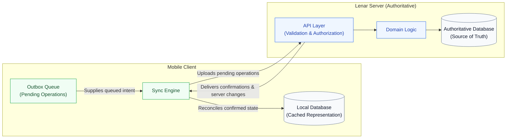
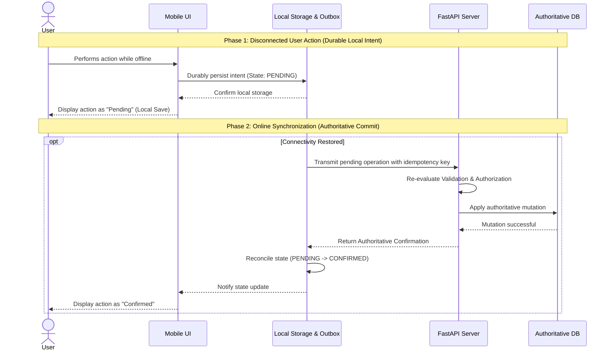
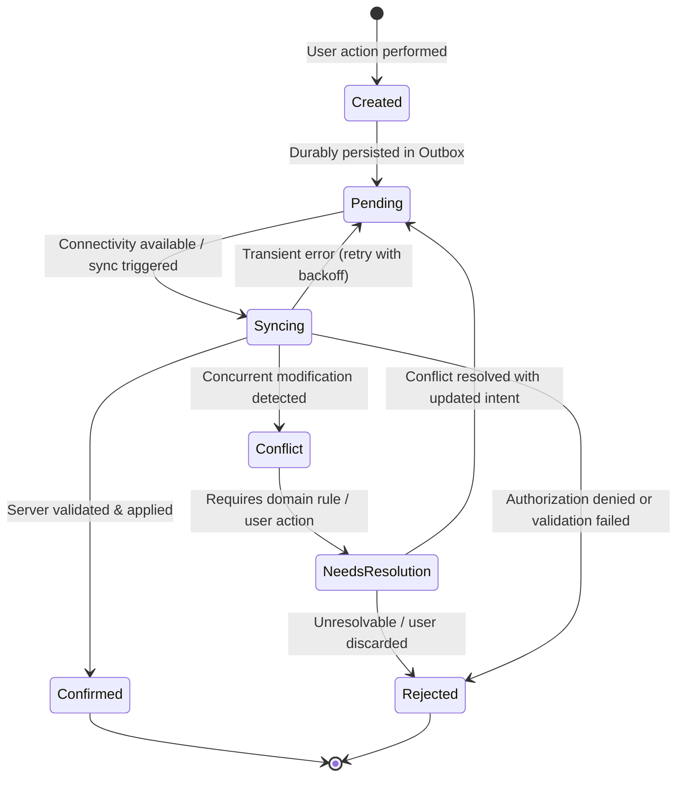
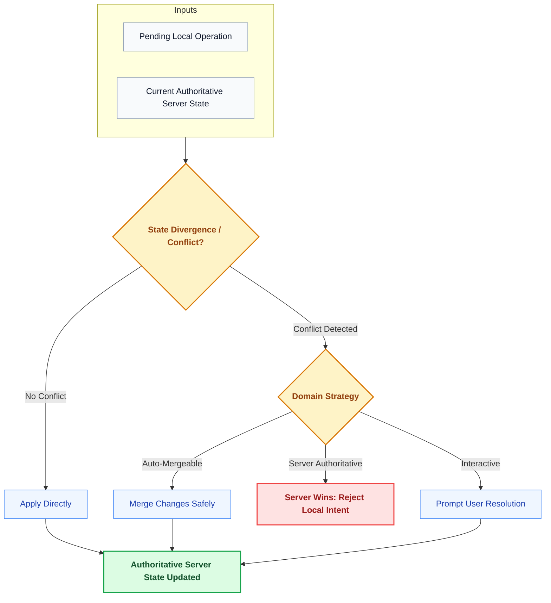
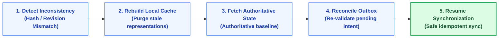
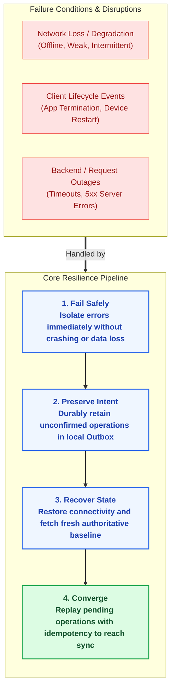

# Lenar — Offline, Sync & Resilience

> [!NOTE]  
> **Purpose:** Defines how the platform behaves when network connectivity is lost or unstable.  
> **Prerequisites:** `05-Platform.md`  
> **Primary Audience:** Mobile Engineers, Backend Engineers.


---

## At a Glance

Lenar is designed for a world where connectivity cannot always be assumed. An offline-first product must answer more than *"Can the app work without internet?"* It must answer:
- What can the user do?
- What is saved locally?
- What has reached the server?
- What happens when local state and server state differ?

The central principle is:
> **Preserve supported user intent locally, synchronize it safely when connectivity returns, and keep the server authoritative for shared state.**

Offline support is therefore a **feature-by-feature product capability**, not a blanket promise that every part of Lenar works without connectivity.

---

## 1. The Offline-First Principle

Offline-first means that the application is designed with disconnected operation as a normal condition for supported experiences rather than as an exceptional error.

It does **not** mean:
- every feature works offline;
- approval works offline;
- enrollment is established offline;
- authorization can be decided offline permanently;
- every piece of server data is stored locally;
- the device becomes the source of truth;
- local data automatically becomes authoritative;
- every action can be completed without server interaction.

Instead:
```text
Connectivity
    ↓
may improve or degrade
    ↓
supported features adapt
```

---

## 2. Synchronization Architecture

The mobile client maintains a clear separation between its internal local database, its queue of outbound operations, and the synchronization engine responsible for talking to the network.

### [Client-Server Synchronization Architecture]



---

## 3. Offline Write & Synchronization

When a user performs an action offline, it must be safely durably preserved, then correctly synchronized.

### [Offline Write and Synchronization Sequence]



### 3.1 Critical Conceptual Distinctions

These states must never be collapsed or confused in either the architecture or the user interface:

- **OFFLINE:** The device has no usable network connection.
- **LOCAL SAVE:** User intent/state is durably preserved on the device.
- **PENDING:** The operation exists locally but has not been server-confirmed.
- **SYNCING:** The operation is actively being processed against the server.
- **SERVER CONFIRMED:** The authoritative server state confirms the operation.
- **CONFLICT:** Local intent cannot be applied automatically under current rules.
- **REJECTED:** The authoritative server refuses or invalidates the operation.
- **STALE DATA:** The locally available representation may no longer be current.

---

## 4. Operation Lifecycle & Idempotency

Operations progress through a predictable lifecycle as they transition from local intent to authoritative server state.

### [Operation Lifecycle State Model]



### 4.1 Idempotency
A single logical user operation must not accidentally become multiple authoritative effects because of:
- retries
- timeouts
- duplicated delivery
- app restarts
- repeated synchronization

The exact key generation strategy will be defined in implementation, but the architectural requirement is absolute: **retry must be safe.**

---

## 5. Authorization and Conflicts

### 5.1 Authorization Re-Evaluation
The server re-evaluates authorization when the operation reaches the authoritative boundary. Do not assume that an authorization result observed before going offline remains permanently valid when connectivity returns.

### 5.2 Conflict Handling
Lenar does not rely on one universal conflict algorithm. Conflict strategy depends strictly on domain semantics. Potential strategies (e.g., server wins, merge, reject, user resolution) are applied only where justified by the specific domain rule.

#### [Domain-Specific Conflict Resolution Flow]



#### [Local State Inconsistency Recovery Flow]



---

## 6. Local Storage, Performance, and UX

### 6.1 Local Storage
Do not mirror the entire server by default. Local persistence is selected according to:
- User value
- Offline usefulness
- Data sensitivity
- Freshness requirements
- Storage cost
- Sync complexity

It is vital to distinguish an **optional cache** from **important pending user intent**.

### 6.2 Performance and Network
- Avoid unnecessary full refreshes.
- Prefer incremental synchronization where appropriate.
- Avoid unnecessary duplicate payloads.
- Control retry behavior to prevent server flooding.
- Minimize unnecessary battery and network usage.

### 6.3 UX Connection
The user interface should clearly distinguish: Offline, Saved locally, Pending, Syncing, Synced, Needs attention, and Failed. **Never allow the UI to claim server confirmation before authoritative confirmation exists.**

---

## 7. Resilience, Recovery, and Testing

The architecture must have a clear path from failure back toward a trusted state.

### [Resilience and Recovery Model]



### 7.1 Testing the Model
The resilience model demands robust testing across critical scenarios, including:
- Offline submission
- App termination after local persistence
- Device restart
- Network loss during a request
- Timeout and duplicate retry
- Authorization change while offline
- Server-side resource change while offline (Deleted resource / Conflict)
- Expired authentication
- Full resynchronization
- Local storage pressure
- Backend outage

### 7.2 Observability
Synchronization health should be measurable. Key metrics include:
- Queue size and queue age
- Sync success rate vs failure rate
- Retry count and conflict rate
- Full-resync frequency
- Synchronization latency

*(Note: Analytics are secondary. An analytics failure must not break core authoritative operations).*

---

## Related Documentation

For how offline behavior connects to the broader system, refer to:

- [../product/03-Product-Requirements.md](../01-user-requirements/03-Product-Requirements.md)
- [../product/04-UX-UI.md](../01-user-requirements/04-UX-UI.md)
- [../product/06-Data-Content.md](../01-user-requirements/06-Data-Content.md)
- [../product/07-Security-Privacy-Governance.md](../01-user-requirements/07-Security-Privacy-Governance.md)
- [09-System-Architecture.md](09-System-Architecture.md)
- [10-Technology-Stack.md](10-Technology-Stack.md)
- [11-Performance-Reliability.md](11-Performance-Reliability.md)
- [12-Testing-Quality.md](12-Testing-Quality.md)
- [13-Analytics-Observability.md](13-Analytics-Observability.md)
- [16-Development-Release.md](16-Development-Release.md)
- [../decisions/17-Decisions-Risks-Evolution.md](../decisions/17-Decisions-Risks-Evolution.md)
