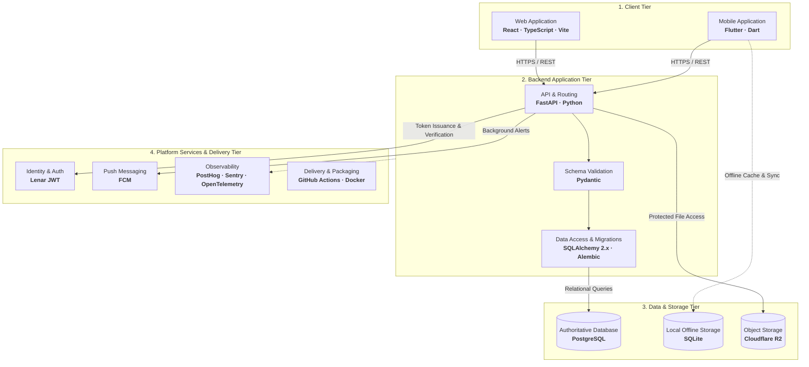
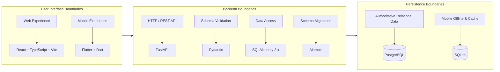
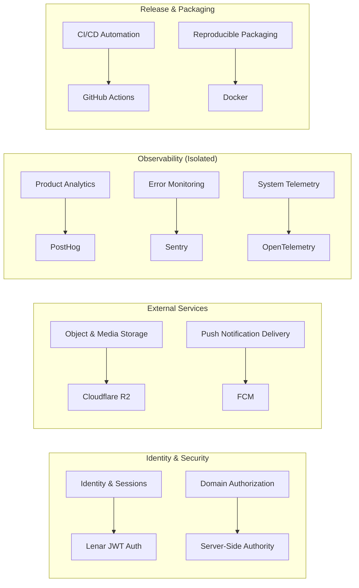
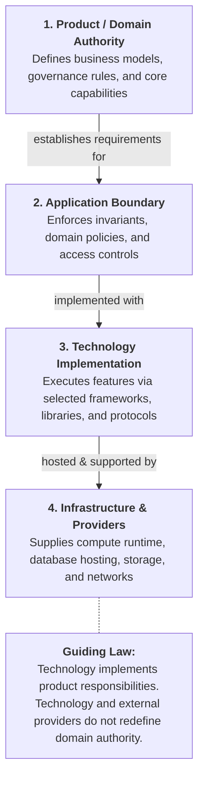
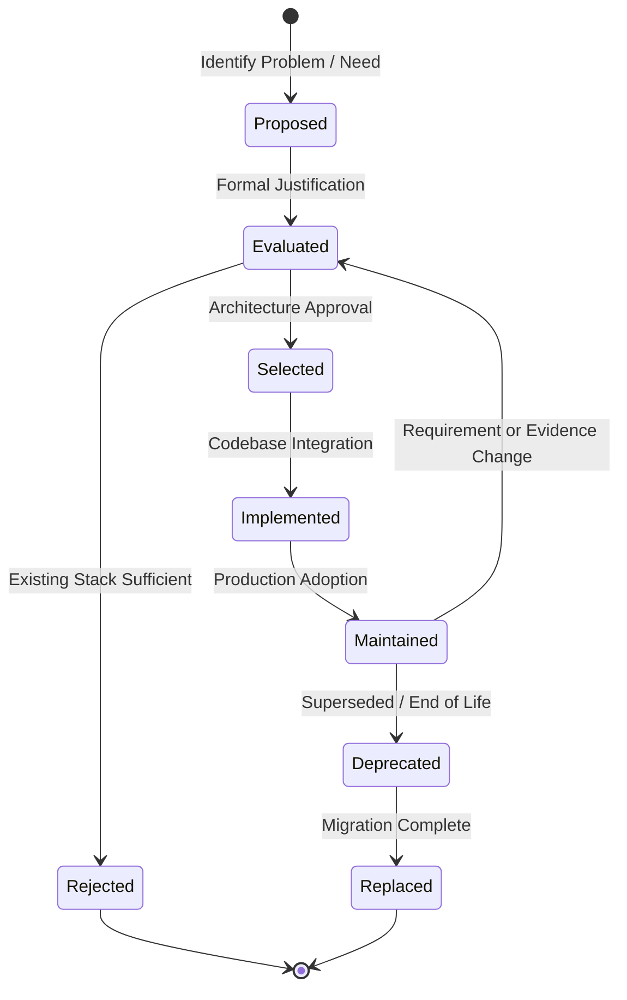

# Lenar — Technology Stack

> [!NOTE]  
> **Purpose:** Defines the strict languages, frameworks, and infrastructure tools chosen for Lenar.  
> **Prerequisites:** `09-System-Architecture.md`  
> **Primary Audience:** All Engineers.


---

## At a Glance

Lenar uses a deliberately practical technology stack. The goal is not to assemble the newest or most sophisticated technologies. The goal is to provide a stack that can support:
- a coherent multi-platform product;
- strong backend architecture;
- reliable offline behavior;
- secure data handling;
- maintainable development;
- good performance;
- scalable growth;
- effective testing;
- operational simplicity.

These choices are organized around the system architecture defined in [09-System-Architecture.md](09-System-Architecture.md) and the product requirements defined in [03-Product-Requirements.md](../01-user-requirements/03-Product-Requirements.md).

---

## 1. Technology Philosophy

Technology exists to serve product requirements. The preferred stack is therefore the one that provides an appropriate combination of:
```text
Capability
+
Correctness
+
Security
+
Performance
+
Maintainability
+
Developer productivity
+
Operational simplicity
+
Cost
```

---

## 2. Technology Stack Overview

The stack is composed of grouped responsibility layers to ensure cohesive development across environments.

### Diagram: Technology Stack Overview by Layer
This diagram shows the primary technologies selected for each layer of the Lenar system and how they relate across the client, backend, persistence, and operational tiers.



---

## 3. Technology Responsibility Map

Technologies in Lenar have strict responsibility boundaries. A single tool must not silently become responsible for unrelated concerns. 

### Diagram A: Core Application & Data Stack Boundaries
This diagram maps user-facing and backend product capabilities directly to their authoritative technology choices.



### Diagram B: Platform Services & Operational Boundaries
This diagram maps identity, external cloud services, observability, and release capabilities to their dedicated platform tools.



### Current Core Boundaries
- **React** → Web UI
- **Flutter** → Mobile application / UI
- **FastAPI** → HTTP/API boundary
- **Pydantic** → API schemas and validation
- **SQLAlchemy 2.x** → Server-side data access
- **Alembic** → Database migrations
- **PostgreSQL** → Authoritative relational state
- **SQLite-based architecture** → Selected mobile local state / offline support
- **Lenar-controlled authentication** → JWT / Credentials / Sessions
- **Lenar authorization** → Server-side authority (Permissions)
- **Cloudflare R2** → Object storage
- **Firebase Cloud Messaging (FCM)** → Push delivery
- **PostHog** → Product analytics
- **Sentry** → Error monitoring
- **OpenTelemetry** → Telemetry / instrumentation
- **GitHub Actions** → Automation / CI/CD
- **Docker** → Packaging / reproducible environments

---

## 4. Critical Boundaries & Distinctions

A technology implements product responsibilities; it does not redefine product or domain authority. 

### Diagram: Hierarchy of Domain Authority vs. Implementation
This diagram illustrates how domain authority strictly flows down to technology and infrastructure, ensuring external tools never redefine business rules.



We explicitly separate related but distinct responsibilities:
- **AUTHENTICATION ≠ AUTHORIZATION**
- **DATABASE ≠ CACHE**
- **DATABASE ≠ SEARCH INDEX**
- **DATABASE ≠ ANALYTICS**
- **NOTIFICATION ≠ AUTHORITATIVE STATE**
- **ANALYTICS ≠ APPLICATION DATABASE**
- **TECHNOLOGY ≠ PRODUCT CAPABILITY**
- **PROVIDER ≠ DOMAIN AUTHORITY**
- **FRAMEWORK ≠ DOMAIN MODEL**

---

## 5. Specific Technology Constraints

### 5.1 Mobile Framework
**Flutter** is the current selected mobile framework. While Kotlin Multiplatform + Native UI was heavily evaluated, Flutter currently provides the strongest overall trade-off for Lenar's present mobile requirements. This choice does not claim Flutter is universally superior to all alternatives.

### 5.2 PostgreSQL
**PostgreSQL** is the authoritative relational database direction. However, this does not mean every possible future dataset or cache must live in PostgreSQL. 

### 5.3 Mobile Local Persistence
The mobile local persistence direction relies on **SQLite**. Local storage may contain a cache, drafts, durable user intent, pending operations, and sync metadata. It must *not* be treated as a full mirror of the entire server database.

### 5.4 Authentication vs Authorization
**Lenar-controlled JWT authentication** handles authentication (proving user identity). It does *not* define Lenar's complete authorization model. Server-side authorization remains authoritative.

### 5.5 Object Storage
**Cloudflare R2** is the direction for object storage. Protected file access must remain aligned with the permissions of the associated domain resource. The raw file URL is not an authorization boundary.

### 5.6 Analytics & Observability
These must remain conceptually separated:
- **PostHog** handles product analytics.
- **Sentry** tracks application error monitoring.
- **OpenTelemetry** handles systemic instrumentation.
None of these tools are permitted to become a structural dependency for core, authoritative product correctness.

---

## 6. Dependency Policy & Technology Lifecycle

Technology choices are lifecycle-managed rather than permanent by default.

### Diagram: Technology Lifecycle State Machine
This state model defines the formal lifecycle phases and transitions for any technology dependency introduced into Lenar.



**The core rule:** If the existing stack can safely and adequately satisfy a requirement, prefer using it over introducing another dependency.

Any new technology addition or replacement must be formally justified by:
`problem + benefit + cost + risk + maintenance + replaceability`

---

## Related Documentation

For context on how these technologies fulfill product and architectural needs, refer to:

- [03-Product-Requirements.md](../01-user-requirements/03-Product-Requirements.md)
- [05-Platform.md](05-Platform.md)
- [06-Data-Content.md](../01-user-requirements/06-Data-Content.md)
- [07-Security-Privacy-Governance.md](../01-user-requirements/07-Security-Privacy-Governance.md)
- [08-Offline-Sync-Resilience.md](08-Offline-Sync-Resilience.md)
- [09-System-Architecture.md](09-System-Architecture.md)
- [11-Performance-Reliability.md](11-Performance-Reliability.md)
- [12-Testing-Quality.md](12-Testing-Quality.md)
- [13-Analytics-Observability.md](13-Analytics-Observability.md)
- [14-Infrastructure-Operations.md](14-Infrastructure-Operations.md)
- [16-Development-Release.md](16-Development-Release.md)
- [17-Decisions-Risks-Evolution.md](../decisions/17-Decisions-Risks-Evolution.md)
