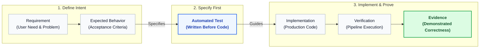
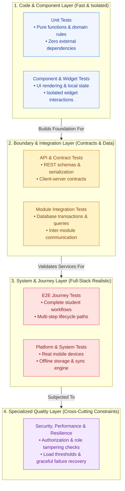
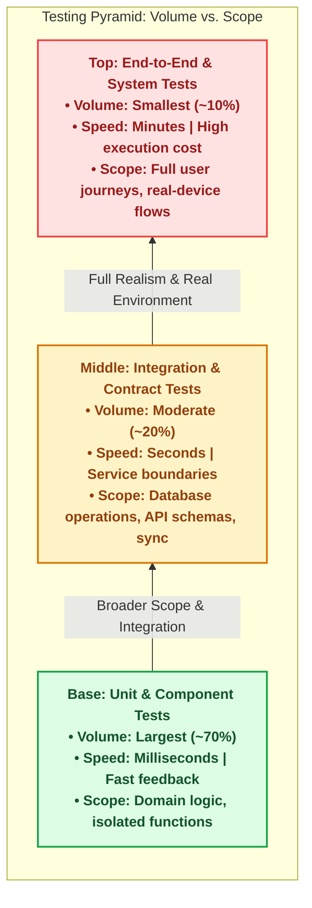
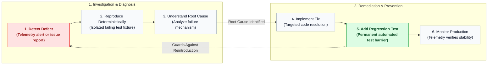
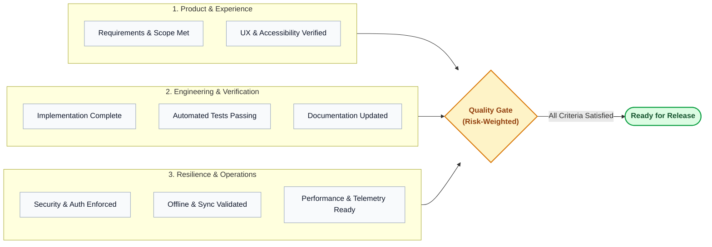

# Lenar — Testing & Quality

> [!NOTE]  
> **Purpose:** Defines the automated testing strategies, QA standards, and deployment gates.  
> **Prerequisites:** `09-System-Architecture.md`  
> **Primary Audience:** QA Engineers, DevOps, All Engineers.


---

## At a Glance

Lenar should not be considered complete merely because:
- the application builds;
- a feature works once;
- unit tests pass;
- the UI looks correct;
- the API returns a successful response.

Quality means the system behaves correctly **as a whole**. Testing must therefore verify Requirements, User Experience, Domain Rules, Security, Data Integrity, Offline/Sync, Platform Behavior, Performance, Accessibility, Integrations, and Operations.

---

## 1. Critical Quality Principle

A feature is not complete simply because code exists. Quality requires explicit evidence that the important behavior is correct. 

The required sequence of verification is:
```text
Requirement → Expected Behavior → Test → Implementation → Verification → Evidence
```

### [Feature Verification Sequence]



> [!WARNING]
> Do not reverse this flow. Do not write the implementation first and then generate tests merely to match what already exists.

---

## 2. Testing Layers and the Pyramid

Testing is not solely about unit tests. We rely on a multi-layer verification model where no single layer replaces the responsibilities of the others.

### [Testing Layers Architecture]



This forms a conceptual distribution pyramid: many fast, focused tests at the base, and fewer, highly realistic, expensive tests at the top.

### [Testing Volume Distribution Pyramid]



---

## 3. Risk-Based Testing

Not every feature requires identical test coverage. We test based on risk:
`Risk = Probability × Impact`

High-impact areas that deserve rigorous, uncompromising testing include:
- Authorization boundaries
- Data integrity and transactional consistency
- Offline capabilities and synchronization reconciliation
- Privileged administration features
- Important database migrations
- Authentication flows

---

## 4. Critical Verification Domains

### 4.1 Authorization Testing
The UI must never be treated as the security enforcement mechanism. Tests must actively verify:
- Allowed access
- Explicitly denied access
- Object-level authorization and scope violations
- Role manipulation and identifier tampering
- Privilege escalation attempts

### 4.2 Offline & Sync Testing
Offline behavior requires deliberate testing. We must verify both **local state** and **server-authoritative state** after reconciliation under these conditions:
- Offline action and durable persistence
- App termination, restart, and reconnect
- Timeout, duplicate retry, and full resynchronization
- Server-side permission changes or resource deletions occurring while the client is offline
- Conflict resolution

### 4.3 Data Integrity
Tests must enforce relationships, database constraints, valid state transitions, uniqueness, transactional consistency, and duplicate-operation prevention.

### 4.4 External Integrations
Using mocks in unit tests does not prove that a real integration works. Important providers require selective real integration tests alongside controlled/mocked tests.

### 4.5 Background Work
Background processing must be tested for success, failure, retries, duplicate delivery, idempotency, and required ordering.

### 4.6 Onboarding & Lifecycle Testing
Testing documentation and practices must recognize the importance of the complete user onboarding and lifecycle journey. The required sequence of verification includes: Registration, Email Verification, Profile Submission, Pending Review, Leader Approval, Admin Approval, Rejection, Resubmission, Enrollment Establishment, Academic Context, Base Community Membership, Authorization Scope, and Role Assignment.

---

## 5. Platform, UI, & Constraints

### 5.1 Real-Device Testing
Verification must include testing on representative **real devices**. We cannot rely entirely on emulators, simulators, or high-end developer laptops to prove mobile viability.

### 5.2 Accessibility
Lenar must be evaluated for fundamental usability. Tests must cover screen reader compatibility, text scaling, keyboard/alternative navigation, color contrast, semantic labels, proper focus states, and adequate touch targets. *(Note: This enforces engineering usability, not a formal legal compliance claim).*

### 5.3 Performance
Performance testing requires representative devices, network conditions, and realistic workloads. Do not rely on synthetic benchmarks. Refer to [11-Performance-Reliability.md](11-Performance-Reliability.md) for expected performance constraints.

---

## 6. Database & Migrations

Database tests must not assume an eternally clean slate. Verification requires testing against:
- A fresh database
- An existing database state
- Representative test data
- The actual upgrade/migration path to prove backward and forward compatibility

---

## 7. Production Quality & Defect Handling

### 7.1 Flaky Tests
We do not normalize flaky tests. You must not simply "re-run the pipeline until it turns green." 
The policy is: **Identify → Investigate → Fix / Remove when genuinely invalid.**

### 7.2 The Failure Verification Loop
Fixing a bug is not just patching code; it is strengthening the system.

#### [Failure Verification and Regression Loop]



### 7.3 Code Coverage
Code coverage percentage is evidence of testing execution; it is **not** the definition of quality. We do not chase a mandatory arbitrary percentage. The correct question is always: *"What important behavior remains insufficiently verified?"*

---

## 8. AI-Assisted Testing

AI tooling is permitted to assist in generating tests, but **passing an AI-generated test does not prove correctness if the test encodes the wrong assumptions.**

All AI-generated tests must be human-reviewed against:
- Product requirements
- Domain rules
- Security rules
- UX behavior
- Offline/sync semantics

---

## 9. Definition of Done

A feature is considered "Done" and ready for release only when all relevant quality dimensions have been satisfied.

### [Definition of Done Quality Model]



*(Note: This is a generalized quality model. The exact weight of each category scales with the risk of the change).*

---

## Related Documentation

- [../product/03-Product-Requirements.md](../01-user-requirements/03-Product-Requirements.md)
- [../product/04-UX-UI.md](../01-user-requirements/04-UX-UI.md)
- [05-Platform.md](05-Platform.md)
- [../product/06-Data-Content.md](../01-user-requirements/06-Data-Content.md)
- [../product/07-Security-Privacy-Governance.md](../01-user-requirements/07-Security-Privacy-Governance.md)
- [08-Offline-Sync-Resilience.md](08-Offline-Sync-Resilience.md)
- [09-System-Architecture.md](09-System-Architecture.md)
- [10-Technology-Stack.md](10-Technology-Stack.md)
- [11-Performance-Reliability.md](11-Performance-Reliability.md)
- [13-Analytics-Observability.md](13-Analytics-Observability.md)
- [14-Infrastructure-Operations.md](14-Infrastructure-Operations.md)
- [16-Development-Release.md](16-Development-Release.md)
- [../decisions/17-Decisions-Risks-Evolution.md](../decisions/17-Decisions-Risks-Evolution.md)
