# Lenar — Platform & Experience Strategy

> **Status:** Platform Reference  
> **Document:** 05 — Platform & Experience Strategy  
> **Purpose:** Define where Lenar exists, how its platforms relate, how the experience should adapt across Web, PWA, Android, and iOS, what the current mobile strategy is, and how platform capabilities, constraints, distribution, and lifecycle should influence the product.

---

## At a Glance

Lenar is a multi-platform product. It is not one interface copied onto several devices.

The product should preserve the same underlying meaning, rules, and user outcomes while allowing each platform to use interaction patterns appropriate to its environment.

The current platform strategy is:

| Platform | Primary Role | Current Direction |
|---|---|---|
| **Web** | Broad access, productivity, management | React + TypeScript + Vite |
| **PWA** | Installable/lightweight web access | Web application with appropriate PWA capabilities |
| **Android** | Primary mobile student experience | Flutter |
| **iOS** | Mobile student experience | Flutter |

The key platform principle is:
> **Shared product semantics, platform-appropriate experience.**

This means Lenar should not become four different products. At the same time, Android, iOS, Web, and PWA should not be forced into identical layouts or interaction patterns merely for the sake of consistency.

---

## 1. Why a Multi-Platform Strategy?

Students and other Lenar users will access the system through different devices and contexts. Some may use:
- Android phones
- iPhones
- Laptops
- Desktop computers
- Browser-based access
- Installed PWAs

The product therefore needs more than a single access surface. The platform strategy exists to answer:
> **What should Lenar provide on each platform, and what should remain common across all of them?**

---

## 2. Platform Philosophy

Lenar follows core platform principles designed to unify the experience while respecting the medium.

### 2.1 One Product

Users should experience:
> **one Lenar**

rather than unrelated applications that happen to use the same brand. The underlying concepts, terminology, account model, permissions, and product semantics should remain strictly aligned.

### 2.2 Platform-Appropriate Experience

Shared meaning does not require identical interaction.

```text
Web
→ keyboard/mouse-oriented interaction

Mobile
→ touch-first interaction

PWA
→ browser-first experience with installable capabilities
```



---

## 3. Platform Map & Roles

Lenar branches into dedicated platforms to best serve the user's immediate context. 



---

## 4. Current Mobile Strategy

The current mobile strategy relies on **Flutter + Dart** to build the Android and iOS experiences. 

While Kotlin Multiplatform + Native UI was a serious alternative during the evaluation process, Flutter currently provides the strongest overall trade-off for Lenar's present mobile requirements. 

It is important to emphasize that framework choices are driven by product requirements, maintenance cost, and capability needs—not technology preference. 

---

## 5. Platform Lifecycle

The lifecycle of the application varies significantly by platform. For example, mobile app lifecycles (App Store distribution, strict updates) differ mechanically from Browser/PWA lifecycles (continuous deployment, immediate updates).



---

## 6. Platform Decision Flow

When introducing new features or capabilities, the decision of how to implement them on a platform is guided by a structured evaluation of product needs against platform reality.



---

## 7. Platform Content Rules

The following rules govern how features should be approached across platforms:

1. **One Product:** Lenar is one product across multiple platforms.
2. **Semantics:** Shared semantics do not require identical interfaces.
3. **Mobile Framework:** Flutter is the current mobile framework decision.
4. **Adaptation:** Platform-specific behavior is appropriate where platform differences materially affect usability or capability.
5. **Permissions:** Permissions should be contextual and minimal.
6. **Graceful Degradation:** Unsupported capabilities need defined fallback/limitation behavior.
7. **Authority:** Server-side authorization remains authoritative on every client.
8. **Boundaries:** Platform differences should be concentrated in appropriate boundaries rather than scattered throughout the application logic.
9. **Validation:** Platform support must be tested on actual representative environments.
10. **Constraints:** Low-end device constraints are highly relevant to the platform strategy.

---

## Related Documentation

For detailed specifications connected to this platform strategy, refer to the following canonical documents:

- [../product/03-Product-Requirements.md](../product/03-Product-Requirements.md)
- [../product/04-UX-UI.md](../product/04-UX-UI.md)
- [../product/06-Data-Content.md](../product/06-Data-Content.md)
- [../product/07-Security-Privacy-Governance.md](../product/07-Security-Privacy-Governance.md)
- [08-Offline-Sync-Resilience.md](08-Offline-Sync-Resilience.md)
- [09-System-Architecture.md](09-System-Architecture.md)
- [10-Technology-Stack.md](10-Technology-Stack.md)
- [11-Performance-Reliability.md](11-Performance-Reliability.md)
- [12-Testing-Quality.md](12-Testing-Quality.md)
- [../product/15-Legal-Business.md](../product/15-Legal-Business.md)
- [16-Development-Release.md](16-Development-Release.md)
- [../decisions/17-Decisions-Risks-Evolution.md](../decisions/17-Decisions-Risks-Evolution.md)
