# Lenar — System Architecture

> **Status:** Architecture Reference  
> **Document:** 09 — System Architecture  
> **Purpose:** Define how Lenar is structurally organized, where system boundaries exist, what responsibilities belong to each major component, how components communicate, where data flows, how external systems are integrated, how failures are contained, and how the architecture can evolve as Lenar grows.

---

## At a Glance

Lenar is designed as a **modular monolith with clearly defined boundaries**.

The architecture intentionally begins with a relatively simple deployable system rather than prematurely distributing the product into many independent services. 

The current high-level structure is:
```text
Clients
   ↓
Application API
   ↓
Domain / Application Modules
   ↓
Authoritative Data & Supporting Infrastructure
```

---

## 1. Architectural Style: Modular Monolith

The core backend architecture is a **FastAPI modular monolith** backed by **PostgreSQL**. 

This means:
- One principal backend application/deployment initially.
- Meaningful internal modules with explicit responsibilities.
- Controlled dependencies between modules.
- A shared authoritative database.
- The ability to extract modules later if evidence justifies it.

The conceptual module map logically groups related domains within the monolith:



### 1.1 The Admin Control Plane
An important architectural responsibility within this monolith is the **Admin Control Plane**. It is responsible for governing authoritative system state, particularly:
- Organization (University, Faculty, Department, Level)
- Academic Time (Academic Session, Semester)
- Governance (Creator Roles, Assignments)

The control plane also participates in determining and establishing the user's enrollment attachment. It is conceptually distinct from the user-facing application side, even if it is currently deployed as part of the modular monolith.

*(Note: These are conceptual responsibility boundaries. We do not automatically create a separate service, separate deployment, or separate database for every module.)*

---

## 2. System Context

The broader ecosystem encompasses users, clients, the central Lenar Application, core infrastructure, and necessary external providers.



---

## 3. Layered Architecture & Request Flow

To preserve maintainability, Lenar enforces a strict dependency direction across its layers.



Domain logic must not depend directly on FastAPI request objects, Flutter UI states, PostgreSQL drivers, or specific provider SDKs.

### 3.1 The API Boundary and Data Flow

The API is the primary boundary between untrusted clients and server-side behavior. It is responsible for authentication, authorization, validation, and invoking application flows, ensuring that not all business logic is carelessly dumped into routes.



---

## 4. Critical Architectural Distinctions

A correct mental model of Lenar requires preserving these boundaries:
- **MODULE BOUNDARY ≠ DEPLOYMENT BOUNDARY**
- **DOMAIN ≠ DATABASE TABLES**
- **APPLICATION LOGIC ≠ CONTROLLER LOGIC**
- **CLIENT ≠ AUTHORITY**
- **CACHE ≠ AUTHORITATIVE DATA**
- **ANALYTICS ≠ CORE TRANSACTION**
- **NOTIFICATION ≠ AUTHORITATIVE STATE**
- **EXTERNAL PROVIDER ≠ LENAR DOMAIN AUTHORITY**

---

## 5. Failure Boundaries & Dependencies

Architectural resilience requires distinguishing between critical dependencies (which fail the core product) and optional/secondary dependencies (which degrade gracefully). 



For example, primary authoritative data is a core dependency. Analytics, error monitoring, and notification delivery are secondary to a successful authoritative state change.

---

## 6. Offline / Synchronization Constraints

Lenar's offline capabilities follow a strict architectural relationship:
```text
Mobile Local State → Synchronization → API → Domain Validation → Authoritative Server State
```
Synchronization must never replace domain authority. For the detailed protocol and resilience principles, refer to [08-Offline-Sync-Resilience.md](08-Offline-Sync-Resilience.md).

---

## 7. External Providers & Domain Events

### 7.1 Integration Boundaries
External providers (e.g., push notification services) must sit behind explicit integration boundaries. Provider-specific SDK logic must not be scattered across the domain logic. 
```text
Lenar → Integration Boundary → External Provider
```

### 7.2 Domain Events
Lenar utilizes meaningful domain events (e.g., `AnnouncementPublished`, `IssueStatusChanged`) to trigger background tasks and secondary actions. Events represent meaningful business occurrences; we do not turn every function call into an event.

---

## 8. Scaling and Evolution Path

Lenar anticipates growth through an evidence-driven evolutionary path rather than prematurely building microservices. 

The intended scaling path is:
1. **Modular Monolith:** Ensure clean boundaries.
2. **Optimize:** Query tuning, indexing.
3. **Scale Up/Out:** Database scaling, application scaling, selective caching, and background processing.
4. **Extract:** Genuinely independent workloads are extracted *only* if justified by distinct scaling, deployment, or team-isolation needs.

---

## Related Documentation

- [../product/01-Lenar-Foundation.md](../product/01-Lenar-Foundation.md)
- [../product/03-Product-Requirements.md](../product/03-Product-Requirements.md)
- [05-Platform.md](05-Platform.md)
- [../product/06-Data-Content.md](../product/06-Data-Content.md)
- [../product/07-Security-Privacy-Governance.md](../product/07-Security-Privacy-Governance.md)
- [08-Offline-Sync-Resilience.md](08-Offline-Sync-Resilience.md)
- [10-Technology-Stack.md](10-Technology-Stack.md)
- [11-Performance-Reliability.md](11-Performance-Reliability.md)
- [12-Testing-Quality.md](12-Testing-Quality.md)
- [13-Analytics-Observability.md](13-Analytics-Observability.md)
- [14-Infrastructure-Operations.md](14-Infrastructure-Operations.md)
- [16-Development-Release.md](16-Development-Release.md)
- [../decisions/17-Decisions-Risks-Evolution.md](../decisions/17-Decisions-Risks-Evolution.md)
