# Lenar — Performance & Reliability

> **Status:** Performance & Reliability Reference  
> **Document:** 11 — Performance & Reliability  
> **Purpose:** Define how well Lenar is expected to perform, how the system should behave under constrained conditions, what performance and reliability characteristics matter across platforms and services, how capacity should be approached, and how measurable evidence should guide optimization and scaling.

---

## At a Glance

Lenar should feel fast, responsive, dependable, efficient, and resilient even on imperfect networks and devices. 

Performance is not simply about making everything as fast as technically possible, and reliability is not simply about keeping servers online. For Lenar, the real objective is:
> **Deliver a responsive and dependable experience while preserving correctness under realistic university conditions.**

Those conditions routinely include low-end devices, weak or intermittent connectivity, temporary service failures, and large bursts of usage.

---

## 1. Critical Principles

All engineering work must observe these baseline performance and reliability rules:

1. **Measure before optimizing.**
2. **Optimize end-to-end,** not based on assumptions about where the bottleneck exists.
3. **Performance must not compromise correctness.**
4. **Performance must not compromise authorization.**
5. **Performance must not compromise data integrity.**
6. **Lenar must account for low-end devices and imperfect networks.**
7. **Reliability includes correctness, durability, recoverability, and observability**—not only uptime.
8. **Supporting-service failures should not automatically invalidate core authoritative operations.**
9. **Scaling should be incremental and evidence-driven.**
10. **More infrastructure does not automatically mean more reliability.**
11. **Tail latency matters;** averages alone are insufficient where appropriate.
12. **Exact numerical budgets should not be invented before they are validated.**

---

## 2. Performance Dimensions

Performance cannot be treated as a single metric. Lenar evaluates performance across these distinct dimensions:

- **Latency:** How long an operation takes.
- **Throughput:** How many operations complete in a period.
- **Responsiveness:** How quickly the UI acknowledges input.
- **Startup Time:** Time from launch to usable state.
- **Resource Usage:** CPU, RAM, battery, and storage consumption.
- **Stability:** Predictability of performance under load.
- **Scalability:** The ability to handle growing workloads gracefully.
- **Recovery Time:** How quickly the system returns to normal after constraint or failure.

### 2.1 End-to-End Performance Focus
Optimization must reflect the true user experience, evaluating the complete journey through the stack.

---

## 3. Reliability Dimensions

Reliability is significantly broader than uptime. A system can be reachable but incorrect, or it can temporarily lose availability while preserving user intent securely. 

- **Availability:** The system is reachable and responding.
- **Correctness:** The system behaves according to its domain rules.
- **Durability:** Committed data is safely preserved against loss.
- **Recoverability:** The system can restore itself from a failure state.
- **Consistency:** Operations observe the correct logical sequence of data.
- **Failure Handling:** The system degrades gracefully when components break.
- **Observability:** Operators can accurately determine system health.

> [!WARNING]
> AVAILABLE ≠ CORRECT ≠ RESILIENT

---

## 4. Real-World Constraints

### 4.1 Mobile / Low-End Devices
Performance must be evaluated on representative real-world devices, not solely developer hardware. Key factors include RAM, CPU, storage, GPU limitations, thermal throttling, battery life, and background execution limits.

### 4.2 Network
The system must gracefully handle fast, slow, high-latency, intermittent, and completely offline network conditions. See [08-Offline-Sync-Resilience.md](08-Offline-Sync-Resilience.md) for detailed resilience behavior.

---

## 5. Component-Specific Constraints

- **Database (PostgreSQL):** Approached through query latency, proper indexing, bounded transaction duration, pagination, and predictable connection utilization.
- **Search:** Search performance must remain strictly subject to authorization. We never bypass security rules to make a search faster.
- **Files / Object Storage:** Evaluated by payload size, streaming viability, and bandwidth optimization.
- **Synchronization:** Evaluated by sync latency, queue age, queue throughput, and payload efficiency.

---

## 6. Dependency Failure

The reliability model dictates that failures in secondary systems must be isolated from the core authoritative transaction:
- **Analytics failure** → Analytics unavailable → *Core operation remains valid.*
- **Notification failure** → Delivery affected → *Authoritative state remains valid.*
- **Search delay** → Search representation delayed → *Source of truth remains authoritative.*

---

## 7. Optimization & Scaling Models

### 7.1 Optimization
Optimization must follow a strictly evidence-driven loop.

### 7.2 Scaling
Do not introduce microservices, Kubernetes, message brokers, or specialized search engines merely because they could theoretically improve scale.

---

## 8. Service Level Objectives (SLOs) & Budgets

*(Note: Final numerical targets for latency, availability, battery utilization, RTO, and RPO will be established after representative measurement on production-grade infrastructure).*

---

## Related Documentation

- [../product/03-Product-Requirements.md](../product/03-Product-Requirements.md)
- [../product/04-UX-UI.md](../product/04-UX-UI.md)
- [05-Platform.md](05-Platform.md)
- [../product/06-Data-Content.md](../product/06-Data-Content.md)
- [../product/07-Security-Privacy-Governance.md](../product/07-Security-Privacy-Governance.md)
- [08-Offline-Sync-Resilience.md](08-Offline-Sync-Resilience.md)
- [09-System-Architecture.md](09-System-Architecture.md)
- [10-Technology-Stack.md](10-Technology-Stack.md)
- [12-Testing-Quality.md](12-Testing-Quality.md)
- [13-Analytics-Observability.md](13-Analytics-Observability.md)
- [14-Infrastructure-Operations.md](14-Infrastructure-Operations.md)
- [16-Development-Release.md](16-Development-Release.md)
- [../decisions/17-Decisions-Risks-Evolution.md](../decisions/17-Decisions-Risks-Evolution.md)
