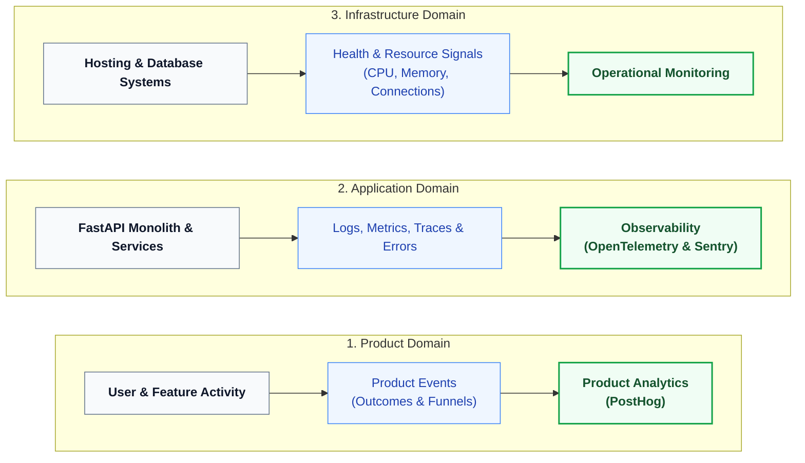
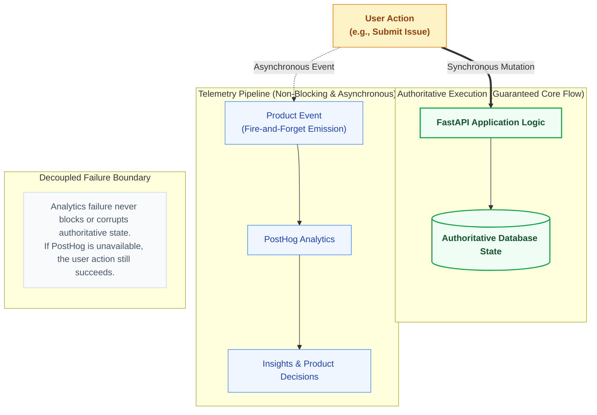
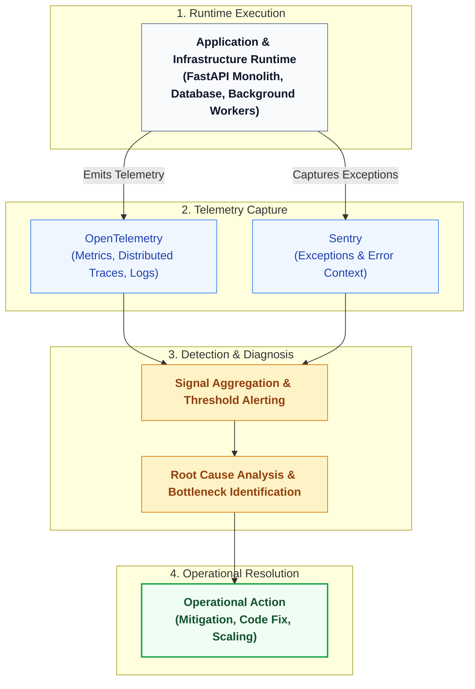
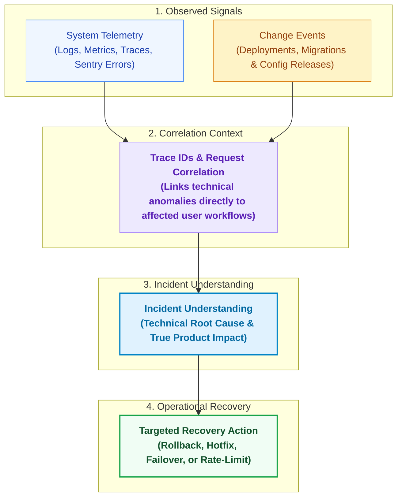
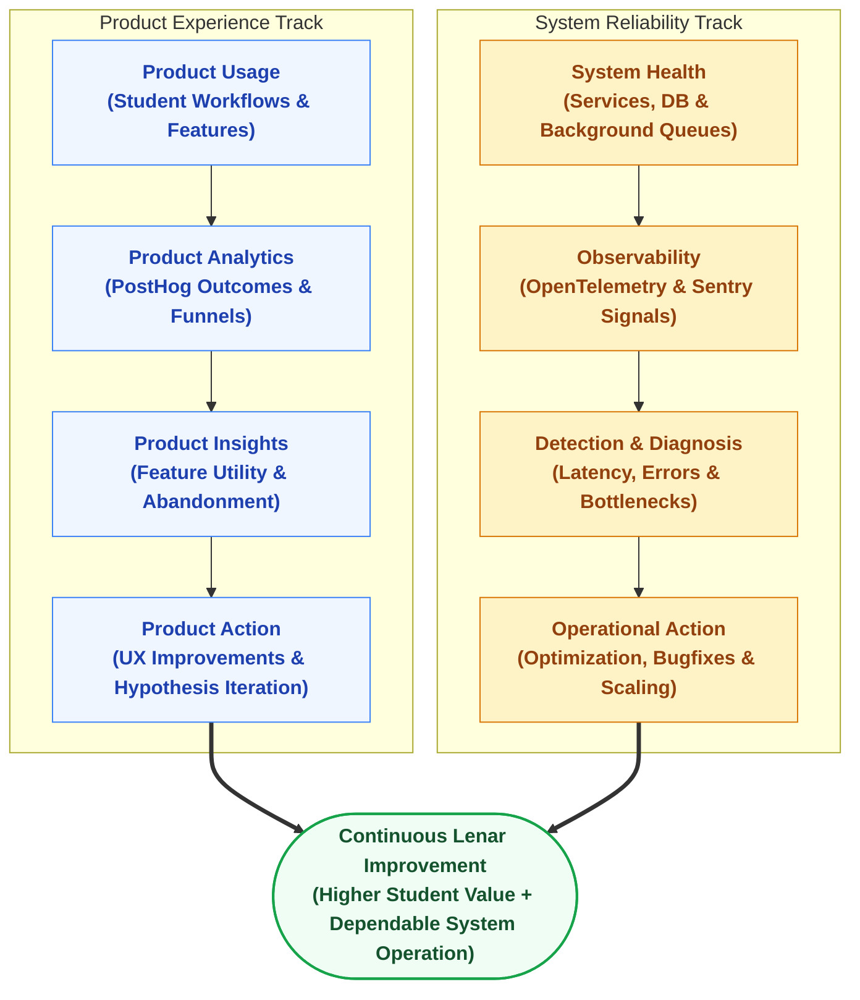

# Lenar — Analytics & Observability

> **Status:** Analytics & Observability Reference  
> **Document:** 13 — Analytics & Observability  
> **Purpose:** Define how Lenar measures product usage, system behavior, performance, errors, reliability, and operational health while maintaining appropriate privacy boundaries and keeping measurement systems separate from authoritative product state.

---

## At a Glance

Lenar needs to know two different things:
> **Are people getting value from the product?**
> **Is the system itself working correctly and reliably?**

These are related, but they are not the same question.

### Product Analytics
Helps us understand what users do, which features are useful, where workflows are abandoned, and whether important product outcomes are occurring over time.

### Observability
Helps us understand whether services are healthy, where requests fail, how long operations take, whether infrastructure is overloaded, and what happened during an incident.

The central principle is:
> **Measure enough to make good decisions, but never collect information merely because it can be collected.**

Analytics and observability are supporting systems. They must never become the authoritative source of product truth, authorization, user identity, security decisions, or transactional correctness.

---

## 1. Measurement Philosophy

Measurement exists to reduce uncertainty. A useful measurement should help answer:
```text
What happened?
Why does it matter?
What decision could this information improve?
```

---

## 2. The Measurement Model

Lenar cleanly separates the measurement of product behavior from the measurement of application and infrastructure health.

### [Measurement Domain Separation]



---

## 3. Product Analytics

Lenar uses **PostHog** for product analytics. 

### 3.1 Event Semantics & Outcomes
Events should represent meaningful product behavior tied to outcomes, not transient UI states. We prefer outcome-oriented measurement over vanity metrics.

| Good Analytics Event | Bad Analytics Event |
|---|---|
| `issue_created` | `button_4_clicked` |
| `announcement_viewed` | `screen_2_opened` |
| `search_performed` | `text_field_focused` |

### 3.2 Onboarding Measurement
Analytics may later measure meaningful onboarding outcomes such as: registration started, verification completed, profile submitted, review completed, approved, rejected, resubmitted, and active. However, analytics do NOT become authoritative for Enrollment, Authorization, Account state, or Community membership.

### 3.3 Analytics Flow and Failure
Analytics explicitly do not modify the authoritative state of the product. 

### [Analytics Flow and Failure Isolation]



**Analytics failure must never be a dependency for core product correctness.** 
If PostHog is unavailable, the analytics signal is degraded, but the authoritative user action (e.g., submitting an issue) must still succeed.

---

## 4. Observability

Lenar uses **Sentry** for error monitoring and **OpenTelemetry** for application telemetry (metrics, traces, and logs).

Observability focuses on system behavior and diagnostic detection. Similar to analytics, observability failure reduces visibility but must not corrupt or block the authoritative product state.

### [Observability Lifecycle and Diagnostic Flow]



---

## 5. Critical Distinctions

A correct mental model of Lenar telemetry preserves these conceptual boundaries:

- **PRODUCT ANALYTICS ≠ OBSERVABILITY**
- **ANALYTICS ≠ AUTHORITATIVE PRODUCT STATE**
- **OBSERVABILITY ≠ AUTHORITATIVE PRODUCT STATE**
- **ANALYTICS ≠ AUTHORIZATION**
- **OBSERVABILITY ≠ AUTHORIZATION**
- **LOGS ≠ AUDIT RECORDS**
- **METRICS ≠ RAW EVENTS**
- **TRACES ≠ PRODUCT ANALYTICS**
- **ERROR MONITORING ≠ PRODUCT ANALYTICS**
- **NOTIFICATION DELIVERY ≠ AUTHORITATIVE STATE**

---

## 6. Privacy & Data Collection

We collect the minimum useful information needed to answer important questions. We do not "track everything."

**We do NOT automatically send:**
- Complete user profiles with every event
- Passwords, credentials, or tokens
- Raw search queries
- Unredacted issue descriptions
- Uploaded file content
- Highly sensitive device/personal information

### 6.1 Retention & Access
Data retention is determined according to usefulness, cost, privacy, security, and legal/operational requirements rather than an infinite default. Production analytics and observability data are protected by least-privilege access, as they can reveal user behavior and security signals.

---

## 7. Metrics & Incident Correlation

Operational metrics capture system dimensions such as request rate, latency, error rate, resource use, queue depth, queue age, database performance, sync health, and overall availability.

During an incident, traces and correlation identifiers connect these technical signals back to actual user impact.

### [Incident Signal Correlation and Recovery Flow]



---

## 8. Alerts & Dashboards

### 8.1 Alerts
Alerts must be actionable. We avoid alerting on every minor warning, noisy thresholds, or conditions that no human needs to respond to. Alert fatigue is an operational failure.

### 8.2 Dashboards
Dashboards are conceptually separated by their audience and purpose. An infrastructure dashboard monitoring PostgreSQL connections should remain distinct from a product dashboard measuring daily active students.

---

## 9. The Combined Model

Product use and system health provide parallel paths toward the same goal: **Lenar Improvement.**

### [Dual-Track Improvement Model: Product Experience and System Reliability]



### 9.1 Experiments & Feature Flags
When evaluating improvements via experimentation, the process requires a formal hypothesis, defined audience, success metric, explicit duration, safety boundary, and clear rollback conditions. Feature flags must have an owner and a review/expiry discipline to prevent permanent technical debt.

### 9.2 Analytics Testing
Analytics instrumentation is code and must be tested. Tests should verify that the correct event fires, incorrect events do not fire, required properties exist, and sensitive properties are explicitly absent.

---

## Related Documentation

- [../product/03-Product-Requirements.md](../01-user-requirements/03-Product-Requirements.md)
- [../product/04-UX-UI.md](../01-user-requirements/04-UX-UI.md)
- [../product/06-Data-Content.md](../01-user-requirements/06-Data-Content.md)
- [../product/07-Security-Privacy-Governance.md](../01-user-requirements/07-Security-Privacy-Governance.md)
- [08-Offline-Sync-Resilience.md](08-Offline-Sync-Resilience.md)
- [09-System-Architecture.md](09-System-Architecture.md)
- [10-Technology-Stack.md](10-Technology-Stack.md)
- [11-Performance-Reliability.md](11-Performance-Reliability.md)
- [12-Testing-Quality.md](12-Testing-Quality.md)
- [14-Infrastructure-Operations.md](14-Infrastructure-Operations.md)
- [../product/15-Legal-Business.md](../01-user-requirements/15-Legal-Business.md)
- [16-Development-Release.md](16-Development-Release.md)
- [../decisions/17-Decisions-Risks-Evolution.md](../decisions/17-Decisions-Risks-Evolution.md)
