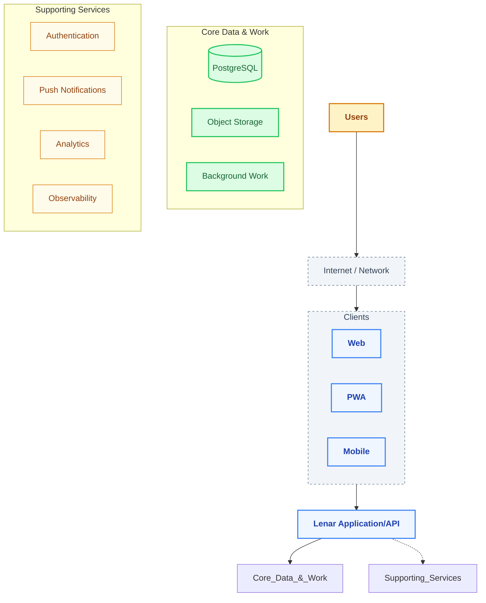
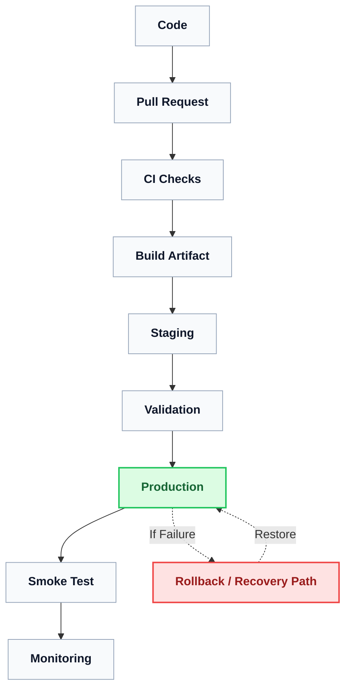
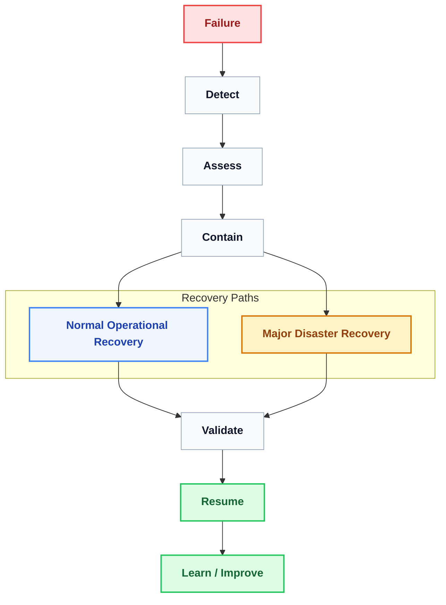

# Lenar — Infrastructure & Operations

> **Status:** Infrastructure & Operations Reference  
> **Document:** 14 — Infrastructure & Operations  
> **Purpose:** Define how Lenar is deployed, where it runs, how environments are separated, how authoritative data is operated, how backups and recovery are handled, how incidents are resolved, and how the infrastructure evolves safely.

---

## At a Glance

Lenar operates on a stable, predictable stack:
- **Backend:** FastAPI + Python
- **Database:** PostgreSQL
- **Object Storage:** Cloudflare R2
- **Authentication:** Lenar-controlled JWT / Credentials / Sessions
- **Push:** Firebase Cloud Messaging
- **Analytics & Observability:** PostHog, Sentry, OpenTelemetry
- **Packaging & CI/CD:** Docker + GitHub Actions

Lenar prefers **managed infrastructure** where it meaningfully reduces operational burden. However, this does not mean "everything must be managed." Operational choices remain evidence-driven, balancing control, cost, and reliability.

---

## 1. Infrastructure Context

Lenar's infrastructure logically separates clients, core data processing, and supporting external services.

---

## 2. Environment Separation

Environments are rigorously separated. We do not use production data casually in development.

```mermaid
flowchart LR
    classDef dev fill:#f1f5f9,stroke:#64748b,stroke-width:2px,color:#334155,font-weight:bold
    classDef stg fill:#fef3c7,stroke:#d97706,stroke-width:2px,color:#92400e,font-weight:bold
    classDef prod fill:#fee2e2,stroke:#ef4444,stroke-width:2px,color:#991b1b,font-weight:bold
    classDef attr fill:#fff,stroke:#cbd5e1,stroke-width:1px,color:#0f172a

    subgraph D[Development]
        direction TB
        D_Data[Data]
        D_Creds[Credentials]
        D_Conf[Configuration]
        D_Dep[Deployment Targets]
        D_Obs[Observability Context]
    end

    subgraph S[Staging]
        direction TB
        S_Data[Data]
        S_Creds[Credentials]
        S_Conf[Configuration]
        S_Dep[Deployment Targets]
        S_Obs[Observability Context]
    end

    subgraph P[Production]
        direction TB
        P_Data[Data]
        P_Creds[Credentials]
        P_Conf[Configuration]
        P_Dep[Deployment Targets]
        P_Obs[Observability Context]
    end

    D ~~~ S
    S ~~~ P

    class D dev;
    class S stg;
    class P prod;
    class D_Data,D_Creds,D_Conf,D_Dep,D_Obs,S_Data,S_Creds,S_Conf,S_Dep,S_Obs,P_Data,P_Creds,P_Conf,P_Dep,P_Obs attr;
```

Each environment isolates its:
- **Data**
- **Credentials and Secrets**
- **Configuration**
- **Observability Context**

---

## 3. Deployment, Migrations, & Rollback

### 3.1 Deployment Flow
Changes move through a strict validation path before reaching production.

### 3.2 Rollback vs. Recovery
**Rollback ≠ Recovery.** 
We do not assume that every release can be automatically rolled back by simply deploying the previous container image. Changes to state—such as database migrations—may make simple application rollback unsafe.

### 3.3 Database Migrations
Migrations are critical operational events. A migration must consider:
- Existing data integrity
- Compatibility with old clients still in the wild
- Compatibility with new clients
- Backup completion prior to execution
- The specific recovery plan if the migration fails

---

## 4. Database & Storage Operations

### 4.1 PostgreSQL (Authoritative Data)
PostgreSQL remains the authoritative source of truth. Operations focus on:
- Availability and connection limits
- Storage growth and indexing health
- Secure transport and encryption
- Version upgrades
- Observability of slow queries and transaction durations

### 4.2 Object Storage (Cloudflare R2)
R2 handles file payloads. Operations must consider access control, storage lifecycle, bandwidth costs, data retention policies, and file integrity.

### 4.3 Backups & Recoverability
**A successful backup job is not proof of recoverability.** 
Restore testing is a mandatory operational requirement. Backups must be secured, isolated from the primary environment, and regularly validated.

---

## 5. Health, Incidents, & Recovery

### 5.1 Health Checks
**Liveness ≠ Readiness.** 
A running process (liveness) is not necessarily a service that is ready to accept traffic or process queue jobs (readiness). Infrastructure routing must respect this distinction.

### 5.2 Recovery Model
Incident response follows a structured path. We explicitly distinguish routine operational recovery from Major Disaster Recovery (which involves catastrophic loss requiring infrastructure restoration or rebuilding).

### 5.3 Business Continuity
Operational resilience is supported by the application architecture itself. Offline mobile capabilities, cached information, and graceful degradation reduce the dependency on a single operational path during an incident.

---

## 6. Observability & Operational Signals

Infrastructure must produce enough signal to accurately determine:
- Overall health and liveness
- Request latency and error rates
- Resource pressure (CPU/RAM/Storage)
- Dependency failures (e.g., FCM, R2)

### 6.1 Offline / Sync Operations
For offline sync mechanisms, infrastructure monitoring must specifically watch:
- Queue growth and queue age
- Sync failure rates
- Conflict rates
- The frequency of required full resynchronizations

*(For the analytics strategy behind these signals, see [13-Analytics-Observability.md](13-Analytics-Observability.md)).*

---

## 7. Security & Access

Infrastructure security relies on:
- Least privilege identity and access management
- Environment isolation (Network and Data)
- Strict secret management (no hardcoded credentials)
- Secure transport (TLS) for all external traffic
- Heavily limited production access, with auditable administrative access

---

## 8. Cost Management

Infrastructure decisions must weigh the cost implications of:
- Compute and scaling
- Database storage and IOPs
- Object storage and outbound bandwidth
- Telemetry retention (Logs, Traces)
- Analytics event volume
- Backup storage

---

## Related Documentation

- [../product/07-Security-Privacy-Governance.md](../product/07-Security-Privacy-Governance.md)
- [08-Offline-Sync-Resilience.md](08-Offline-Sync-Resilience.md)
- [09-System-Architecture.md](09-System-Architecture.md)
- [10-Technology-Stack.md](10-Technology-Stack.md)
- [11-Performance-Reliability.md](11-Performance-Reliability.md)
- [12-Testing-Quality.md](12-Testing-Quality.md)
- [13-Analytics-Observability.md](13-Analytics-Observability.md)
- [../product/15-Legal-Business.md](../product/15-Legal-Business.md)
- [16-Development-Release.md](16-Development-Release.md)
- [../decisions/17-Decisions-Risks-Evolution.md](../decisions/17-Decisions-Risks-Evolution.md)
