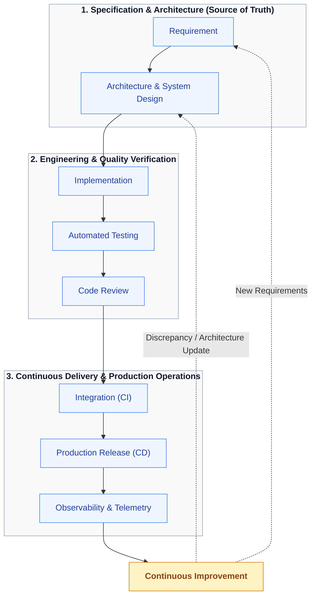
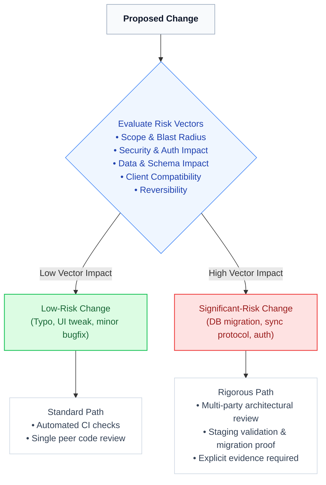
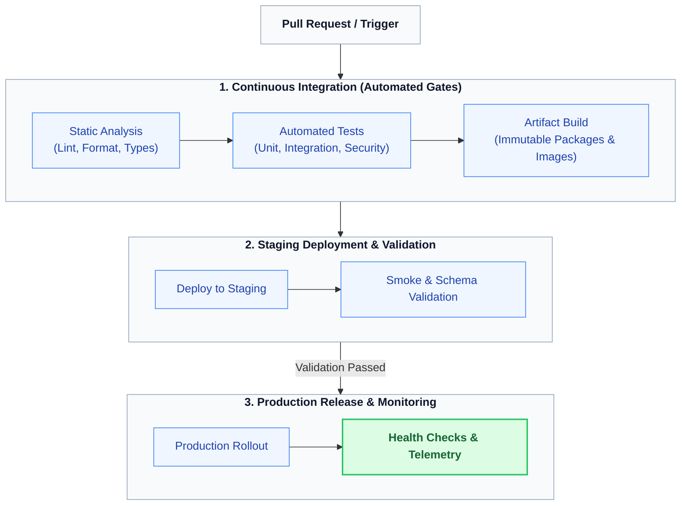
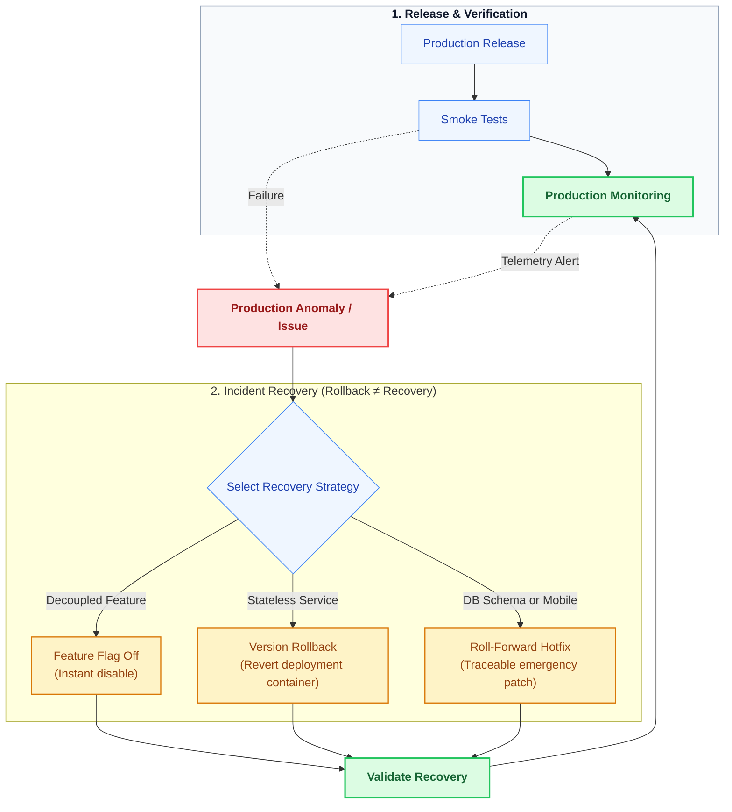

# Lenar — Development & Release

> **Status:** Development & Delivery Reference  
> **Document:** 16 — Development & Release  
> **Purpose:** Define how Lenar is developed, reviewed, integrated, tested, versioned, released, and maintained so that changes can move from implementation to production in a controlled, repeatable, and understandable way.

---

## At a Glance

Lenar needs a development process that makes it possible to move quickly without making the system chaotic. The development strategy aims to balance:

```text
Speed + Quality + Security + Consistency + Traceability + Recoverability
```

---

## 1. Development Philosophy & Source of Truth

The development lifecycle connects requirements to observed production behavior, creating a continuous feedback loop.

### Continuous Development Lifecycle & Feedback Loop



### 1.1 The Source of Truth
- **Canonical documentation** defines product and architecture intent.
- **Code** implements it.

If implementation reveals a contradiction or flaw in the architecture, you must **identify the discrepancy → resolve the decision → update the source of truth.** Do not allow implementation to silently redefine architecture without documentation.

---

## 2. Change Risk Model

Not every change requires identical process depth. A minor typo fix does not require the same scrutiny as a core database migration.

### Change Risk Evaluation Model



- **Small Changes:** Typo, small UI fix, isolated bug fix, minor refactor.
- **Significant Changes:** New capability, domain rule, security change, architecture change, database migration, sync protocol change, or new provider. 

Larger-risk changes require stronger review, explicit validation, and more rigorous evidence.

---

## 3. Code Review

Code review is not merely about formatting and syntax. A high-quality review must evaluate:
- **Correctness** and **Tests**
- **Architecture** and **Maintainability**
- **Security** and **Data Integrity**
- **Failure Handling** (how does it break?)
- **Documentation** (is it updated?)
- **Performance** (where relevant)

---

## 4. CI/CD Flow

Lenar utilizes a structured Continuous Integration and Continuous Deployment pipeline to validate code before it reaches users.

### CI/CD Validation Pipeline



*(Note: The exact CI providers and deployment platforms are implemented in code, but they strictly follow this conceptual validation funnel).*

---

## 5. Compatibility & Versioning

Because Lenar is a multi-platform product, deployment is not atomic. A **new backend** will inevitably coexist with **older mobile clients**. 

Therefore, developers must explicitly consider compatibility for:
- API requests and responses
- Database schemas
- The synchronization protocol
- Authentication tokens and sessions

The project enforces a consistent versioning approach to reflect meaningful compatibility changes and coordinate these lifecycles.

---

## 6. Database Migrations

Database migrations are the highest-risk changes. The lifecycle is:
```text
Create → Test → Review → Stage → Validate → Apply
```
Because of client compatibility, migrations should conceptually follow an **expand-and-contract** pattern where safe to do so, ensuring that the database supports both the old state and the new state simultaneously during the transition window.

---

## 7. Release & Recovery

Production deployments require rapid post-release verification and explicit mitigation strategies tailored to the type of failure.

### Release Verification and Recovery Strategy



### 7.1 Rollback vs. Recovery
**Rollback ≠ Recovery.**
- **Database changes** may not be safely or easily reversible.
- **Mobile rollback** is severely constrained because older app binaries remain installed on student devices long after a new version is released.

Do not claim every release can be "automatically rolled back." Many failures require a "roll-forward" mitigation (a hotfix).

### 7.2 Emergency Releases (Hotfixes)
An emergency does not mean undocumented. Even critical hotfixes must preserve traceability, appropriate automated testing, monitoring, and post-release documentation.

---

## 8. Lifecycles: Feature Flags & Deprecation

### 8.1 Feature Flags
Feature flags allow safe, decoupled releases. However, temporary flags must not remain indefinitely. Their lifecycle is:
```text
Created → Active → Fully Released → Cleanup / Removal
```

### 8.2 Deprecation
When a feature or API is sunset, the process is:
```text
State Reason → Provide Replacement → Identify Affected Consumers → Define Migration Path → Remove
```

---

## 9. Build Security

Development pipelines are privileged environments. We explicitly protect:
- Repository integrity (branch protections)
- CI and deployment credentials
- Mobile signing certificates
- Environment secrets
- Build artifacts

---

## Related Documentation

- [../product/01-Lenar-Foundation.md](../01-user-requirements/01-Lenar-Foundation.md)
- [../product/03-Product-Requirements.md](../01-user-requirements/03-Product-Requirements.md)
- [09-System-Architecture.md](09-System-Architecture.md)
- [10-Technology-Stack.md](10-Technology-Stack.md)
- [11-Performance-Reliability.md](11-Performance-Reliability.md)
- [12-Testing-Quality.md](12-Testing-Quality.md)
- [13-Analytics-Observability.md](13-Analytics-Observability.md)
- [14-Infrastructure-Operations.md](14-Infrastructure-Operations.md)
- [../product/15-Legal-Business.md](../01-user-requirements/15-Legal-Business.md)
- [../decisions/17-Decisions-Risks-Evolution.md](../decisions/17-Decisions-Risks-Evolution.md)
