# Lenar — Decisions, Risks & Evolution

> **Status:** Decision & Evolution Reference  
> **Document:** 17 — Decisions, Risks & Evolution  
> **Purpose:** Record why important Lenar decisions were made, what assumptions and risks surround them, how technical debt and future change are managed, when existing decisions should be reconsidered, and how the system evolves without losing architectural coherence.

---

## At a Glance

Lenar will change. Requirements, technology, and environments evolve. This document ensures that change remains deliberate, explainable, traceable, evidence-driven, and reversible where practical. 

> **A decision should be understandable not only when it is made, but also months or years later when someone needs to question, change, or replace it.**

---

## 1. Core Principle

We do not pretend that architecture or technology is permanent. The engineering approach is:
```text
Choose deliberately.
Document honestly.
Measure continuously.
Reconsider when evidence changes.
```

## 2. Vocabulary & Distinctions

To evaluate a system accurately, the language must be precise. Do not merge these concepts:
- **FACT:** Observed and established.
- **DECISION:** A deliberate choice between alternatives.
- **ASSUMPTION:** A belief not yet fully validated by evidence.
- **REQUIREMENT:** A condition that must be satisfied.
- **CONSTRAINT:** A limitation on available choices.

---

## 3. Architecture Decision Records (ADRs)

For decisions that are difficult to reverse, we use Architecture Decision Records (ADRs). 

ADRs should be created for choices that materially affect:
- Core architecture and security
- Data authority and synchronization protocols
- Major technology frameworks or provider dependencies

**Do NOT create ADRs for every tiny coding decision.** ADRs are conceptually stored under `docs/adr/`. 



---

## 4. Current Major Decisions

The following are the established, current technological decisions for Lenar. *Do not introduce new core technologies without a formal architectural decision.*

| Domain | Technology / Strategy |
|---|---|
| **Architecture** | Modular monolith |
| **Web** | React + TypeScript + Vite |
| **Mobile** | Flutter + Dart |
| **Backend** | FastAPI + Python |
| **Validation** | Pydantic |
| **Data Access & Migrations** | SQLAlchemy 2.x & Alembic |
| **Database** | PostgreSQL |
| **Mobile Local Persistence** | SQLite-based |
| **Authentication** | Lenar-controlled JWT / Credentials / Sessions |
| **Authorization** | Lenar server-side authorization |
| **Object Storage** | Cloudflare R2 |
| **Push Notifications** | Firebase Cloud Messaging |
| **Analytics & Observability** | PostHog, Sentry, OpenTelemetry |
| **CI/CD & Packaging** | GitHub Actions, Docker |

> [!NOTE]
> **Mobile Framework Note:** Flutter is the selected mobile framework. We do not continuously reopen the debate against alternatives (e.g., KMP, React Native) unless explicit, severe, evidence-driven reconsideration triggers are hit.

---

## 5. Evidence & Evolution

### 5.1 Evidence Hierarchy
We weigh evidence according to the following preference hierarchy:
```text
Production evidence
↓
Controlled benchmark / testing
↓
Representative user evidence
↓
Development experience
↓
Technical reasoning
↓
Preference
```

### 5.2 Evolutionary Change
We do not encourage constant architectural churn. Evolution follows a disciplined path:
```text
Current State → Observed Problem → Evidence → Smallest Effective Change → Measure → Adopt or Reconsider
```

---

## 6. Risk Management & Technical Debt

### 6.1 Risk
**Risk ≠ Issue.** An issue is a problem occurring now; a risk is a future possibility.
`Risk = Probability × Impact`



### 6.2 Technical Debt
We explicitly distinguish between **intentional debt** (taken deliberately to meet a deadline with a known cost) and **unintentional debt** (accrued through poor quality or misunderstanding).

All recorded technical debt should have a reason, documented impact, risk, assigned owner, and a clear repayment trigger. We do not maintain giant debt registers full of invented or trivial items.

---

## 7. Decision Dependencies & Change Impact

Major decisions rarely exist in isolation; they influence the entire system topology.



Consequently, a significant architectural or technological change has a massive impact surface that must be explicitly reviewed across disciplines.



---

## 8. AI Governance

AI agents and tools may actively assist in implementation and decision exploration. However, **AI must not silently:**
- Invent architecture
- Reverse approved decisions
- Invent business rules
- Introduce unsupported technologies
- Resolve unresolved requirements without explicit human authorization

The correct flow when utilizing AI is:
```text
Canonical Documentation → Approved Decision → Implementation → Verification
```

If an AI identifies a gap in the architecture or requirements, it must:
```text
Identify Gap → Do Not Invent → Request Decision Resolution → Update Source of Truth → Implement
```

---

## 9. Documentation Drift

When the documented architecture and the codebase diverge:
**Documented Architecture ≠ Actual Implementation**

This divergence is treated as a defect requiring attention, not as acceptable collateral damage. The codebase implements the architecture; it does not silently redefine it.

---

## Related Documentation

- [../product/01-Lenar-Foundation.md](../product/01-Lenar-Foundation.md)
- [../product/03-Product-Requirements.md](../product/03-Product-Requirements.md)
- [../architecture/05-Platform.md](../architecture/05-Platform.md)
- [../product/06-Data-Content.md](../product/06-Data-Content.md)
- [../product/07-Security-Privacy-Governance.md](../product/07-Security-Privacy-Governance.md)
- [../architecture/08-Offline-Sync-Resilience.md](../architecture/08-Offline-Sync-Resilience.md)
- [../architecture/09-System-Architecture.md](../architecture/09-System-Architecture.md)
- [../architecture/10-Technology-Stack.md](../architecture/10-Technology-Stack.md)
- [../architecture/11-Performance-Reliability.md](../architecture/11-Performance-Reliability.md)
- [../architecture/12-Testing-Quality.md](../architecture/12-Testing-Quality.md)
- [../architecture/13-Analytics-Observability.md](../architecture/13-Analytics-Observability.md)
- [../architecture/14-Infrastructure-Operations.md](../architecture/14-Infrastructure-Operations.md)
- [../product/15-Legal-Business.md](../product/15-Legal-Business.md)
- [../architecture/16-Development-Release.md](../architecture/16-Development-Release.md)
