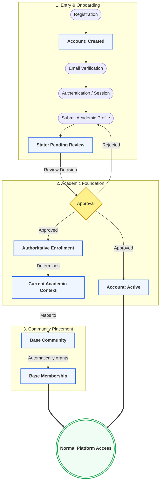

# How a Student Moves Through Lenar

This document serves as the central conceptual guide to the Lenar foundation. It illustrates the primary behavioural flow, showing how a user moves from registration to normal platform access, and what major system conditions determine whether that access is available.

To make the system easy to understand at first glance, the model is divided into two parts:
1. **The Student Journey**: How a person moves from initial registration to becoming an active student.
2. **Access and Authority**: The specific system conditions evaluated before granting platform access or allowing administrative actions.

### Diagram A: The Student Journey
This flow shows the chronological path a new user takes. Notice that important system states (like *Account Active* or *Enrollment*) are only established after explicit approval.

*(Reference Diagram:)*



### Diagram B: What Determines Normal Access
This diagram shows the static checkpoints the system evaluates when a user attempts to do something. It separates the baseline requirements for normal access from the strict evaluation of Governance Authority.

*(Reference Diagram:)*

```mermaid
flowchart TD
    classDef condition fill:#eff6ff,stroke:#2563eb,stroke-width:2px,font-weight:bold
    classDef decision fill:#fef08a,stroke:#ca8a04,stroke-width:2px
    classDef allow fill:#f0fdf4,stroke:#16a34a,stroke-width:3px,font-weight:bold
    classDef deny fill:#fef2f2,stroke:#dc2626,stroke-width:3px,font-weight:bold

    subgraph 1. Baseline Identity Conditions
        direction TB
        Act[Account is Active]:::condition
        Sess[Valid Authentication Session]:::condition
        Enr[Authoritative Enrollment Exists]:::condition
        Ctx[Current Academic Context]:::condition
        Mem[Base Community Membership]:::condition
    end
    
    subgraph 2. Governance Authority
        direction TB
        Gov[Governance Assignment]:::condition --> Role[Role + Authority Context]:::condition
    end

    1. Baseline Identity Conditions --> Authz
    Role -.->|Optional: If performing admin actions| Authz
    
    Authz{Authorization Engine}:::decision
    Authz -->|All conditions met & scope valid| Allow(((ALLOW: Platform Access))):::allow
    Authz -->|Missing condition, mismatch, or revoked| Deny(((DENY: Access Blocked))):::deny
```


---

## 1. The Core Conceptual Flow

The system evaluates user state through a structured progression. While domains are independent, their conceptual flow follows this pipeline:

**REGISTRATION**
↓
**ACCOUNT CREATED**
↓
**EMAIL VERIFICATION**
↓
**AUTHENTICATION / SESSION**
↓
**ONBOARDING**
↓
**ACADEMIC PROFILE**
↓
**PROFILE SUBMISSION**
↓
**PENDING REVIEW**
↓
**APPROVAL**

### The Critical Approval Fan-Out
When Onboarding reaches the Approval state, the system fans out to establish the user's permanent foundation:
**APPROVAL**
├── **Account Lifecycle** → Becomes Active
└── **Enrollment** → Authoritative attachment established

### Establishing Context
Once enrolled, the user requires an academic context.
**ENROLLMENT**
↓
**CURRENT ACADEMIC CONTEXT**
↑ &nbsp;&nbsp;&nbsp;&nbsp;&nbsp;&nbsp;&nbsp;&nbsp;&nbsp;&nbsp;&nbsp;&nbsp;&nbsp;&nbsp;&nbsp;&nbsp; ↑
**ORGANIZATION** &nbsp;&nbsp;&nbsp;&nbsp; **ACADEMIC TIME**

### Community and Participation
The context defines where the user belongs.
**CURRENT ACADEMIC CONTEXT**
↓
**BASE COMMUNITY**
↓
**BASE MEMBERSHIP**
↓
**NORMAL PLATFORM ACCESS**

### Authority and Access
Separate from participation, the system manages permissions.
**GOVERNANCE**
↓
**ROLE + AUTHORITY CONTEXT**
↓
**AUTHORIZATION**
↓
**ALLOW / DENY**

---

## 2. Critical Interconnections

The pipeline above is not a simple linear flow; domains continuously interact:

- **Account Lifecycle → Authentication:** Account status dictates session validity. If an account is suspended, affected sessions are invalidated, and new authentication is denied.
- **Account Lifecycle → Authorization:** If an account is suspended, all protected operations are automatically denied, regardless of prior governance assignments.
- **Onboarding → Account Lifecycle:** The Approval decision in Onboarding triggers the Account Lifecycle to transition to Active.
- **Onboarding → Enrollment:** The Approval decision triggers the creation of the user's authoritative Enrollment record.
- **Organization → Enrollment:** Organization provides the valid institutional structure. Enrollment attaches the user to that structure.
- **Academic Time → Enrollment:** Academic Time provides the temporal framework. Enrollment uses it to form the Current Academic Context.
- **Organization + Academic Time + Enrollment:** Organization provides "where", Academic Time provides "when", and Enrollment combines them with "who" and "Level" to form a complete Academic Context, without merging into a single domain.
- **Enrollment → Community:** The Current Academic Context determines the user's relationship to their Base Community.
- **Community → Membership:** Being placed in a Base Community automatically establishes Base Membership for the user.
- **Community → Governance:** Base Community provides the target/context boundary within which Leader authority can exist.
- **Governance → Authorization:** Governance establishes WHO has authority and WHERE (the assignment).
- **Authorization:** Decides WHAT an actor may do based on RBAC, Scope, and Context.
- **Membership → Authorization:** Membership may contribute contextual awareness to an authorization decision, but it does NOT inherently grant governance authority.

---

## 3. What Does NOT Automatically Happen

To preserve boundaries and prevent dangerous cascading side-effects, the following rules are explicitly enforced. **These negative rules are critical to understanding the system:**

- **Email Verification ≠ Account Active:** Verifying an email proves ownership; it does not approve the account for platform use.
- **Account Active ≠ Normal Platform Access:** An active account without a valid Base Community still cannot access standard platform features.
- **Pending Review ≠ Account Suspension:** Being under review is a normal onboarding state, not a punitive account lifecycle state.
- **Rejection ≠ Account Suspension:** Rejection returns the user to Profile Completion; it does not suspend the account.
- **Session Expiration ≠ Enrollment destruction:** Losing a session only requires re-authentication.
- **Session Expiration ≠ Onboarding reset:** Progress is saved server-side.
- **Academic Time advancement ≠ automatic Level promotion:** Changing the calendar does not automatically promote students to the next level.
- **Academic Time advancement ≠ automatic Governance revocation:** Session transitions do not strip Leaders of their roles.
- **Carried Course ≠ Level change:** Registering for a lower-level course does not downgrade a student's core academic Level.
- **Carried Course ≠ Base Community change:** The student remains anchored in their primary Level's community.
- **Organization change ≠ automatic Enrollment rewrite:** Renaming or restructuring a department does not silently alter historical enrollments.
- **Organization change ≠ automatic Community deletion:** Structural changes require managed transitions, not cascading deletes.
- **Organization change ≠ automatic Governance revocation:** Reorganizing a faculty does not automatically fire its administrators.
- **Membership ≠ Governance authority:** Being in a community does not make you a leader of it.
- **Governance Assignment ≠ Authorization permission:** An assignment is a record of authority; Authorization is the real-time evaluation engine.
- **Authorization ≠ Governance assignment:** The policy engine evaluates, it does not assign roles.
- **Account Suspension ≠ Enrollment deletion:** Suspended students remain enrolled conceptually; they are just barred from platform access.
- **Account Suspension ≠ Governance-history deletion:** Suspension halts the exercise of authority but retains the historical assignment.
- **Closed Account ≠ physical data deletion:** Closure is a status change; data deletion is a separate legal/compliance process.
- **Client state ≠ server authority:** The client can never dictate truths about Organization, Time, Enrollment, or Authority.

---

## 4. Master System Model — Real Examples

### Example A — New Registration
User registers → Account Created → Verification email sent → User verifies → System generates a new authenticated session → User enters Profile Completion.

### Example B — Leaves and returns unverified
Account Created, but Email not verified. User leaves. Returns later → attempts login → System demands Verification required before proceeding.

### Example C — Verified but incomplete
Account Created, Email Verified, Profile Incomplete. User returns later → Login → State-aware resume → User lands precisely back in Profile Completion.

### Example D — Pending review
Profile submitted → State becomes Pending Review. User leaves. Returns → Login → System recognizes Pending Review and blocks normal access, showing status.

### Example E — Approved
Approval → Account becomes Active → Enrollment established → Academic Context formulated → Base Community identified → Base Membership created → Normal Access granted.

### Example F — Missing Base Community
Approval ✅, Account Active ✅, Enrollment ✅, Academic Context ✅, but Base Community ❌ (e.g., the specific department/level combination hasn't been configured by Admin).
→ Normal platform access is unavailable. 
When an Admin creates the Base Community → matching Base Memberships are established → normal access becomes eligible.

### Example G — Academic Progression
A student is 300L / Session A / Semester 2. 
→ Academic Time changes to Session B. 
→ Progression rules (external to Time domain) evaluate and determine advancement. 
→ Student becomes 400L / Session B / Semester 1. 
→ Same Active Enrollment record updates. 
→ Base Community changes according to new Current Academic Context.

### Example H — Carryover
A 400L student registers for a 300L carried course. 
→ Student remains 400L. 
→ Student remains in 400L Base Community. 
→ No downgrade to 300L occurs.

### Example I — Governance
Super Admin → assigns Admin to University X.
Admin → assigns Leader to Base Community Y. The Candidate's authoritative Academic Context must exactly match Y.
Leader → assigns Sub-Leader / Manager / Writer. The candidate must be a current member of Base Community Y.

### Example J — Revocation
Leader is revoked → Leader authority ends immediately.
Sub-Leader / Manager / Writer → remain recorded and active unless they are separately explicitly revoked. (No cascading revocation).

### Example K — Suspension
Active Account is Suspended.
Authentication → current sessions are invalidated / future authentication is denied.
Authorization → protected operations are denied.
Enrollment → remains intact (not silently destroyed).
Governance history → remains intact.
