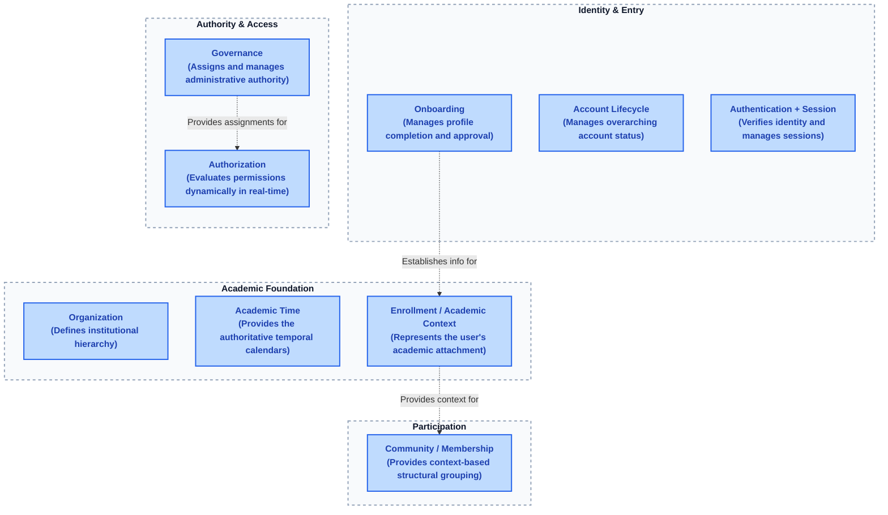

# Nine-Domain Map

The Lenar foundation is divided into nine explicit behavioural domains to ensure clear ownership, prevent monolithic coupling, and enforce strict boundaries. 

This conceptual map organizes the domains into four logical groups to help you orient yourself. Note that these groups are for presentation only—they are not architectural layers or sequential pipeline steps.

*(Reference Diagram:)*

Below is the baseline ownership for each domain:

### 1. Account Lifecycle
- **Purpose:** Manages the overarching status of a user's account.
- **Owns:** Account state (Created, Active, Suspended, Closed).
- **Consumes:** Onboarding approval (to become Active).
- **Does not own:** Authentication, Session, Onboarding logic, or Authorization logic.
- **Important Invariants:** Account Active ≠ Normal Platform Access. Account closure/suspension does not silently physically delete historical enrollment or governance records.
- **Canonical specification:** [Account Lifecycle Specification](../specifications/account-lifecycle/account-lifecycle-specification.md)

### 2. Authentication / Session
- **Purpose:** Verifies identity and issues/manages secure sessions.
- **Owns:** Identity verification, session tokens, session lifecycle.
- **Consumes:** Account Lifecycle state (to invalidate/deny on suspension).
- **Does not own:** Account states, Onboarding progression, Authorization policies.
- **Important Invariants:** Authentication ≠ Authorization. Session expiration does not reset Enrollment or Onboarding.
- **Canonical specification:** [Authentication Specification](../specifications/authentication/authentication-specification.md)

### 3. Onboarding
- **Purpose:** Manages the funnel from initial registration through profile completion and review to final approval.
- **Owns:** Registration, profile data gathering, review status, the Approval decision.
- **Consumes:** Authentication state (for state-aware return).
- **Does not own:** Account Lifecycle state machine, Enrollment records.
- **Important Invariants:** Pending Review ≠ Account Suspension. Rejection ≠ Suspension. 
- **Canonical specification:** [Onboarding Specification](../specifications/onboarding/onboarding-specification.md)

### 4. Organization
- **Purpose:** Defines the authoritative institutional hierarchy and relationships.
- **Owns:** University, Faculty (where applicable), Department, valid institutional relationships, and University-specific organization models.
- **Consumes:** Nothing (it is the root context provider).
- **Does not own:** Academic Time, Enrollment, Community, Academic Context.
- **Important Invariants:** Organization is University-relative (no universal rigid hierarchy). Organization ≠ Academic Context.
- **Canonical specification:** [Organization Specification](../specifications/organization/organization-specification.md)

### 5. Academic Time
- **Purpose:** Provides the authoritative temporal framework (calendars).
- **Owns:** Academic Session, Semester/Term, Configured Future Periods, Current Effective Period, Historical Periods.
- **Consumes:** Organization (belongs to a specific University).
- **Does not own:** Academic progression algorithms, Level, Enrollment, Community.
- **Important Invariants:** Configured Future ≠ Current Effective. Academic Time advancement ≠ automatic Level promotion. Academic Time ≠ Progression.
- **Canonical specification:** [Academic Time Specification](../specifications/academic-time/academic-time-specification.md)

### 6. Enrollment
- **Purpose:** Represents the user's authoritative academic attachment and generates their current context.
- **Owns:** Academic attachment, Current Academic Context formulation (Level).
- **Consumes:** Organization (for structure), Academic Time (for current period), Onboarding (for initial establishment).
- **Does not own:** Institutional structure (Organization), Temporal framework (Academic Time), Community groupings.
- **Important Invariants:** Enrollment ≠ Organization. Level ≠ Course participation. Normal progression updates Enrollment; it does not create a totally new, disconnected Enrollment record.
- **Canonical specification:** [Enrollment Specification](../specifications/enrollment/enrollment-specification.md)

### 7. Community / Membership
- **Purpose:** Provides structural grouping and context-based participation for users.
- **Owns:** Community entities, Membership records, Base Community assignments.
- **Consumes:** Academic Context (from Enrollment).
- **Does not own:** Institutional hierarchy (Organization), Governance authority.
- **Important Invariants:** Community ≠ Organization. Membership ≠ Governance. Base Membership is automatic based on context. Missing Base Community blocks normal access without invalidating Enrollment.
- **Canonical specification:** [Community Membership Specification](../specifications/community/community-membership-specification.md)

### 8. Governance
- **Purpose:** Assigns and manages administrative authority.
- **Owns:** Governance Assignments (User + Role + Authority Context), Leader/Subordinate assignment lifecycle.
- **Consumes:** Organization/Community (for target context), Enrollment (to validate Leader eligibility).
- **Does not own:** Authorization evaluation engine, Membership.
- **Important Invariants:** Role ≠ Permission. Governance revocation is non-cascading. Academic progression does not automatically revoke Governance.
- **Canonical specification:** [Governance Specification](../specifications/governance/governance-specification.md)

### 9. Authorization
- **Purpose:** Evaluates permissions dynamically in real-time.
- **Owns:** Permission evaluation logic (ALLOW / DENY).
- **Consumes:** Governance Assignment (Roles), Context, Scopes, Account Lifecycle state.
- **Does not own:** Governance Assignment creation, Account states.
- **Important Invariants:** Authorization = RBAC + Scope + Context. Default Authorization = DENY. 
- **Canonical specification:** [Authorization Specification](../specifications/authorization/authorization-specification.md)
