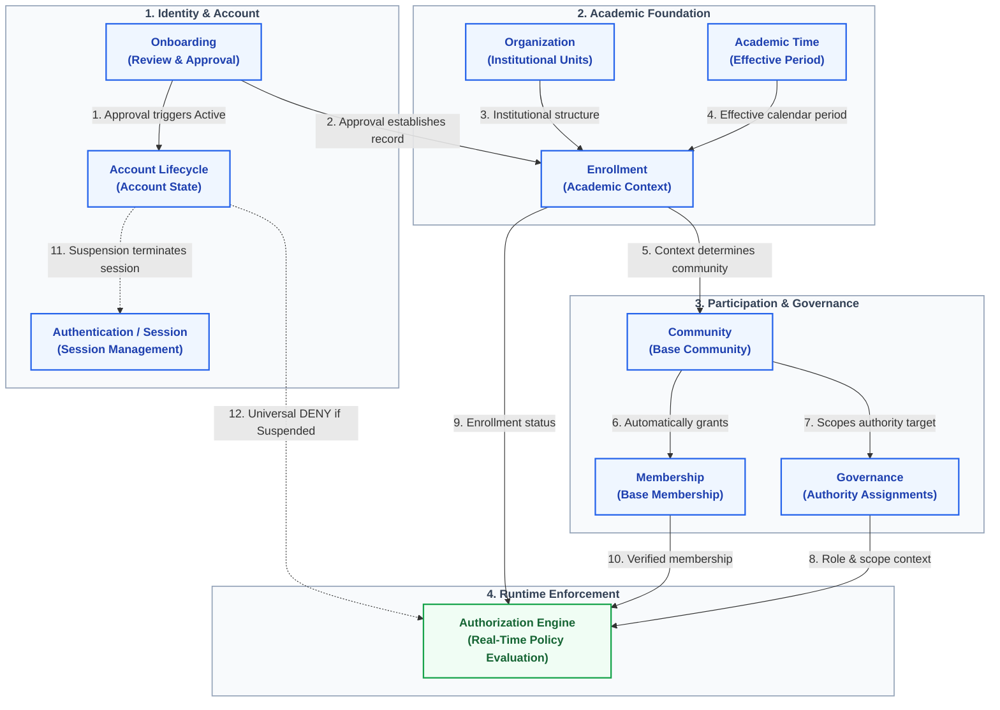
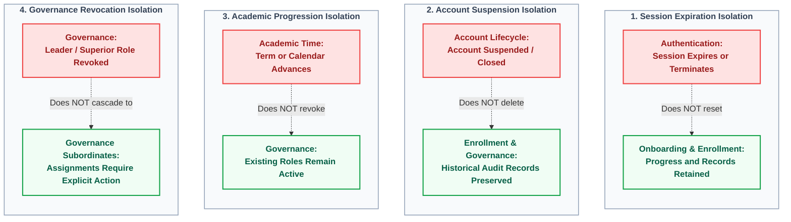

# Domain Relationships

This document details how the nine foundational domains interact. 

To maintain clear system boundaries without creating monolithic interdependencies, domain interactions are divided into two complementary perspectives:
1. **Context and Dependency Flow**: How upstream events trigger state changes and supply runtime context to downstream domains.
2. **Non-Cascading Boundary Invariants**: Explicit architectural guarantees that prevent lifecycle and session disruptions from propagating across boundaries.

### Diagram A: Authoritative Domain Context and Dependency Flow

# [Authoritative Domain Context and Dependency Flow]
This diagram illustrates how identity approval propagates into academic context, community placement, and runtime authorization enforcement across the foundational domains.

*(Reference Diagram:)*

### Diagram B: Non-Cascading Boundary Invariants

# [Non-Cascading Boundary Invariants]
This diagram illustrates the explicit isolation boundaries that prevent lifecycle and session events in one domain from automatically cascading into destructive updates in others.

*(Reference Diagram:)*

### Onboarding → Account Lifecycle
- **Relationship:** Influences / Triggers.
- **Why:** Onboarding manages the review process; Account Lifecycle manages the state.
- **Flow:** When Onboarding reaches an `Approval` decision, it signals Account Lifecycle to transition the account from `Created` to `Active`.
- **What does NOT cross:** Onboarding does not manage the Account Lifecycle state machine directly.

### Onboarding → Enrollment
- **Relationship:** Establishes.
- **Why:** Enrollment cannot exist for unapproved users.
- **Flow:** The `Approval` decision in Onboarding triggers the initial establishment of the user's Enrollment record.
- **What does NOT cross:** Once established, Enrollment handles progression. Onboarding does not manage ongoing academic changes.

### Organization → Enrollment
- **Relationship:** Provides context.
- **Why:** Enrollment must attach a user to valid institutional units.
- **Flow:** Organization provides the valid University, Faculty, and Department structures. Enrollment consumes this to ensure the academic attachment is valid.
- **What does NOT cross:** Enrollment does not create or mutate organizational units.

### Academic Time → Enrollment
- **Relationship:** Provides temporal framework.
- **Why:** Academic context must be anchored in time.
- **Flow:** Academic Time provides the Current Effective Period. Enrollment consumes this to formulate the user's Current Academic Context.
- **What does NOT cross:** Enrollment does not alter the academic calendar.

### Enrollment → Community
- **Relationship:** Determines / Influences.
- **Why:** A user's Base Community is dictated by their academic position.
- **Flow:** Enrollment formulates the Current Academic Context. That context determines which Base Community the user belongs to.
- **What does NOT cross:** Enrollment does not directly create Community records.

### Community ↔ Membership
- **Relationship:** Owns / Contains.
- **Why:** Users need a representation of their participation within a Community.
- **Flow:** The Community domain automatically establishes Base Membership when a user matches a Base Community.
- **What does NOT cross:** Membership does not redefine the Community structure.

### Community ↔ Governance
- **Relationship:** Provides target context.
- **Why:** Governance Assignments (like Leader) need a scope.
- **Flow:** Community provides the target boundary (the specific Base Community). Governance uses this to scope the Assignment.
- **What does NOT cross:** Community does not assign roles. Membership does not automatically grant Governance authority.

### Governance → Authorization
- **Relationship:** Provides authority context.
- **Why:** The policy engine needs to know who holds what role.
- **Flow:** Governance establishes the Governance Assignment (User + Role + Target). Authorization evaluates this assignment at runtime.
- **What does NOT cross:** Governance does not execute the ALLOW/DENY decision. 

### Enrollment → Authorization
- **Relationship:** Contributes context.
- **Why:** Some policies may require a user to have an active Enrollment.
- **Flow:** Enrollment status is evaluated as part of the Authorization Context.

### Membership → Authorization
- **Relationship:** Contributes context.
- **Why:** Access to specific community features requires verified membership.
- **Flow:** Membership status is evaluated as part of the Authorization Context.

### Account Lifecycle → Authentication
- **Relationship:** Constrains.
- **Why:** Suspended/Closed accounts must not be able to log in.
- **Flow:** If Account Lifecycle changes to `Suspended`, it forces Authentication to invalidate existing sessions and deny future attempts.

### Account Lifecycle → Authorization
- **Relationship:** Overrides / Constrains.
- **Why:** A suspended user might still hold a Governance Assignment historically, but must not be allowed to act.
- **Flow:** Account status is consumed by Authorization. A `Suspended` state results in a universal DENY for protected operations.
