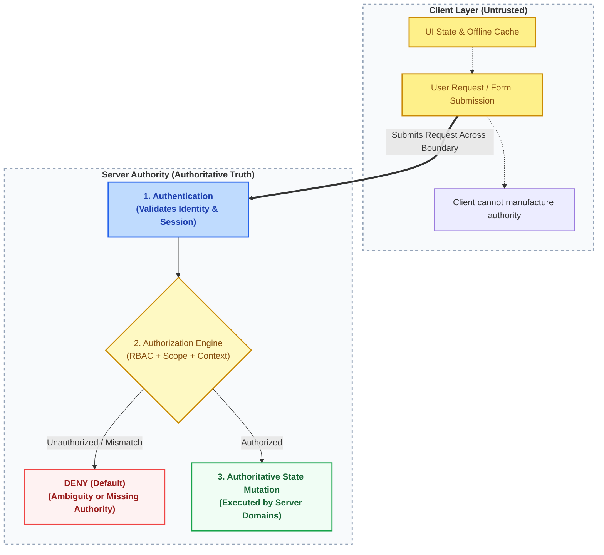
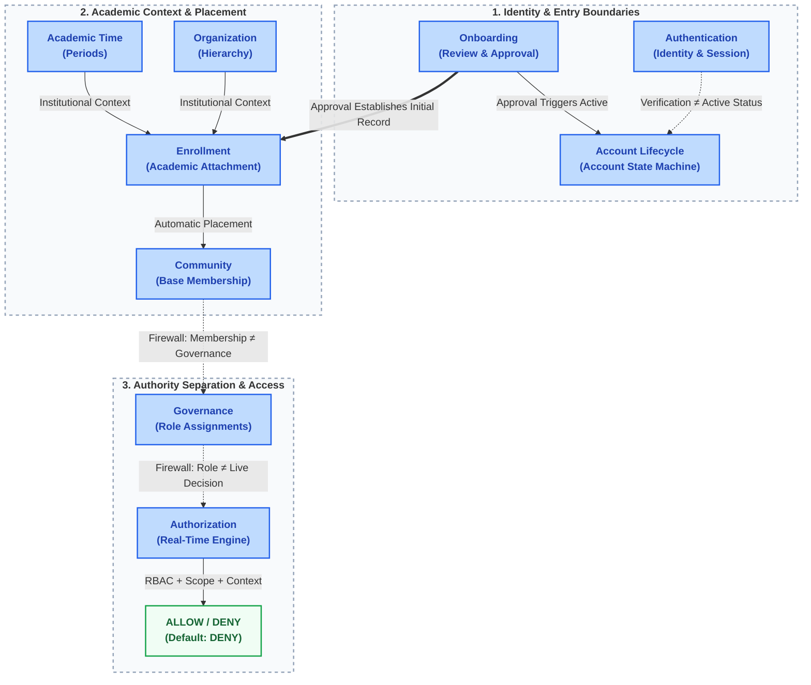

# Decision and Boundary Map

This map explicitly defines the responsibilities and boundaries of each domain.

### Diagram A: Client vs. Server Authority Boundary
This diagram illustrates the fundamental trust boundary where untrusted client inputs must pass through server-side authentication and authorization before any authoritative state mutation can occur.

*(Reference Diagram:)*

### Diagram B: Domain Responsibility & Decision Boundaries
This diagram illustrates the explicit boundaries separating domains, highlighting where authority transfers and where strict firewalls prevent cross-domain overreach.

*(Reference Diagram:)*

## Domain Responsibility Map

| Domain | What it Decides | What it NEVER Decides |
|---|---|---|
| **Account Lifecycle** | The overarching state of the account (Created, Active, Suspended, Closed). | Onboarding review outcomes; Authorization logic. |
| **Authentication** | Who the user is, and if their session is valid. | Whether the account is active; What the user is allowed to do. |
| **Onboarding** | Registration data capture, profile review, and the Approval decision. | Ongoing academic progression; The Account state machine. |
| **Organization** | The authoritative institutional hierarchy and valid relationships. | What Academic Time it is; A user's academic context. |
| **Academic Time** | The authoritative academic periods and effective transitions. | Level promotion; Enrollment creation. |
| **Enrollment** | The user's authoritative academic attachment. | The existence of Organization units; The calendar. |
| **Community** | The grouping and participation structures. | Governance authority; Institutional hierarchy. |
| **Governance** | Who holds which administrative roles in which contexts. | The real-time ALLOW/DENY permission decision. |
| **Authorization** | The real-time evaluation of permissions (ALLOW/DENY). | Who gets assigned a role; The Account state. |

---

## Major Locked Decisions

The following foundational decisions form the baseline of the current working model. While they are **not immutable forever**, they represent the established foundation and require rigorous cross-domain assessment if challenged.

| Decision | Impact / Meaning |
|---|---|
| **Approval → Account Active** | Onboarding approval triggers the account to become Active. |
| **Approval → Enrollment** | Onboarding approval triggers the initial Enrollment record. |
| **Email Verification → Authentication only** | Verification proves identity; it does not approve platform access. |
| **Base Community = University + Dept + Level** | The primary academic community relies on this specific context. |
| **Base Membership = automatic** | Users are placed into their Base Community automatically via context. |
| **Level ≠ Course participation** | Level is a first-class concept; taking a lower-level course does not change your core Level. |
| **Academic Time ≠ automatic Level promotion** | Calendar advancement does not automatically promote students. |
| **Academic progression ≠ Governance revocation** | Normal progression does not automatically fire a Leader. |
| **Leader eligibility = authoritative Context match** | Candidates must match the Base Community's authoritative Academic Context. |
| **Subordinate eligibility = current Base Membership** | Managers/Writers must be members of the community they serve. |
| **Governance revocation = non-cascading** | Removing a Leader does not automatically remove their subordinates. |
| **Authorization = RBAC + Scope + Context** | Permissions require role, correct scope, and valid context. |
| **Default Authorization = DENY** | Ambiguity, missing context, or missing authority always results in DENY. |
| **Client = untrusted** | The client cannot manufacture authoritative state. |
| **Server = authoritative** | The server evaluates and owns the truth. |
