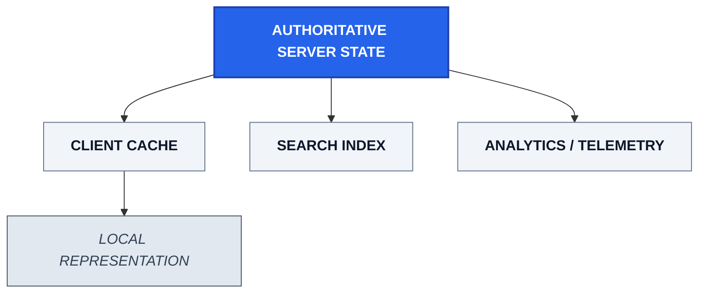
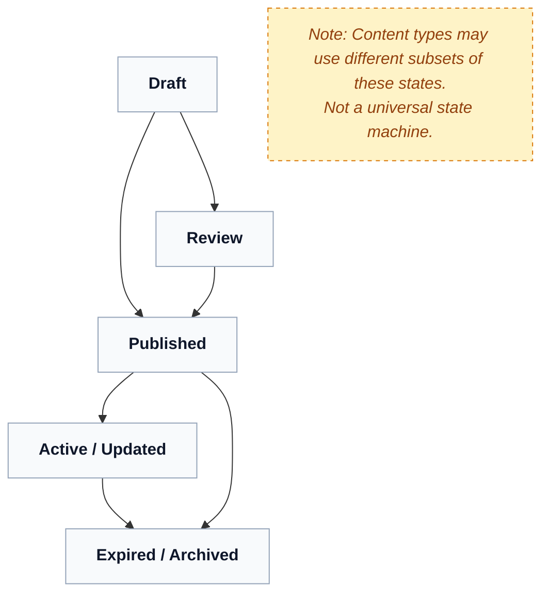
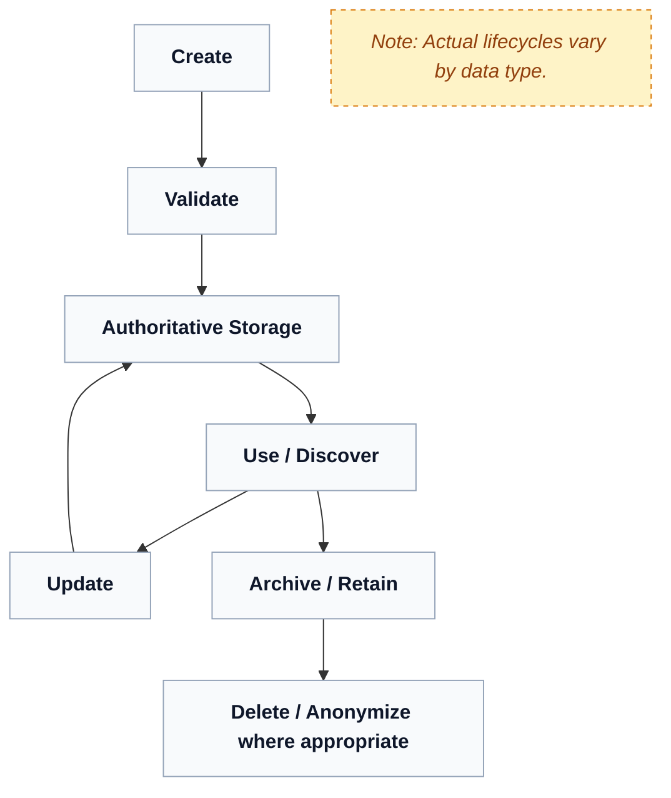

# Lenar — Data & Content

> **Status:** Data & Content Reference  
> **Document:** 06 — Data & Content  
> **Purpose:** Define the information Lenar represents, the relationships and ownership surrounding that information, how content is created and managed, how data changes over time, and the principles that govern storage, search, files, history, freshness, migration, and future evolution.

---

## At a Glance

Lenar is fundamentally an information system. 

Its usefulness depends not only on features and interfaces, but on whether the information inside it is:
- meaningful;
- accurate;
- appropriately scoped;
- discoverable;
- current;
- trustworthy;
- protected;
- recoverable;
- and represented consistently across the platforms that use it.

This document establishes the conceptual data and content model. The physical PostgreSQL schema and implementation-level data specifications belong in the appropriate supporting specifications and later implementation work.

---

## 1. Data Philosophy

Lenar should treat data as a product asset rather than merely database records. The system should preserve the meaning and relationships of information across its entire flow:

```text
Collection
   ↓
Validation
   ↓
Storage
   ↓
Use
   ↓
Update
   ↓
Archive / Retention
   ↓
Deletion where appropriate
```

---

## 2. The Lenar Information Model

The Lenar domain requires modeling several conceptual families of data that interact closely to create the student experience.

```mermaid
flowchart TD
    classDef root fill:#1e293b,color:#fff,stroke:#0f172a,stroke-width:2px,font-weight:bold
    classDef domain fill:#f8fafc,stroke:#94a3b8,stroke-width:1px,color:#0f172a,font-weight:bold

    L[LENAR DATA & CONTENT]
    
    Reg[Registration / Verification]
    UserId[User Identity]
    AcadProf[Academic Profile Claims]
    Enroll[Enrollment Attachment]
    
    Org[Organization]
    AcadTime[Academic Time]
    Acad[Academic Context]
    
    Comm[Community]
    Mem[Membership]
    Gov[Governance]
    
    Cont[Content]
    CS[Campus Services]
    Notif[Notifications]
    Files[Files / Media]
    Search[Search]
    Sync[Synchronization]
    Admin[Admin Control Plane / Audit]
    
    L --- Reg
    L --- UserId
    L --- AcadProf
    L --- Enroll
    
    L --- Org
    L --- AcadTime
    L --- Acad
    
    L --- Comm
    L --- Mem
    L --- Gov
    
    L --- Cont
    L --- CS
    L --- Notif
    L --- Files
    L --- Search
    L --- Sync
    L --- Admin
    
    class L root;
    class Reg,UserId,AcadProf,Enroll,Org,AcadTime,Acad,Comm,Mem,Gov,Cont,CS,Notif,Files,Search,Sync,Admin domain;
```



### 2.1 Core Conceptual Entities

Lenar relies on the following core conceptual entities. *(Note: This is a domain model, not a physical database schema).*

- **User Identity:** The base authentication persona established via Registration.
- **Academic Profile:** The set of academic claims submitted by the user prior to approval.
- **University / Faculty / Department / Level:** The institutional structural academic organization.
- **Academic Time:** Authoritative tracking of time (Academic Session, Semester).
- **Enrollment:** Establishes the specific academic context of a student (Level, Academic Session, Semester).
- **Community:** Represents participation and belonging. Every active user has a Base Community.
- **Membership:** The relationship denoting participation in a Community. Base Community membership is automatically established from an approved Academic Context.
- **Governance:** Manages Creator Roles, Assignments, Revocation, and Transfer.
- **Announcement / Opportunity / Event / Resource:** Approved informational content distributed to users.
- **Issue / Issue Update:** Structured campus reporting and its resolution history.
- **Notification:** Timely alerts and delivery tracking.
- **File / Media:** Assets attached to primary entities.
- **Audit Event / Revision / Change Metadata:** Tracking who changed what and when.
- **Sync Operation:** Managing offline interactions and state reconciliation.

---

## 3. Data Authority & Representations

A critical boundary in Lenar is the distinction between authoritative state and secondary representations. 



### 3.1 Essential Distinctions

- **Authoritative Data vs Cache:** The server-side system is authoritative for shared product state unless a specific domain rule establishes another authority.
- **Authoritative Data vs Search Index:** A search index accelerates discovery but is not the authoritative source of truth.
- **Authoritative Data vs Analytics/Telemetry:** Analytics measure system usage; they do not dictate core data state.
- **Authoritative Data vs Notification:** A push notification is a transient alert about data, not the data itself.

### 3.2 The Mobile Local State

Do not treat the local mobile database as "just a cache." While the server remains authoritative for shared state, the mobile client maintains rich local states containing:
- Cached information
- Drafts
- Durable local user intent
- Pending operations
- Synchronization metadata

### 3.3 Ownership vs Authority
Ownership defines who is responsible for the data (e.g., a Department owns its announcements). Authority dictates which system layer possesses the undeniable current state of that data.

### 3.4 Search Behavior
Search must not become an authorization bypass. The conceptual flow remains strict:
```text
Source Data → Indexable Representation → Search → Visibility / Authorization Filtering → Result
```

---

## 4. Content & Data Lifecycle

Information in Lenar is not static. Content transitions through states of visibility, while underlying data follows a broader technical lifecycle.

### 4.1 Content Lifecycle

Content (such as Announcements or Opportunities) experiences a visibility and validation lifecycle.



- **Publication State vs Content Validity:** A draft (publication state) is distinct from an expired notice (content validity).
- **Current State vs Historical State:** The system must distinguish between what is actively applicable today versus what was applicable previously.

### 4.2 Data Lifecycle

At a systemic level, all records proceed through a generalized operational lifecycle.



---

## 5. Files and Attachments

Files are conceptually associated with domain resources rather than existing in a vacuum. 
- **Announcement** → Attachment
- **Issue** → Evidence
- **Opportunity** → Supporting document

The file URL itself is not the authorization boundary. Access to a file is governed by the user's access to the parent resource.

---

## 6. Local Data Persistence Strategy

Not every server resource needs to be mirrored locally. Local persistence decisions are evaluated against:
- User value
- Offline usefulness
- Data sensitivity
- Storage cost on the device
- Required freshness
- Synchronization complexity

---

## 7. Retention and Deletion

Data does not live forever. Lenar preserves the conceptual distinction between:
- **Removal from normal access:** The data is hidden from users but exists operationally.
- **Physical deletion:** The data is securely eradicated.
- **Anonymization:** Identifying traits are stripped for analytical retention.
- **Retention:** Data kept strictly for legitimate audit, legal, or operational reasons.

*(Exact retention periods and legal classifications will be specified in detailed compliance policies).*

---

## Related Documentation

For how this data model connects to the rest of the Lenar system, refer to:

- [02-Problem-Users-Domain.md](02-Problem-Users-Domain.md)
- [03-Product-Requirements.md](03-Product-Requirements.md)
- [07-Security-Privacy-Governance.md](07-Security-Privacy-Governance.md)
- [../architecture/08-Offline-Sync-Resilience.md](../architecture/08-Offline-Sync-Resilience.md)
- [../architecture/09-System-Architecture.md](../architecture/09-System-Architecture.md)
- [../architecture/10-Technology-Stack.md](../architecture/10-Technology-Stack.md)
- [../architecture/11-Performance-Reliability.md](../architecture/11-Performance-Reliability.md)
- [../architecture/13-Analytics-Observability.md](../architecture/13-Analytics-Observability.md)
- [../architecture/14-Infrastructure-Operations.md](../architecture/14-Infrastructure-Operations.md)
- [15-Legal-Business.md](15-Legal-Business.md)
