# Lenar — Legal, Regional & Business Considerations

> **Status:** Legal & Business Reference  
> **Document:** 15 — Legal, Regional & Business Considerations  
> **Purpose:** Define the legal, regional, commercial, operational, and licensing considerations that can materially affect Lenar's product, architecture, data handling, distribution, costs, and long-term operation, while clearly separating confirmed decisions from matters that require professional or jurisdiction-specific review.

---

> [!WARNING]
> **This document is NOT legal advice.** It is an engineering and product reference. It does not constitute a privacy policy, terms of service, legal opinion, compliance certificate, or guarantee of compliance. Where professional review or jurisdiction-specific legal determination is required, explicit review must be sought.

---

## At a Glance

Lenar operates within a real-world environment involving students, universities, laws, app stores, third-party services, intellectual property, and operating costs. These external conditions can materially affect product and technical decisions. 

The central principle is:
> **Treat legal, regional, business, and licensing constraints as product and architecture inputs rather than problems discovered only after implementation.**

## 1. Business & Legal Philosophy

The objective is to avoid preventable problems caused by ignoring real-world constraints. Major product and integration decisions must account for more than just engineering feasibility.

---

## 2. Regional & Institutional Context

Lenar's initial product context is built for a university student environment, specifically operating in **Nigeria** within the context of **FUTA**. 

### 2.1 Institutional Relationships
We operate parallel to, but conceptually distinct from, the university administration until formalized otherwise. We **must not** assume:
- Institutional endorsement or ownership
- The authority to publish official information on behalf of the university
- Permission to use official university branding/trademarks
- Direct access to student records or internal institutional systems

Where these are required, they require explicit authority and agreement.

---

## 3. Privacy & Data Boundaries

Legal and privacy considerations must follow user data through its entire lifecycle.

Lenar's architecture must support fundamental privacy principles:
- **Data Minimization:** Only collect what is strictly necessary.
- **Purpose Limitation:** Use data only for the reason it was collected.
- **Transparency:** Ensure users understand what is collected and why.
- **Location & Transfer:** Be aware of where data is stored and cross-border processing rules.
- **Rights:** Ensure the system can accommodate access, correction, and deletion requests.

---

## 4. Intellectual Property & Open Source

### 4.1 IP Boundaries
Lenar must maintain clear conceptual and legal boundaries between:
- Lenar-owned IP
- Contributor / Contractor IP
- University IP
- User-generated content
- Third-party IP
- Open-source software

### 4.2 Open-Source Licensing
Open-source licenses matter. The engineering team must maintain a dependency inventory, review license compatibility (e.g., copyleft vs. permissive), and ensure any distribution or attribution obligations are fulfilled.

---

## 5. Third-Party Dependencies

When deciding whether to build or buy a component, we evaluate: *cost, control, security, privacy, complexity, maintenance, lock-in, and time-to-deliver.*

For our chosen providers, we must ask strict conceptual questions before full production reliance:

For providers like **Cloudflare R2, FCM, PostHog, Sentry,** and **OpenTelemetry** infrastructure, we must review their provider terms, data processing agreements, retention policies, pricing limits, and exportability.

---

## 6. App Stores & Distribution

Mobile distribution relies on third-party gatekeepers. We must anticipate constraints regarding:
- Developer agreements and privacy declarations
- Granular device permissions (and justifying them to reviewers)
- Store review requirements and rejection risks
- Code signing and certificate management
- Forced update lifecycles

---

## 7. Business Continuity & Sustainability

Operational sustainability requires preparing for dependency failures that go beyond server crashes. 

We must actively manage the risk of:
- **Key-Person Dependency:** Loss of important organizational knowledge.
- **Provider Dependency:** Sudden provider failure or hostile term changes.
- **Credential Dependency:** Loss of access to critical domains or infrastructure accounts.
- **Institutional Dependency:** Changes in university relationships or funding.

---

## 8. Operational Costs

The initial product purpose does not depend on a finalized commercial revenue model (future commercial models remain open possibilities). However, operational costs are immediate realities. 

**Do not assume free tiers are permanent production solutions.** Cost architecture must account for:
- Compute and Database usage
- Storage and Bandwidth
- Backups and Archiving
- Push Notifications
- Analytics and Telemetry
- Error Monitoring
- Domains, App Store fees, and Support

---

## 9. The Legal / Technical Connection

Legal and business decisions are not isolated; they directly mutate the codebase.
For example, a legal decision regarding data retention directly dictates database schema design (soft vs. hard deletes), backup rotation strategies, automated cleanup jobs, and the user interface for account deletion.

---

## Related Documentation

- [01-Lenar-Foundation.md](01-Lenar-Foundation.md)
- [03-Product-Requirements.md](03-Product-Requirements.md)
- [../architecture/05-Platform.md](../architecture/05-Platform.md)
- [06-Data-Content.md](06-Data-Content.md)
- [07-Security-Privacy-Governance.md](07-Security-Privacy-Governance.md)
- [../architecture/08-Offline-Sync-Resilience.md](../architecture/08-Offline-Sync-Resilience.md)
- [../architecture/10-Technology-Stack.md](../architecture/10-Technology-Stack.md)
- [../architecture/11-Performance-Reliability.md](../architecture/11-Performance-Reliability.md)
- [../architecture/13-Analytics-Observability.md](../architecture/13-Analytics-Observability.md)
- [../architecture/14-Infrastructure-Operations.md](../architecture/14-Infrastructure-Operations.md)
- [../architecture/16-Development-Release.md](../architecture/16-Development-Release.md)
- [../decisions/17-Decisions-Risks-Evolution.md](../decisions/17-Decisions-Risks-Evolution.md)
