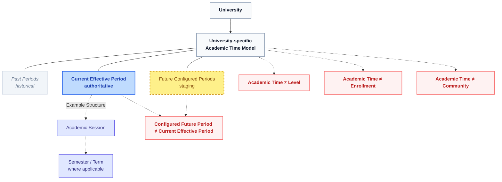

# Lenar — Academic Time Specification

Status: DRAFT  
Maturity: BEHAVIORAL  
Version: 0.1  
Owner: TBD  
Last Reviewed: 2026-08-31

## 1. Purpose
Academic Time is the authoritative temporal framework through which a University defines and identifies its academic periods, including academic sessions and semesters, and determines when those periods become effective. This specification defines how the system conceptually models these periods as a first-class domain, ensuring it remains distinct from institutional Organization, Enrollment, and academic progression.

## 2. Scope
This specification covers:
- The definition of Academic Session and Semester/Term as University-relative concepts.
- The distinction between configured future academic periods and currently effective periods.
- The rules governing transitions to new academic periods.
- The boundary between Academic Time and other domains (Level, Enrollment, Community, Governance).

This specification does **not** cover:
- Exact academic calendar dates or scheduling implementations (cron jobs, schedulers).
- Academic progression algorithms (pass/fail, level promotion, carryover rules).
- Database schemas or API contracts.
- Exact governance permission matrices for calendar administration.

## 3. Canonical References
- `docs/product/01-Lenar-Foundation.md`
- `docs/product/02-Problem-Users-Domain.md`
- `docs/product/03-Product-Requirements.md`
- `docs/product/04-UX-UI.md`
- `docs/product/06-Data-Content.md`
- `docs/product/07-Security-Privacy-Governance.md`

## 4. Dependencies
- Organization
- Enrollment
- Community / Membership
- Governance
- Authorization
- Security / Privacy
- Account Lifecycle
- Onboarding
- Authentication

## 5. Terminology
- **Academic Time:** The first-class domain providing the temporal framework for the institution.
- **Academic Session:** The larger institutional academic period used by a University's calendar (e.g., 2025/2026).
- **Semester / Term:** A sub-period within a session, where applicable to the University's model.
- **Academic Period:** A generic conceptual term for the University's relevant period.
- **Configured Future Period:** An academic period that has been defined but is not yet effective.
- **Current Effective Period:** The authoritative academic period presently active according to the University's calendar.
- **Historical Period:** A past academic period that is no longer effective but remains historically meaningful.

## 6. Actors
- **Admin:** University-scoped authorized actor capable of configuring Academic Time.
- **Super Admin:** Platform-scoped administrative actor.
- **System Authority:** The authoritative transition mechanism executing effective time changes.
- **User:** A consumer of the current academic time whose context is influenced by it.

## 7. Preconditions
- A University must exist in the Organization domain for its relative Academic Time model to be defined.
- A future academic period must be configured before it can become the current effective period.

## 8. Core Rules
1. **Academic Time is University-Relative:** Each University has its own Academic Time model (sessions, terms).
2. **Configured ≠ Effective:** Future periods can be configured without immediately changing the current effective time.
3. **Effective Transition Point:** A future period becomes effective only at the authoritative transition point defined by the University.
4. **No Automatic Promotion:** Advancing the Academic Time does NOT automatically promote every student's Level.
5. **No Level Derivation:** Academic Time does not determine Level or derive it from course participation or carryover courses.
6. **No Governance Revocation:** Time transitions do not automatically revoke Governance Assignments.
7. **Distinct from Enrollment:** Academic Time provides the temporal framework; Enrollment uses it to form a user's Current Academic Context.

## 9. State Model

## 10. Main Behaviors
- **Configuration:** Authorized admins prepare future academic periods in advance.
- **Effective Transition:** The authoritative University academic calendar triggers the transition, making the configured future period the Current Effective Period.
- **Context Integration:** When the effective period changes, downstream domains (like Enrollment) reflect this new temporal reality within users' Current Academic Contexts.
- **Historical Preservation:** Once a period concludes, it becomes historical. Past enrollments referencing this period remain intact and coherent.

## 11. Alternate & Failure Behaviors
- **Premature Configuration:** Creating next year's session does not shift students into it; it simply stages the future period.
- **Client Forgery:** If a client attempts to declare an unauthorized period as current, the server rejects it.
- **Invalid Period Access:** Attempts to mutate historical periods beyond permitted administrative corrections are rejected to preserve truth.

## 12. Invariants
- `Academic Time ≠ Level`
- `Academic Time ≠ Enrollment`
- `Academic Time ≠ Organization`
- `Academic Time ≠ Community`
- Academic Time transitions do NOT automatically change Level or Governance.
- The server is authoritative over effective academic time.
- A University has one current authoritative academic period (if its model mandates a singular current period).

## 13. Authorization & Security
- **Server Authority:** The server strictly controls period transitions and configurations.
- **Untrusted Client:** Clients cannot manufacture, advance, or mutate Academic Time.
- **Cross-Domain:** Authorization may consume current Academic Time/Context to decide permissions, but Academic Time does not define the permission logic.

## 14. Data Semantics
- Academic Time records preserve historical, current, and future states.
- Changing the current Academic Time does not rewrite past academic contexts. Historical data remains conceptually meaningful.

## 15. Offline / Platform Behavior
- Offline clients may cache current/future academic periods according to Offline/Sync rules.
- Authoritative Academic Time transitions are strictly server-side.
- Semantics remain consistent across Web, PWA, Android, and iOS.

## 16. User Experience & Feedback
- Users should intuitively understand the Current Academic Session and Semester/Term (e.g., "2025/2026 Semester 1") without seeing implementation mechanics.
- Specific calendar configuration UIs for Admins will allow staging future periods.

## 17. Notifications / Secondary Effects
- An effective time transition may trigger secondary notifications or workflows (e.g., course registration opening).
- Academic Time does not internally execute these workflows; it only broadcasts the state change.

## 18. Observability / Audit
Conceptual events to track:
- Academic Period Configured
- Academic Period Effective
- Academic Period Changed

*(Telemetry schema is deferred).*

## 19. Acceptance Criteria
- Academic Time is a first-class authoritative domain.
- Academic Time is University-relative.
- Academic Session is defined.
- Semester/Term is defined where applicable.
- Academic Period is conceptually defined.
- Future periods may be configured before becoming effective.
- Configured future time ≠ currently effective time.
- Only the authoritative effective transition changes current Academic Time.
- Academic Time advancement does not automatically promote every student.
- Academic Time does not determine Level by itself.
- Academic Time does not derive Level from course participation.
- Academic Time provides the temporal framework used by Enrollment/Academic Context.
- Enrollment remains distinct from Academic Time.
- Organization remains distinct from Academic Time.
- Community remains distinct from Academic Time.
- Governance does not automatically revoke assignments because of time transitions.
- Authorization may consume current Academic Time/context but does not belong to Academic Time.
- Historical academic periods remain meaningful.
- Universities can have different academic calendars/models.
- V1 can use FUTA's authoritative academic calendar.
- Client/offline state cannot manufacture authoritative Academic Time.

## 20. Testing Requirements
Tests must conceptually verify:
- University-specific time model.
- Current period isolation.
- Future period configuration without side effects.
- Effective transition behavior.
- Preservation of historical periods.
- Semester/term behavior where applicable.
- University isolation (no global clock).
- V1 FUTA model validity.
- Organization separation.
- Enrollment integration via Academic Context.
- Level separation (no auto-promotion).
- Course/carryover separation.
- Governance continuity during transitions.
- Authorization context consumption.
- Prevention of client/offline manipulation.

## 21. Explicit Non-Assumptions
This specification does **NOT** decide:
- Exact academic calendar dates.
- Exact session naming conventions.
- Exact semester/term counts.
- Exact future-period scheduling implementation or scheduler.
- Exact database schema or API contracts.
- Exact progression algorithm (pass/fail, carryover).
- Exact historical storage.
- Exact notification behaviors or synchronization implementation.

## 22. Open Questions

| Question | Classification | Notes |
|---|---|---|
| Exact FUTA academic calendar configuration | NON-BLOCKING | Belongs to University configuration |
| Exact University-specific calendar configuration | NON-BLOCKING | Belongs to University configuration |
| Exact semester/term naming | NON-BLOCKING | Belongs to University configuration |
| Exact effective-time transition implementation | FUTURE | Implementation detail |
| Exact historical representation | FUTURE | Implementation detail |
| Exact interaction with progression rules | FUTURE | Belongs to academic progression domain |

## 23. Change Impact
- **Directly affected:** Enrollment, Academic Context, Organization, Community / Membership, Governance, Authorization.
- **Potentially affected:** Onboarding, Account Lifecycle, Offline / Sync, Notifications, Testing, Analytics / Observability.

## 24. Related ADRs
None currently applicable.

## 25. Related Specifications
- `../account-lifecycle/account-lifecycle-specification.md`
- `../authentication/authentication-specification.md`
- `../onboarding/onboarding-specification.md`
- `../organization/organization-specification.md`
- `../enrollment/enrollment-specification.md`
- `../community/community-membership-specification.md`
- `../governance/governance-specification.md`
- `../authorization/authorization-specification.md`

## Specification Completeness Checklist
- [x] Defined all required states
- [x] Documented all valid transitions
- [x] Defined boundary with adjacent domains
- [x] Resolved offline/sync conflicts
- [x] Documented failure states
- [x] Covered security boundaries
- [x] Removed implementation details
- [x] Deferred non-blocking technical questions
