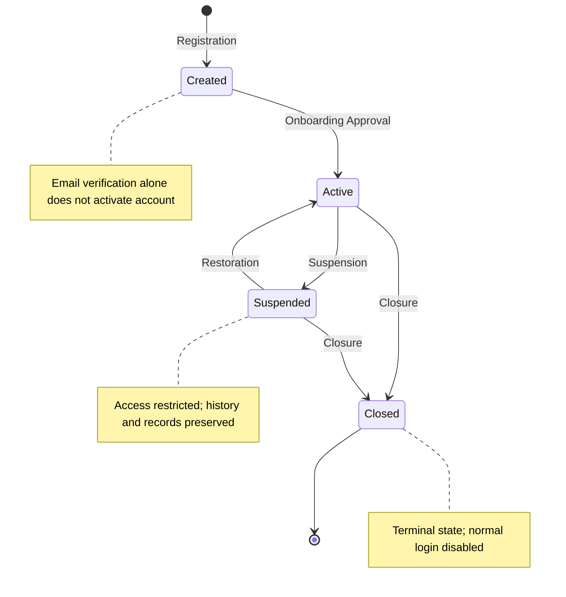

# Lenar — Account Lifecycle Specification

Status: DRAFT  
Maturity: BEHAVIORAL  
Version: 0.2  
Owner: TBD  
Last Reviewed: 2026-08-31

## 1. Purpose
Account Lifecycle describes the authoritative state of a user's Lenar account over the existence and operation of that account. It manages the foundational status of the account in the system, which subsequently influences authentication, authorization, and platform access.

## 2. Scope
This specification covers:
- The four authoritative lifecycle states: Created, Active, Suspended, Closed.
- The lifecycle transitions between these states.
- The behavioral consequences of these lifecycle states on normal platform access.

This specification does **not** cover:
- Authentication internals (e.g., session management, JWT).
- Onboarding behavior (e.g., email verification, profile completion, review).
- Enrollment lifecycle.
- Governance permission matrices or assignment authority.
- Authorization engines.
- Database schema, physical deletion, or data-retention implementation.

## 3. Canonical References
- `docs/product/01-Lenar-Foundation.md`
- `docs/product/02-Problem-Users-Domain.md`
- `docs/product/03-Product-Requirements.md`
- `docs/product/04-UX-UI.md`
- `docs/product/06-Data-Content.md`
- `docs/product/07-Security-Privacy-Governance.md`

## 4. Dependencies
- Authentication
- Onboarding
- Enrollment
- Community / Membership
- Governance
- Authorization
- Security / Privacy
- Notifications (Planned)

## 5. Terminology
- **Account:** The core systemic representation of a user identity within Lenar.
- **Account Lifecycle:** The authoritative state machine governing the account's operational validity.
- **Created:** The initial state where an account exists but has not been activated.
- **Active:** The standard operating state for an approved account.
- **Suspended:** A restrictive state preventing normal account operation.
- **Closed:** A terminal lifecycle state preventing normal use.
- **Activation:** The transition from Created to Active triggered by Onboarding Approval.
- **Restoration:** The authorized transition from Suspended back to Active.
- **Closure:** The transition to the terminal Closed state.

## 6. Actors
- **User:** The person to whom the account belongs.
- **Authorized Administrative Actor:** A governed persona capable of triggering lifecycle transitions like suspension or closure.
- **Security/System Authority:** Automated or systemic entities triggering lifecycle changes based on defined rules.

*(Exact permission matrices for these actors belong to Authorization).*

## 7. Preconditions
- A new account can only transition from Created to Active following a successful Onboarding Approval.
- An account can only be Suspended if it is currently Active.
- An account can only be Restored if it is currently Suspended.
- Both Active and Suspended accounts may be Closed.

## 8. Core Rules
1. **Registration** establishes the `Created` state.
2. **Email Verification** triggers an authentication change only; the account remains `Created`.
3. **Onboarding Approval** causes the account to become `Active`.
4. **Account Active ≠ Normal Platform Access.**
5. **Suspended** accounts face authentication/session restrictions, authorization denial, and inability to exercise governance normally.
6. **Suspension** does NOT automatically destroy Enrollment history, Membership history, or Governance history.
7. **Closed** is terminal for normal account operation.
8. **Closed ≠ physical deletion.**
9. A **Closed** account cannot resume through ordinary Login.

## 9. State Model

### Account Lifecycle State Machine
Authoritative state transitions governing user account operational validity from registration to closure.

## 10. Main Behaviors
- **Account Creation:** Upon registration, the account is immediately placed into the `Created` state.
- **Activation:** Upon receiving an Onboarding Approval decision, the account formally transitions to `Active`.
- **Normal Active State:** An Active account may proceed to authenticate, establish context, and receive normal platform access according to its Enrollment, Membership, and Authorization context.
- **Suspension:** An authorized administrative or systemic action transitions an Active account to `Suspended`, restricting access.
- **Restoration:** An authorized action removes a suspension, returning the account to `Active`.
- **Closure:** An authorized action (or user request, depending on future rules) transitions an Active or Suspended account to `Closed`.

## 11. Alternate & Failure Behaviors
- **Rejected Onboarding:** A rejected submission simply returns the user to profile correction; the account remains `Created`. It is not suspended.
- **Email Verification:** A successful email verification grants an authenticated session but does not activate the account.
- **Pending Review:** An account under review remains `Created`.

## 12. Invariants
- `Created ≠ Email Verified`.
- `Created ≠ Active`.
- `Account Active ≠ Normal Platform Access`.
- `Pending Review`, `Rejected`, `Verification`, `Profile Completion`, and `Enrollment Processing` are strictly excluded from being Account Lifecycle states.
- The server is strictly authoritative over the Account Lifecycle.
- `Closed ≠ physical deletion`.

## 13. Authorization & Security
- **Server Authority:** The server is strictly authoritative.
- **Untrusted Client:** A client cannot self-activate, self-suspend, self-reopen, or self-close another account.
- **Cross-Domain Boundaries:** 
  - Authorization consumes the Account Lifecycle state; a Suspended account automatically results in a DENY for protected operations.
  - Authentication consumes the Account Lifecycle state to invalidate affected sessions and deny new authentications when Suspended.
- **Protection:** Lifecycle transitions must be performed by appropriately authorized entities, protected by the Authorization engine.

## 14. Data Semantics
- Lifecycle state is an authoritative account-level concept.
- **Closure:** Does not imply physical deletion. The retention, anonymization, or physical deletion of historical data (Enrollment, Community, Governance) is governed by separate legal, privacy, and data policies outside this state transition.

## 15. Offline / Platform Behavior
- Account Lifecycle semantics remain consistent across Web, PWA, Android, and iOS.
- Offline mode may cache lifecycle information for UX purposes.
- Offline state cannot authoritatively manufacture or mutate lifecycle transitions.

## 16. User Experience & Feedback
- The UI should communicate meaningful lifecycle consequences clearly:
  - Account Active (and any missing context preventing access).
  - Account Suspended (explaining the restriction context if appropriate).
  - Account Closed (terminal state feedback).
- Internal security details must not be exposed unnecessarily. Specific screens are not designed here.

## 17. Notifications / Secondary Effects
Notifications regarding account activation, suspension, restoration, or closure may be dispatched. The exact behavior and templates will be defined by a future Notifications specification. Account Lifecycle focuses solely on the state transition.

## 18. Observability / Audit
Meaningful conceptual events to track include:
- Account Created
- Account Activated
- Account Suspended
- Account Restored
- Account Closed

*(Telemetry schema is not defined in this specification).*

## 19. Acceptance Criteria
- Registration creates an account in the `Created` state.
- Email verification does not itself make the account `Active`.
- Successful onboarding Approval transitions the account to `Active`.
- Rejected onboarding does not become an Account Suspension.
- Pending Review is strictly an Onboarding state, not an Account Lifecycle state.
- Active Account does not by itself guarantee normal platform access (requires Enrollment, Context, Membership, etc.).
- A missing Base Community after approval means: Account Active (Yes), Enrollment (Yes), Academic Context (Yes), Base Community (No), Normal Platform Access (No).
- Suspended accounts cannot operate normally.
- Suspension causes appropriate authentication and session invalidation/denial consequences.
- Suspended accounts cannot perform protected operations (Authorization DENY).
- Suspension does not automatically destroy Enrollment, Membership, or Governance history.
- Suspended accounts can be restored to `Active` through an authorized lifecycle action.
- `Active` or `Suspended` accounts can be transitioned to `Closed` according to applicable rules.
- `Closed` accounts cannot resume normal operation merely through Login.
- `Closed` is distinct from physical data deletion.
- Client state cannot manufacture or mutate authoritative lifecycle state.
- Offline state cannot manufacture authoritative lifecycle transitions.

## 20. Testing Requirements
Tests must conceptually verify:
- Registration → Created.
- Approval → Active.
- Rejection separation (account remains Created).
- Pending Review separation.
- Email verification separation (account remains Created).
- Active → Suspended transition.
- Suspended → Active restoration.
- Active → Closed transition.
- Suspended → Closed transition.
- Closed accounts cannot use normal-login/reopen.
- Session consequences of Suspension and Closure.
- Authorization consequences of Suspension.
- Preservation of Enrollment, Governance, and Membership history upon Suspension/Closure.
- Protection against client and offline manipulation of authoritative state.
- ALLOW/DENY paths based on lifecycle state.

## 21. Explicit Non-Assumptions
This specification does **NOT** decide:
- Exact suspension reasons.
- Exact closure reasons.
- Exact restoration authority or process.
- Exact reactivation processes for Closed accounts.
- Exact account deletion and data retention policies.
- Exact authentication/session mechanics.
- Exact authorization policy matrices.
- Exact database schemas or API contracts.
- Exact security automation or notification behaviors.

## 22. Open Questions

| Question | Classification | Notes |
|---|---|---|
| Exact suspension authority/policy | NON-BLOCKING | Belongs to Governance + Authorization |
| Exact closure authority/policy | NON-BLOCKING | Belongs to Governance + Authorization |
| Exact closed-account re-entry process | FUTURE | Dependent on future product requirements |
| Exact data retention/deletion policy | FUTURE | Belongs to Legal/Data compliance |
| Security-triggered lifecycle transitions | FUTURE | Unless required elsewhere by systemic automation |

## 23. Change Impact
- **Directly affected:** Authentication, Onboarding, Authorization, Governance.
- **Potentially affected:** Enrollment, Community / Membership, Security / Privacy, Offline / Sync, Notifications, Testing, Analytics / Observability.

## 24. Related ADRs
None currently applicable.

## 25. Related Specifications
- `../authentication/authentication-specification.md`
- `../onboarding/onboarding-specification.md`
- `../enrollment/enrollment-specification.md`
- `../community/community-membership-specification.md`
- `../governance/governance-specification.md`
- `../authorization/authorization-specification.md`

## Specification Completeness Checklist
- [x] Defined all required states
- [x] Documented all valid transitions
- [x] Defined boundary with adjacent domains
- [x] Resolved offline/sync conflicts
- [x] Documented failure states
- [x] Covered security boundaries
- [x] Removed implementation details
- [x] Deferred non-blocking technical questions
