# Lenar — Authorization Specification

> **Status:** DRAFT
> **Maturity:** BEHAVIORAL
> **Version:** 0.1
> **Owner:** TBD
> **Last Reviewed:** 2026-08-31

---

## 1. Purpose

This specification defines the behavioral contract for Authorization in Lenar. It dictates how the system determines whether an authenticated actor is permitted to perform a requested operation on a target resource.

It establishes the core architectural principle:
**Authorization = RBAC + Scope + Context**

It clearly separates Authorization ("May you do this?") from Authentication ("Who are you?"), and separates it from Governance (which manages role assignments).

## 2. Scope

**What this specification covers:**
- The conceptual Authorization Decision flow (ALLOW / DENY).
- The Default Deny principle.
- The evaluation of Role, Scope, and Context in authorization decisions.
- The reliance on current, server-authoritative state.
- The separation of membership from governance authority.
- Handling of missing information, scope mismatches, and context mismatches.

**What it explicitly does not cover:**
- The complete final RBAC permission matrix (which operations each role can perform).
- The exact technical policy engine representation or middleware implementation.
- Database schemas for storing authorization policies.
- Exact public/private endpoint catalogs, API error codes, or UI denial messages.
- Multiple-role conflict resolution (which remains an open policy question).
- The creation, assignment, or mutation of Governance roles.

## 3. Canonical References

- [01-Lenar-Foundation.md](../../product/01-Lenar-Foundation.md)
- [02-Problem-Users-Domain.md](../../product/02-Problem-Users-Domain.md)
- [03-Product-Requirements.md](../../product/03-Product-Requirements.md)
- [04-UX-UI.md](../../product/04-UX-UI.md)
- [06-Data-Content.md](../../product/06-Data-Content.md)
- [07-Security-Privacy-Governance.md](../../product/07-Security-Privacy-Governance.md)
- [08-Offline-Sync-Resilience.md](../../architecture/08-Offline-Sync-Resilience.md)
- [09-System-Architecture.md](../../architecture/09-System-Architecture.md)
- [10-Technology-Stack.md](../../architecture/10-Technology-Stack.md)
- [12-Testing-Quality.md](../../architecture/12-Testing-Quality.md)
- [17-Decisions-Risks-Evolution.md](../../decisions/17-Decisions-Risks-Evolution.md)
- [Specification Framework README](../README.md)

## 4. Dependencies

- **Onboarding Specification**
- **Authentication Specification**
- **Enrollment Specification**
- **Community / Membership Specification**
- **Governance Specification**

## 5. Terminology

- **Authorization Decision:** The evaluation resulting in either ALLOW or DENY.
- **Resource:** The target conceptual entity (e.g., Submission, Community).
- **Operation:** The requested action (e.g., Approve, Manage).
- **Scope:** The authority boundary within which a governance role operates (Platform, University, or Base Community).
- **Context:** The current authoritative state and relationships (e.g., Enrollment, Membership) relevant to determining permission.

## 6. Actors

- **Authenticated Actor:** The user or system attempting to perform an operation.

## 7. Preconditions

- The actor must possess valid authentication (except for explicitly public operations).
- Authoritative state (Governance assignments, Enrollment context, Memberships) must exist on the server.

## 8. Core Rules

- **Default Deny:** If the system cannot affirmatively establish that an operation is authorized, or if required authorization information is unavailable, the decision is DENY. Uncertainty must never become implicit permission.
- **Authentication ≠ Authorization:** Successful authentication does not automatically grant unrestricted access.
- **Scope Matching:** If a request targets a resource outside the actor's applicable authority scope, the decision is DENY. (e.g., A Leader of Community A attempting to manage Community B).
- **Context Matching:** If an operation requires a specific contextual relationship (e.g., active membership, specific academic standing) and that relationship does not hold, the decision is DENY.
- **Current Authority:** Authorization must rely strictly on the current authoritative governance state. If a Leader assignment is revoked, the actor is immediately DENIED governed operations, regardless of stale client state.
- **Role Consumption:** Authorization consumes Governance assignments. It does not create, assign, revoke, or transfer them.
- **Membership Limits:** Membership provides participation context. Membership alone does not grant governance or administrative authority.

## 9. State Models and Diagrams

### Authorization Decision Model

### Authorization Context

## 10. Main Behaviors

### Authorization Evaluation Flow
When a protected operation is requested, the system performs the following conceptual evaluation:
1. Verify authenticated identity.
2. Determine current applicable governance role/assignment.
3. Determine applicable authority scope.
4. Determine required contextual relationships.
5. Identify target resource and requested operation.
6. Evaluate applicable authorization policy.
7. Return ALLOW or DENY.

### Academic Context Dependencies
Where an operation depends on academic context, authorization must use the current authoritative context from **Enrollment**. Old profile claims, course participation alone, or client-selected contexts must not be used as authoritative context.

## 11. Alternate & Failure Behaviors

### Restrictive Account State
Authorization respects the Account Lifecycle. If the authenticated account is in a restrictive state (e.g., suspended), protected access is DENIED, even if roles or memberships technically exist.

### Restricted Onboarding Sessions
A restricted authenticated onboarding session does not automatically authorize normal platform operations. It permits only operations relevant to onboarding completion, as defined by policy.

### Conflict Resolution
Governance currently leaves the holding of multiple simultaneous roles unresolved. Authorization must not invent a universal rule (e.g., "highest role wins" or "first matching wins") for conflict resolution. Unresolved policy conflicts must result in DENY.

## 12. Invariants

- Authentication does not imply Authorization.
- Role does not automatically imply unrestricted access.
- Membership does not imply governance authority.
- Scope mismatch causes denial.
- Required context mismatch causes denial.
- Missing required authorization information causes denial.
- Revoked governance authority cannot be restored by stale client state.
- Unauthenticated protected requests are denied.
- Restrictive account state can deny protected access.
- Client state cannot manufacture authorization.
- Offline state cannot manufacture authorization.
- Authorization does not mutate Governance, Enrollment, Membership, or Community.

## 13. Authorization & Security

- **Server Authority:** The server is exclusively authoritative for authorization. Clients may cache expectations for UX purposes but cannot self-authorize.
- **Denial Enforcement:** If the decision is DENY, the requested protected operation must not be performed.

## 14. Data Semantics

- **Authorization Policy:** A conceptual mapping of Role + Scope + Context → Resource + Operation. The exact physical representation is deferred.

## 15. Offline / Platform Behavior

- Semantics must remain consistent across Web, PWA, Android, and iOS.
- Offline states cannot establish authoritative authorization for protected operations. Requests requiring authorization must be evaluated by the server.

## 16. User Experience & Feedback

- The exact failure-reporting UX, API error codes (e.g., 403 Forbidden), or denial messages remain outside this specification.

## 17. Observability / Audit

Meaningful authorization signals include:
- Authorization decision: ALLOW
- Authorization decision: DENY
- Denied due to scope
- Denied due to context
- Denied due to missing authority
*(Note: Care must be taken not to expose internal denial reasons to unauthorized users if it presents a security risk.)*

## 18. Acceptance Criteria

- Unauthenticated protected requests are denied.
- Authenticated users are evaluated through authorization rather than automatically granted access.
- Role contributes to authorization.
- Scope constrains authority.
- Context contributes where required.
- Scope mismatch causes denial.
- Context mismatch causes denial.
- Missing required authorization information causes denial.
- Membership alone does not grant governance authority.
- Current Governance Assignment is used.
- Revoked Governance Assignment cannot continue authorizing operations.
- Academic Context is taken from authoritative Enrollment where applicable.
- Normal academic progression does not automatically revoke Governance Assignments, but context changes are evaluated dynamically.
- Restricted onboarding sessions do not automatically grant normal platform authorization.
- Client state cannot manufacture authorization.
- Offline state cannot manufacture authoritative authorization.
- Denied operations are not performed.

## 19. Testing Requirements

Verification must eventually cover:
- Authentication prerequisite enforcement.
- Role evaluation and Scope matching/mismatch.
- Context matching, context mismatch, and missing context.
- Missing role and Revoked Governance Assignment scenarios.
- The boundary between Membership and Governance.
- Academic-context-dependent authorization.
- Restrictive account state denial.
- Restricted onboarding access denial.
- Client manipulation and offline manipulation attempts.
- Both complete ALLOW paths and DENY paths.

## 20. Explicit Non-Assumptions

This specification does **NOT** decide:
- The exact RBAC permission matrix.
- Exact role precedence or multiple-role conflict resolution.
- The policy-engine technology or middleware implementation.
- Authorization database schemas or API contracts.
- JWT claims or token scopes.
- Exact public/private endpoint catalogs.
- Exact error codes, denial messages, or telemetry schemas.

## 21. Open Questions

- **Exact RBAC permission matrix:** BLOCKING (for implementation)
- **Multiple-role combination/conflict policy:** BLOCKING (for implementation)
- **Exact policy-engine representation:** BLOCKING (for implementation)
- **Exact resource/action catalog:** NON-BLOCKING (until detailed implementation planning)
- **Exact denial UX/error codes:** NON-BLOCKING
- **Exact telemetry schema:** FUTURE

## 22. Change Impact

**Directly affected:**
- Governance (Relies on authorization to enforce its assignments)
- Enrollment / Academic Context (Source of contextual facts)
- Community / Membership (Source of contextual facts)
- Authentication (Prerequisite)
- Account Lifecycle (Prerequisite condition)

**Potentially affected:**
- Onboarding
- Content (Access controls)
- Notifications (Visibility)
- Offline / Sync (Caching policies)
- Testing (Authz suites)
- Analytics / Observability (Access logs)
- API design (Middleware implementation)

## 23. Related Specifications

- [Authentication Specification](../authentication/authentication-specification.md)
- [Onboarding Specification](../onboarding/onboarding-specification.md)
- [Enrollment Specification](../enrollment/enrollment-specification.md)
- [Community / Membership Specification](../community/community-membership-specification.md)
- [Governance Specification](../governance/governance-specification.md)

---

## Specification Completeness Checklist

Before a specification is marked `IMPLEMENTATION-READY`, verify:

- [x] Scope is defined
- [x] Actors are defined
- [x] Terminology is defined
- [x] Dependencies are defined
- [x] Preconditions are defined
- [x] Core rules are defined
- [x] States are defined where applicable
- [x] Valid transitions are defined where applicable
- [x] Failure behavior is defined
- [x] Invariants are defined
- [x] Authorization/security constraints are defined
- [x] Data semantics are clear
- [x] Offline/platform behavior is addressed where relevant
- [x] User-visible outcomes are clear
- [x] Acceptance criteria are testable
- [x] Testing requirements are identified
- [x] Explicit non-assumptions are documented
- [ ] All blocking questions resolved (e.g. Exact RBAC matrix, policy engine)
- [x] Canonical references are verified
- [x] No currently applicable ADRs identified
- [x] Relevant diagrams are verified
