# Lenar — Community / Membership Specification

> **Status:** DRAFT
> **Maturity:** BEHAVIORAL
> **Version:** 0.1
> **Owner:** TBD
> **Last Reviewed:** 2026-08-31

---

## 1. Purpose

This specification defines the behavioral contract for Community and Membership in Lenar. It establishes Community as a first-class grouping independent of individual users, defines Membership as a distinct relationship, and details the dependency between the user's Academic Context and their foundational Base Community.

It outlines the responsibilities and boundaries of Community creation, lifecycle, and transitions, without becoming the specification for Governance, Authorization, Content, or Social features.

## 2. Scope

**What this specification covers:**
- The conceptual independence of Community and Membership from the User.
- The definition and behavior of the Base Community.
- The distinction between Organization and Community.
- Rules governing Base Community creation and automatic Base Membership.
- Handling of missing Base Communities and academic context transitions.
- The conceptual coexistence of Base Community with Other Communities.

**What it explicitly does not cover:**
- Exact types, creation rules, or joining mechanisms for Other Communities.
- Social network features, messaging, chat, or content feeds.
- Governance permissions, RBAC, Leader roles, or authorization engines.
- Detailed deletion/archive taxonomies or database schemas.
- Exact background-job execution mechanics for matching members.

## 3. Canonical References

- [01-Lenar-Foundation.md](../../product/01-Lenar-Foundation.md)
- [02-Problem-Users-Domain.md](../../product/02-Problem-Users-Domain.md)
- [03-Product-Requirements.md](../../product/03-Product-Requirements.md)
- [04-UX-UI.md](../../product/04-UX-UI.md)
- [06-Data-Content.md](../../product/06-Data-Content.md)
- [07-Security-Privacy-Governance.md](../../product/07-Security-Privacy-Governance.md)
- [08-Offline-Sync-Resilience.md](../../architecture/08-Offline-Sync-Resilience.md)
- [09-System-Architecture.md](../../architecture/09-System-Architecture.md)
- [10-Technology-Stack.md](../../architecture/10-Technology-Stack.md)
- [12-Testing-Quality.md](../../architecture/12-Testing-Quality.md)
- [17-Decisions-Risks-Evolution.md](../../decisions/17-Decisions-Risks-Evolution.md)
- [Specification Framework README](../README.md)

## 4. Dependencies

- **Onboarding Specification**
- **Authentication Specification**
- **Enrollment Specification**
- **Governance Specification** (Planned)
- **Authorization Specification** (Planned)

## 5. Terminology

- **Community:** A first-class domain grouping that exists independently of individual users.
- **Membership:** A first-class relationship representing a user's participation in a Community.
- **Base Community:** A distinguished kind of Community associated with a specific academic context (University + Department + Level) serving as the user's foundational Community.
- **Other Community:** Communities that may exist independently of the University's academic organizational hierarchy.

## 6. Actors

- **Admin:** Responsible for authoritative Community creation.
- **User:** Participates in Communities via Membership.

## 7. Preconditions

- A user must have an established Active Enrollment and Current Academic Context before a Base Membership can be determined.

## 8. Core Rules

- **First-class Domains:** Community ≠ User, Membership ≠ User, Membership ≠ Community.
- **Base Community Hierarchy:** All Base Communities are Communities, but not all Communities are Base Communities.
- **Organization ≠ Community:** Organization (University/Faculty/Department/Level) defines institutional structure. Community defines a participation boundary. A Base Community is associated with an academic context; it is not itself an organizational node in the universal tree.
- **Admin Ownership:** Admin is responsible for Community creation. Base Community creation is guided by the authoritative academic context (Admin must not create a Base Community for an invalid context).
- **Uniqueness:** There is exactly one active Base Community associated with a given University + Department + Level context.
- **Automatic Membership:** Every Active user must have exactly one current Base Community Membership. Base Membership is automatic; the user does not manually join, and cannot voluntarily leave it.
- **No Automatic Creation:** A Base Community is NOT automatically created merely because a user registered. It remains an administrative responsibility.
- **Level ≠ Courses:** Carried courses do not change a user's Base Community. Base Community follows the student's authoritative Level.

## 9. State Models and Diagrams

### Community Model

### Membership Lifecycle

## 10. Main Behaviors

### Missing Base Community
If a user completes Onboarding and establishes a valid Enrollment and Academic Context, but the required Base Community does not exist:
1. The user's Enrollment and Academic Context remain fully valid (they are not rejected).
2. The user **cannot** complete the transition to the Active state because the required Base Community and Base Membership are missing.
3. This is an administrative configuration dependency.

### Recovery from Missing Base Community
1. An authorized Admin creates the missing Base Community.
2. The system identifies matching Active Enrollments.
3. Base Membership is automatically established for those users.
4. The users become eligible for the Active state without needing to re-register, resubmit, or manually join.

### Academic Context Change
When a user's Current Academic Context changes (e.g., normal progression from 300L to 400L):
1. The system identifies the Base Community for the new context.
2. The current Base Membership changes.
3. The old Base Community is no longer the user's current Base Community.

### Coexisting Memberships
Users may belong to zero or more Other Communities without losing their Base Community. Additional Communities do not replace the foundational Base Community.

## 11. Alternate & Failure Behaviors

### Enrollment End
When a user's Active Enrollment genuinely ends (e.g., Graduation, Withdrawal):
1. The user has no Current Academic Context.
2. The previous Base Community relationship is no longer the user's current Base Community.

### Community Retirement
Communities have an administrative lifecycle (Created/Available vs. No Longer Available/Retired). For Base Communities, retirement must account for affected active enrollments before Active access is allowed to depend on that context. The system must not silently create an unrelated replacement Community.

## 12. Invariants

- Community exists independently of users.
- Exactly one active Base Community exists per University + Department + Level context.
- Every Active user has exactly one current Base Community Membership.
- Base Membership is automatic.
- Users cannot voluntarily leave their Base Community.
- Additional Community memberships can coexist with Base Membership.
- A missing Base Community does not invalidate Enrollment, but prevents completion of Active status.
- Admin creation of a missing Base Community results in automatic matching Base Membership.
- Academic Context change causes the current Base Community relationship to transition.
- A carried course does not change Base Community.
- Ending Enrollment ends the user's current Base Community relationship.
- Client-side state cannot manufacture Community or Membership authority.

## 13. Authorization & Security

- **Creation Authority:** Community creation is Admin-owned. Governance authority is required for privileged Community operations (exact RBAC/Leader permissions are deferred to Governance).
- **Client Untrusted:** A client cannot create an authoritative Community, manufacture Base Community membership, change its own Base Community by altering local data, or declare itself a Community owner. The server remains authoritative.

## 14. Data Semantics

- **Membership as First-Class:** Membership is a distinct relationship entity (allowing for future properties like active/inactive, start/end, type), not merely an array of user IDs on a Community object.
- **Base vs Other Community Matrix:**
  - *Base Community:* Admin-created, required academic context (Dept+Level), automatic membership, foundational to Active user, voluntary leave not permitted, exactly one current Base Membership.
  - *Other Community:* Admin/User-created (deferred), context not necessarily required, membership deferred, not foundational, voluntary leave possible, potentially many memberships.

## 15. Offline / Platform Behavior

- Community and Membership state are authoritative server-side.
- A client may cache appropriate Community data under Offline/Sync rules, but offline state cannot independently establish authoritative Base Membership.

## 16. User Experience & Feedback

Meaningful user-visible concepts:
- Current Base Community.
- Additional Community Memberships.
- Membership unavailable or changed.
- Community unavailable.
*(Note: Users should not have to manually perform the foundational Base Membership action.)*

## 17. Observability / Audit

Meaningful events:
- Community Created / Base Community Created
- Community Retired / Made Unavailable
- Base Membership Established / Changed
- Membership Removed / Ended

## 18. Acceptance Criteria

- Community exists independently of users.
- Admin creates Communities.
- Base Community is a distinguished kind of Community associated with University + Department + Level.
- Organization and Community remain conceptually distinct.
- One active Base Community exists per context.
- Every Active user has exactly one current Base Community Membership.
- Base Membership is automatic; users cannot voluntarily leave.
- Additional Community memberships coexist with Base Membership.
- A missing Base Community does not invalidate Enrollment, but blocks Active status.
- Admin creation of the missing Base Community results in automatic matching Base Membership.
- Academic Context change causes the current Base Community relationship to transition.
- A carried course does not change Base Community.
- Ending Enrollment ends the user's current Base Community relationship.
- Client-side state cannot manufacture Community or Membership authority.
- Other Communities remain conceptually supported.

## 19. Testing Requirements

Verification must eventually cover:
- Community creation and Base Community creation constraints.
- Academic-context association and One active Base Community per context constraint.
- Automatic Base Membership and uniqueness.
- Additional Community coexistence.
- Academic Context change.
- Level / carried-course separation.
- Enrollment ending.
- Missing Community recovery.
- Unauthorized client mutation and offline mutation attempts.

## 20. Explicit Non-Assumptions

This specification does **NOT** decide:
- Exact Community types, or exact Other Community creation rules.
- Exact joining/invitation/request mechanisms for Other Communities.
- Exact Membership schema or historical representation.
- Exact community deletion/archive model.
- Exact Leader/Manager/Writer permissions or governance policies.
- Exact authorization rules or notifications.
- Exact Community matching algorithm beyond the core Base Community relationship.
- Exact database schema or API contracts.

## 21. Open Questions

- **Exact lifecycle of non-Base Communities:** FUTURE
- **Exact membership lifecycle for non-Base Communities:** FUTURE
- **Exact historical Base Membership representation:** NON-BLOCKING (or FUTURE)
- **Exact remediation when a Base Community is retired/replaced:** BLOCKING (only if required for implementation)
- **Exact Governance authority details:** NON-BLOCKING (Belongs to Governance)

## 22. Change Impact

**Directly affected:**
- Enrollment (Base community targets)
- Governance (Authority and rules)
- Authorization (Access limits)
- Onboarding (Blocks Active state if missing)
- Account lifecycle / Active state (Dependency)

**Potentially affected:**
- Content relevance (Feed targeting)
- Notifications (Context broadcasts)
- Testing (Membership suites)
- Offline / Sync (Caching of communities)
- Analytics / Observability (Community metrics)

## 23. Related Specifications

- [Onboarding Specification](../onboarding/onboarding-specification.md)
- [Authentication Specification](../authentication/authentication-specification.md)
- [Enrollment Specification](../enrollment/enrollment-specification.md)
- Governance Specification (Planned)
- Authorization Specification (Planned)

---

## Specification Completeness Checklist

Before a specification is marked `IMPLEMENTATION-READY`, verify:

- [x] Scope is defined
- [x] Actors are defined
- [x] Terminology is defined
- [x] Dependencies are defined
- [x] Preconditions are defined
- [x] Core rules are defined
- [x] States are defined where applicable
- [x] Valid transitions are defined where applicable
- [x] Failure behavior is defined
- [x] Invariants are defined
- [x] Authorization/security constraints are defined
- [x] Data semantics are clear
- [x] Offline/platform behavior is addressed where relevant
- [x] User-visible outcomes are clear
- [x] Acceptance criteria are testable
- [x] Testing requirements are identified
- [x] Explicit non-assumptions are documented
- [ ] All blocking questions resolved (e.g. remediation on retirement)
- [x] Canonical references are verified
- [x] No currently applicable ADRs identified
- [x] Relevant diagrams are verified
