# Lenar — Enrollment / Academic Context Specification

> **Status:** DRAFT
> **Maturity:** BEHAVIORAL
> **Version:** 0.1
> **Owner:** TBD
> **Last Reviewed:** 2026-08-31

---

## 1. Purpose

This specification defines the behavioral contract for Enrollment, Active Enrollment, and Academic Context in Lenar. It covers initial establishment after onboarding approval, academic-context progression, the enrollment lifecycle, context changes, ending an enrollment, and the relationship between Enrollment, Organization, Academic Time, Academic Profile, and Base Community.

It explains what Enrollment means as a domain concept, without becoming the specification for Community, Governance, Authorization, Authentication, or Courses.

## 2. Scope

**What this specification covers:**
- The definition of Enrollment as a formal, authoritative academic attachment.
- The University-relative interpretation of Academic Context.
- The lifecycle of an Enrollment (Establishment, Progression, Ending).
- The separation of Level from course participation.
- The conceptual dependency between Enrollment and Base Community.
- The distinction between normal progression and a genuine change of academic attachment.

**What it explicitly does not cover:**
- Exact progression algorithms, academic standing rules, pass/fail requirements, carryover rules, or graduation calculations.
- Exact enrollment database schemas, API structures, or historical enrollment schemas.
- Community matching algorithms or membership schemas.
- Exact authorization implementations, reviewer routing, or governance permissions.
- Course registration or course behavior.
- Specific matriculation number parsers.
- Complete notification behavior or exact academic calendar dates.

## 3. Canonical References

- [01-Lenar-Foundation.md](../../product/01-Lenar-Foundation.md)
- [02-Problem-Users-Domain.md](../../product/02-Problem-Users-Domain.md)
- [03-Product-Requirements.md](../../product/03-Product-Requirements.md)
- [04-UX-UI.md](../../product/04-UX-UI.md)
- [06-Data-Content.md](../../product/06-Data-Content.md)
- [07-Security-Privacy-Governance.md](../../product/07-Security-Privacy-Governance.md)
- [08-Offline-Sync-Resilience.md](../../architecture/08-Offline-Sync-Resilience.md)
- [09-System-Architecture.md](../../architecture/09-System-Architecture.md)
- [10-Technology-Stack.md](../../architecture/10-Technology-Stack.md)
- [12-Testing-Quality.md](../../architecture/12-Testing-Quality.md)
- [17-Decisions-Risks-Evolution.md](../../decisions/17-Decisions-Risks-Evolution.md)
- [Specification Framework README](../README.md)
- [Canonical Phase B Model](../../phase-b/canonical-phase-b-model.md)
- [Pass 2 Domain Decisions](../../phase-b/pass-2-domain-decisions.md)
- [Final Correction Report](../../phase-b/final-correction-report.md)
- [Onboarding Specification Audit](../../phase-b/onboarding-specification-audit.md)
- [Authentication + Session Integrated Audit](../../phase-b/authentication-session-integrated-audit.md)

## 4. Dependencies

- **Onboarding Specification**
- **Authentication Specification**
- **Community / Membership Specification** (Planned)
- **Account Lifecycle Specification** (Planned)

## 5. Terminology

- **Enrollment:** The user's formal, authoritative academic attachment to an academic context.
- **Active Enrollment:** The single current active academic attachment for a user.
- **Academic Context:** The specific institutional context established by an Enrollment.
- **Current Academic Context:** The authoritative, currently effective academic context associated with the user's Active Enrollment (e.g., University, Faculty, Department, Level, Academic Session, Semester).
- **Ended Enrollment:** An historical, finished academic attachment (e.g., due to graduation or withdrawal).
- **Academic Profile:** The user-provided academic information/claims prior to authoritative approval.

## 6. Actors

- **Student / User:** Holds the Enrollment.
- **System / University Model:** Provides the authoritative organizational and academic rules governing contexts and progression.

## 7. Preconditions

- A user must have submitted an Academic Profile.
- The profile must undergo authorized acceptance (Approval) before an Enrollment is established.
- A valid University context must exist.

## 8. Core Rules

- **Enrollment represents formal attachment:** Approval establishes Enrollment. An Enrollment is not merely an "approved" flag; it is an authoritative academic attachment.
- **No "Enrollment Processing" product state:** After approval, Enrollment is immediately established, which in turn establishes the Academic Context.
- **University-relative Context:** Academic Context is always interpreted within a specific University. Lenar does not impose one universal academic hierarchy on every University.
- **V1 Predetermined Context:** For V1, the University context (FUTA) may be predetermined without requiring a UI selector, but the model remains University-relative.
- **Level is a first-class concept:** Do not force "Department → Level" as a rigid universal rule. Level is distinct from course participation.
- **Carried Courses ≠ Level:** A carried or repeated course does not cause the student to repeat or remain in the previous Level.
- **Single Active Enrollment:** A user has at most one Active Enrollment at any given time.
- **Academic Time is independent:** Enrollment uses the currently effective Academic Time, but Academic Time is a separate authoritative domain owned by the Admin Control Plane.
- **Progression vs. New Enrollment:** Normal academic progression changes the Current Academic Context while the active Enrollment continues. A genuine change of University constitutes a completely new Enrollment.

## 9. State Models and Diagrams

### Academic Context Model

### Enrollment Lifecycle

## 10. Main Behaviors

### Initial Enrollment Establishment
1. User submits an Academic Profile containing constrained options (Faculty, Department, Level) valid for the University context.
2. An authorized reviewer grants Approval.
3. Approval directly establishes the Active Enrollment.
4. The Active Enrollment establishes the user's Current Academic Context.

### Academic Progression
1. The authoritative university academic state, effective academic time, progression rules, and student standing are evaluated.
2. An effective transition point is reached.
3. The Current Academic Context transitions (e.g., 300L Semester 2 → 400L Semester 1).
4. The underlying Active Enrollment continues.

### Base Community Relationship
1. An Active Enrollment establishes a Current Academic Context.
2. The Current Academic Context determines the Base Community.
3. When the Academic Context changes, the Base Community relationship transitions.
4. When Enrollment ends, the old Base Community is no longer the user's current Base Community.
*(Note: Enrollment provides the context dependency, but the Community/Membership specification owns the actual matching and membership behavior.)*

## 11. Alternate & Failure Behaviors

### Genuine Academic Attachment Change (University Change)
- If a user changes Universities, the old Enrollment is marked as **Ended**.
- A new, distinct Enrollment is established for the new University, becoming the new Active Enrollment.

### Ended Enrollment
- An Active Enrollment may undergo a genuine end (e.g., Graduation, Withdrawal), transitioning to **Ended**.
- An Ended Enrollment is historical and is **not silently reactivated** as a shortcut if the user later returns. A genuinely new academic attachment requires a new Enrollment.

## 12. Invariants

- A user has at most one Active Enrollment.
- Active Enrollment represents the user's current academic attachment.
- Current Academic Context belongs to the Active Enrollment.
- Current Academic Context is University-relative.
- Academic Time is authoritative outside Enrollment.
- Level is not derived from course participation.
- Carried courses do not change the user's Level.
- Normal academic progression does not automatically create a new Enrollment.
- University change creates a new academic attachment.
- Ended Enrollment is not silently reactivated.
- Profile claims are not authoritative Enrollment.
- Current Base Community follows current Academic Context, but Community/Membership owns the actual membership behavior.

## 13. Authorization & Security

- **Boundary:** Enrollment does not define reviewer routing, Leader permissions, or role assignment. It relies on authorization (RBAC + Scope + Context) established elsewhere.
- **Untrusted Client:** Client-submitted academic information is not authoritative merely because it was supplied.
- **Server Authority:** Enrollment must be established through authoritative server-side behavior. A client cannot manufacture an Enrollment, Academic Context, or Active status.
- **No Client Mutation:** Client state (including offline caching) cannot independently mutate authoritative Enrollment.

## 14. Data Semantics

- **Academic Profile:** User-provided academic claims.
- **Enrollment:** Formal authoritative attachment.
- **Academic Context:** The state of that attachment (University, Organization, Level, Time).
- **Organization:** The institutional structure (Faculty, Dept, Level definitions).
- **Academic Time:** The chronological framework (Session, Semester).
Enrollment references Organization and Academic Time, but does not duplicate or own them.

## 15. Offline / Platform Behavior

- Enrollment and authoritative Academic Context are **server-authoritative**.
- A client may cache appropriate academic-context information according to Offline/Sync rules.
- Local state or session expiration cannot independently establish, manufacture, or mutate authoritative Enrollment.

## 16. User Experience & Feedback

- The user interfaces with meaningful states: Enrollment Active, Academic Context Current, Academic Context Transitioned, and Enrollment Ended.
- The UI must abstract unnecessary domain complexity without violating the formal relationships (e.g., showing a user their current Level without conflating it with their carried courses).

## 17. Observability / Audit

Meaningful audit events include:
- Enrollment Established
- Academic Context Transitioned
- Enrollment Ended
- Genuine University/attachment change

## 18. Acceptance Criteria

- Approval establishes Enrollment.
- A user has no more than one Active Enrollment.
- Enrollment establishes Current Academic Context.
- Academic Context is interpreted within the relevant University.
- Faculty, Department, and Level are constrained by the authoritative University model.
- V1 may use FUTA as the predetermined University context.
- Future multi-university support can select the University before applying its academic model.
- Normal progression changes Current Academic Context without automatically creating a new Enrollment.
- Academic Time advancement alone does not blindly advance everyone.
- Carried/repeated courses do not change the student's Level.
- Course participation does not determine Base Community.
- A University change establishes a new Enrollment.
- Ended Enrollment is not silently reactivated.
- Base Community follows Current Academic Context without Enrollment owning Community membership behavior.
- Client-submitted claims cannot manufacture authoritative Enrollment.
- Session expiration or client offline state cannot manufacture or mutate Enrollment.
- No conflicting Enrollment/Academic Context can be presented as current.

## 19. Testing Requirements

The eventual test strategy must verify:
- Initial Enrollment establishment.
- Active Enrollment uniqueness.
- Current Academic Context and University-relative context interpretation.
- Academic-time transitions.
- Normal Level progression.
- Carried-course / Level separation.
- Context transitions and University changes.
- Enrollment ending and the re-entry/new enrollment boundary.
- Base Community dependency boundary.
- Unauthorized client mutation attempts and offline mutation attempts.

## 20. Explicit Non-Assumptions

This specification does **NOT** decide:
- Exact progression algorithm, academic standing rules, pass/fail requirements, carryover rules, or graduation calculation.
- Exact enrollment database schema, historical enrollment schema, or enrollment transition API.
- Exact community matching algorithm or membership schema.
- Exact reviewer routing, governance permissions, or authorization implementation.
- Exact parser for matriculation numbers.
- Exact university-selection UI.
- Exact academic calendar dates or exact notification behavior.

## 21. Open Questions

- **Exact university-specific progression rules:** FUTURE
- **Exact classification of attachment changes (e.g., intra-university transfers):** BLOCKING
- **Exact Enrollment historical representation:** BLOCKING
- **Exact ending reason taxonomy:** NON-BLOCKING
- **Exact exceptional progression behavior (e.g., suspension of studies):** BLOCKING
- **Exact mechanics for context transition triggers:** BLOCKING

## 22. Change Impact

**Directly affected:**
- Onboarding (Transforms profile claims into Enrollment)
- Community / Membership (Relies on context for base community)
- Academic Time (Provides the chronological framework)
- Organization (Provides the institutional framework)

**Potentially affected:**
- Governance (Policy administration)
- Authorization (Contextual access)
- Content / relevance (Feed targeting based on context)
- Notifications (Context-specific broadcasts)
- Testing (Progression scenarios)
- Offline / Sync (Caching context rules)
- Analytics / Observability (Student lifecycle tracking)

## 23. Related Specifications

- [Onboarding Specification](../onboarding/onboarding-specification.md)
- [Authentication Specification](../authentication/authentication-specification.md)
- Community / Membership Specification (Planned)

---

## Specification Completeness Checklist

Before a specification is marked `IMPLEMENTATION-READY`, verify:

- [x] Scope is defined
- [x] Actors are defined
- [x] Terminology is defined
- [x] Dependencies are defined
- [x] Preconditions are defined
- [x] Core rules are defined
- [x] States are defined where applicable
- [x] Valid transitions are defined where applicable
- [x] Failure behavior is defined
- [x] Invariants are defined
- [x] Authorization/security constraints are defined
- [x] Data semantics are clear
- [x] Offline/platform behavior is addressed where relevant
- [x] User-visible outcomes are clear
- [x] Acceptance criteria are testable
- [x] Testing requirements are identified
- [x] Explicit non-assumptions are documented
- [ ] All blocking questions resolved (e.g., exact context transition triggers)
- [x] Canonical references are verified
- [x] No currently applicable ADRs identified
- [x] Relevant diagrams are verified
