# Lenar — Governance Specification

> **Status:** DRAFT
> **Maturity:** BEHAVIORAL
> **Version:** 0.1
> **Owner:** TBD
> **Last Reviewed:** 2026-08-31

---

## 1. Purpose

This specification defines the behavioral contract for Governance in Lenar. It manages the assignment, scope, context, lifecycle, revocation, and transfer of governance roles.

It enforces a strict separation between Governance and Authorization:
- **Governance** determines WHO holds authority, WHERE that authority applies (context), WHEN it is active, and HOW it is assigned, revoked, or transferred.
- **Authorization** determines WHAT the assigned role is permitted to do.

This document establishes the Governance boundaries without defining the detailed permission matrix.

## 2. Scope

**What this specification covers:**
- The conceptual definition of a Governance Assignment (User + Role + Authority Context).
- The hierarchy and assignment flow for core roles: Super Admin, Admin, Leader (Class Leader), Sub-Leader, Manager, and Writer.
- Eligibility requirements for Leader and subordinate role assignments based on authoritative Enrollment and Membership.
- The lifecycle of a Governance Assignment (Transfer, Revocation).
- Non-cascading revocation behavior and independence from normal academic progression.

**What it explicitly does not cover:**
- Exact Authorization rules, RBAC matrices, or permission engines.
- Whether users may hold multiple simultaneous Governance Assignments (policy is deferred).
- Exact UI flows, API contracts, or database schemas for governance management.
- The infrastructure mechanism for the initial Super Admin bootstrap.
- The exact transfer approval workflow or Community retirement remediation workflow.

## 3. Canonical References

- [01-Lenar-Foundation.md](../../product/01-Lenar-Foundation.md)
- [02-Problem-Users-Domain.md](../../product/02-Problem-Users-Domain.md)
- [03-Product-Requirements.md](../../product/03-Product-Requirements.md)
- [04-UX-UI.md](../../product/04-UX-UI.md)
- [06-Data-Content.md](../../product/06-Data-Content.md)
- [07-Security-Privacy-Governance.md](../../product/07-Security-Privacy-Governance.md)
- [08-Offline-Sync-Resilience.md](../../architecture/08-Offline-Sync-Resilience.md)
- [09-System-Architecture.md](../../architecture/09-System-Architecture.md)
- [10-Technology-Stack.md](../../architecture/10-Technology-Stack.md)
- [12-Testing-Quality.md](../../architecture/12-Testing-Quality.md)
- [17-Decisions-Risks-Evolution.md](../../decisions/17-Decisions-Risks-Evolution.md)
- [Specification Framework README](../README.md)
- [Canonical Phase B Model](../../phase-b/canonical-phase-b-model.md)
- [Pass 2 Domain Decisions](../../phase-b/pass-2-domain-decisions.md)
- [Final Correction Report](../../phase-b/final-correction-report.md)

## 4. Dependencies

- **Onboarding Specification**
- **Authentication Specification**
- **Enrollment Specification**
- **Community / Membership Specification**
- **Authorization Specification** (Planned)

## 5. Terminology

- **Governance Assignment:** A first-class relationship between a User and a governance Role within a specific Authority Context.
- **Role:** The title of authority (e.g., Super Admin, Admin, Leader). A role is never assigned "globally" without its required context.
- **Authority Context:** The scope where the governance authority applies (e.g., Platform, a specific University, or a specific Base Community).
- **Leader:** The primary governed authority of a Base Community (identical to "Class Leader").
- **Self-Escalation:** The forbidden act of a governance holder using their current authority to grant themselves a higher or sibling level of authority.

## 6. Actors

- **Super Admin:** Platform-wide authority.
- **Admin:** University-scoped authority.
- **Leader:** Base Community-scoped authority.
- **Subordinate Roles (Sub-Leader, Manager, Writer):** Community-scoped operational authorities.

## 7. Preconditions

- The initial Super Admin must be established via an out-of-band platform bootstrap.
- For Admin assignment, a valid University context must exist.
- For Leader assignment, a valid Base Community must exist, and the candidate's Active Enrollment context must match it.
- For subordinate assignment, the candidate must hold an active Membership in the Base Community.

## 8. Core Rules

### Governance Roles & Contexts
- **Super Admin:** Platform-wide scope. Administers Admins. The first Super Admin is established through a controlled platform bootstrap outside ordinary in-application assignment.
- **Admin:** University-scoped. A Super Admin assigns a user to be an Admin of a *specific* University. Admin administers Communities and Leaders within that University.
- **Leader:** Base Community-scoped. An Admin assigns a Leader to a specific Base Community. 
- **Subordinate Roles:** Base Community-scoped. A Leader assigns Sub-Leaders, Managers, and Writers within their governed Base Community.

### Assignment Eligibility
- **Leader Eligibility:** A user may be assigned as Leader only if their authoritative Current Academic Context (University + Department + Level) matches the Base Community's academic context at the exact time of assignment. Claims or course participation do not suffice.
- **Subordinate Eligibility:** Candidates for Sub-Leader, Manager, or Writer must be current members of the target Base Community at assignment time.

### Conceptual Independence
- **Assignment ≠ Membership:** Governance authority is distinct from participation.
- **Governance Context ≠ Academic Context:** They may overlap (e.g., referring to the same Base Community), but their lifecycles are completely independent.
- **No Self-Escalation:** A user cannot promote themselves to a higher role or create their own assignment in another context. Superior authority must establish the assignment.

## 9. State Models and Diagrams

### Governance Model

### Governance Assignment Lifecycle

## 10. Main Behaviors

### Establishing Governance Assignments
1. **Super Admin → Admin:** Super Admin selects a valid University and an existing User, establishing an Admin assignment.
2. **Admin → Leader:** Admin selects a Base Community and a User. The system verifies the User's authoritative academic context matches the Community. The Leader assignment is established.
3. **Leader → Subordinates:** Leader selects a User within their Base Community. The system verifies membership. The subordinate assignment is established.

### Governance Transfer
When a Governance Assignment is transferred:
1. The Old Assignment is explicitly **Ended**.
2. A New Assignment is established for the new assignee.
*(Note: History is not rewritten to make the new holder appear as if they always held the role.)*

## 11. Alternate & Failure Behaviors

### Normal Academic Transitions
If a Leader's academic context changes through ordinary progression (e.g., 300L → 400L), the existing Governance Assignment does **NOT** automatically end. Governance lifecycle remains independent of ordinary academic progression until explicitly revoked.

### Non-Cascading Revocation
If a superior assignment is revoked (e.g., an Admin is revoked by a Super Admin, or a Leader is revoked by an Admin):
- The existing subordinate assignments (e.g., Leaders assigned by that Admin, or Managers assigned by that Leader) **remain active**.
- Subordinate assignments do not automatically disappear merely because the assigning authority ended. They must be independently revoked according to governance rules.

### Community Retirement
If a governed Community genuinely ceases to exist (Retired / Unavailable), a Governance Assignment tied exclusively to that context cannot remain active in that nonexistent context.

## 12. Invariants

- A Governance Assignment requires a User, a Role, and an Authority Context.
- The initial Super Admin cannot be created via ordinary registration or self-selection.
- Admin assignments are strictly University-scoped.
- Leader assignments are strictly Base Community-scoped.
- Leader eligibility requires an exact authoritative Academic Context match at assignment time.
- Subordinate role eligibility requires current authoritative Membership at assignment time.
- Normal academic progression does not automatically revoke Governance Assignments.
- Revocation of a superior authority does not cascade to subordinate assignments.
- Governance transfer ends the old assignment and creates a new one.
- Self-escalation of governance authority is forbidden.

## 13. Authorization & Security

- **Boundary:** Governance manages the assignment lifecycle. The exact permissions (WHAT the roles can do) belong to Authorization (RBAC + Scope + Context).
- **Client Untrusted:** Governance assignments are strictly server-authoritative. A client cannot declare itself Admin, Leader, or manufacture a governance scope.
- **Offline Integrity:** Offline states cannot independently establish authoritative governance assignments or revocations.

## 14. Data Semantics

- **Governance Assignment:** Modeled as an explicit entity joining User, Role, and Context. It is not a generic string flag on a User record.

## 15. Offline / Platform Behavior

- Clients may cache role and context information for display purposes.
- All authoritative assignment, revocation, transfer, and authority changes require server validation and cannot be processed purely offline.

## 16. User Experience & Feedback

- Users with active Governance Assignments should have visibility into their scopes.
- Revocation or transfer should be clearly communicated to affected users without implying academic penalties.

## 17. Observability / Audit

Meaningful governance events include:
- Super Admin bootstrap
- Admin / Leader / Subordinate assignment established
- Governance assignment revoked / ended
- Governance assignment transferred

## 18. Acceptance Criteria

- Initial Super Admin is established via controlled platform bootstrap.
- Super Admin establishes Admin assignments for specific valid Universities.
- Admin creates Communities within their assigned University authority.
- Admin assigns Leaders exclusively to specific Base Communities.
- Leader candidate's authoritative Academic Context strictly matches the Base Community at assignment time.
- Leader assigns Sub-Leader, Manager, and Writer within their governed Base Community.
- Subordinate candidates are current members of the target Base Community.
- Membership and Governance Assignment are proven distinct concepts.
- Normal academic progression does not automatically revoke Governance Assignments.
- Revoking a Leader does not automatically revoke subordinate assignments.
- Revoking an Admin does not automatically revoke existing subordinate assignments.
- Governance transfer definitively ends the old assignment and establishes a new one.
- A user cannot self-escalate their governance authority.
- A retired governed context cannot support an active assignment tied exclusively to that context.
- Client state cannot manufacture or elevate governance authority.

## 19. Testing Requirements

Verification must cover:
- Super Admin bootstrap mechanics.
- Admin assignment and University scope constraints.
- Community creation authority boundary.
- Leader assignment and strict academic-context eligibility.
- Subordinate-role assignment and membership eligibility.
- Academic progression continuity (no auto-revocation).
- Leader and Admin revocation (verifying non-cascade).
- Individual assignment revocation and Transfer semantics.
- Governed Context retirement handling.
- Unauthorized client mutation and offline governance mutation attempts.

## 20. Explicit Non-Assumptions

This specification does **NOT** decide:
- The exact RBAC permission matrix or Authorization policy engine.
- Whether a user can hold multiple simultaneous Governance Assignments.
- The exact UI flows or API contracts for governance actions.
- The exact database schema or audit schema for assignments.
- The exact workflow for transfer approvals or Community retirement remediation.
- The infrastructure code for the Super Admin bootstrap.

## 21. Open Questions

- **Multiple Governance Assignments / multiple-role policy:** FUTURE
- **Exact classification of governance scope vs context representation in DB:** FUTURE
- **Exact transfer workflow (e.g. requires recipient acceptance?):** BLOCKING
- **Exact handling when academic context and Governance Context diverge over time:** NON-BLOCKING
- **Exact handling of Community retirement for affected assignments:** BLOCKING

## 22. Change Impact

**Directly affected:**
- Authorization (Consumes assignments to grant access)
- Community / Membership (Targets for assignments)
- Organization (University targets for Admins)
- Enrollment / Academic Context (Validates Leader eligibility)

**Potentially affected:**
- Notifications (Governance alerts)
- Testing (Governance suites)
- Offline / Sync (Role caching)
- Analytics / Observability (Audit logs)

## 23. Related Specifications

- [Onboarding Specification](../onboarding/onboarding-specification.md)
- [Authentication Specification](../authentication/authentication-specification.md)
- [Enrollment Specification](../enrollment/enrollment-specification.md)
- [Community / Membership Specification](../community/community-membership-specification.md)
- Authorization Specification (Planned)

---

## Specification Completeness Checklist

Before a specification is marked `IMPLEMENTATION-READY`, verify:

- [x] Scope is defined
- [x] Actors are defined
- [x] Terminology is defined
- [x] Dependencies are defined
- [x] Preconditions are defined
- [x] Core rules are defined
- [x] States are defined where applicable
- [x] Valid transitions are defined where applicable
- [x] Failure behavior is defined
- [x] Invariants are defined
- [x] Authorization/security constraints are defined
- [x] Data semantics are clear
- [x] Offline/platform behavior is addressed where relevant
- [x] User-visible outcomes are clear
- [x] Acceptance criteria are testable
- [x] Testing requirements are identified
- [x] Explicit non-assumptions are documented
- [ ] All blocking questions resolved (e.g. exact transfer workflows)
- [x] Canonical references are verified
- [x] No currently applicable ADRs identified
- [x] Relevant diagrams are verified
