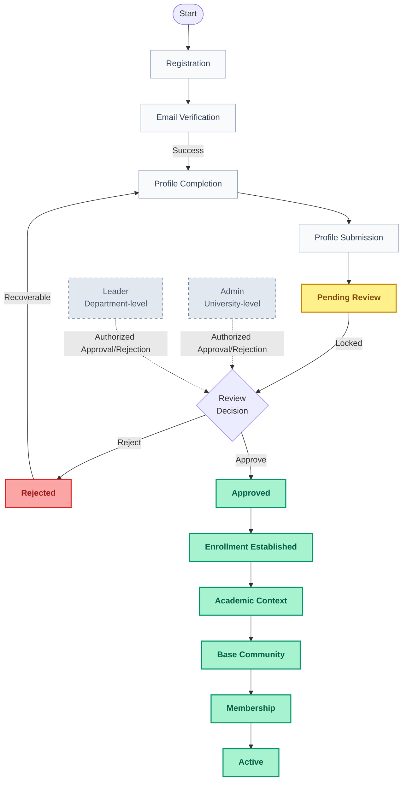

# Lenar — Onboarding Specification

> **Status:** DRAFT
> **Maturity:** BEHAVIORAL
> **Version:** 0.1
> **Owner:** TBD
> **Last Reviewed:** 2026-08-31

---

## 1. Purpose

This specification defines the detailed behavioral contract for Lenar's onboarding journey. It establishes exactly what happens from the moment a user registers until they gain active access to the platform.

## 2. Scope

**What this specification covers:**
- Registration
- Email Verification transition
- Academic Profile Completion
- Profile Submission
- Pending Review
- Rejection / correction
- Resubmission
- Approval
- Handoff into Enrollment, Academic Context, Base Community, Membership, and Active status.

**What it explicitly does not cover:**
- Authentication (password hashing, credential storage, JWT structure, sessions).
- Enrollment (detailed model and schema).
- Academic Context composition.
- Community matching algorithm and Membership schema.
- Governance and Authorization implementation (permission matrices, token internals).
- Database persistence schemas and notification delivery mechanics.

## 3. Canonical References

- [01-Lenar-Foundation.md](../../product/01-Lenar-Foundation.md)
- [02-Problem-Users-Domain.md](../../product/02-Problem-Users-Domain.md)
- [03-Product-Requirements.md](../../product/03-Product-Requirements.md)
- [04-UX-UI.md](../../product/04-UX-UI.md)
- [06-Data-Content.md](../../product/06-Data-Content.md)
- [07-Security-Privacy-Governance.md](../../product/07-Security-Privacy-Governance.md)
- [08-Offline-Sync-Resilience.md](../../architecture/08-Offline-Sync-Resilience.md)
- [09-System-Architecture.md](../../architecture/09-System-Architecture.md)
- [12-Testing-Quality.md](../../architecture/12-Testing-Quality.md)
- [17-Decisions-Risks-Evolution.md](../../decisions/17-Decisions-Risks-Evolution.md)
- [Specification Framework README](../README.md)

## 4. Dependencies

- **Authentication Specification** (Planned)
- **Organization Specification** (Planned)
- **Academic Time Specification** (Planned)
- **Governance Specification** (Planned)
- **Authorization Specification** (Planned)
- **Enrollment / Academic Context Specification** (Planned)
- **Community / Membership Specification** (Planned)
- **Offline / Sync Specification** (Planned)

## 5. Terminology

- **Registration:** The initiation of the user's account onboarding. Registration ≠ Enrollment.
- **Verification:** The successful confirmation of the user's email. Verification ≠ Approval.
- **Academic Profile Completion:** The stage where the user provides their institutional claims (Full Name, Matric No, Level, Faculty, Department).
- **Pending Review:** A locked product state where a submitted profile awaits authorization.
- **Rejection:** An authorized reviewer denying the profile submission, requiring the user to correct and resubmit.
- **Approved:** The authorized review decision succeeded. Approval ≠ Enrollment.
- **Active:** The required post-approval onboarding transition completed (Enrollment established, Academic Context established, Base Community established, Membership established). The user can enter normal Lenar.

## 6. Actors

- **Person / Unverified User:** The actor initiating registration.
- **Verified User:** An actor who has completed email verification but not profile review.
- **Leader:** An authorized reviewer with Base Community context. (Note: Leader is the same role as Class Leader). Can approve applicable submissions within their scope.
- **Admin:** An authorized reviewer with university-level authority. Can approve submissions from anywhere within the university.

## 7. Preconditions

- The actor must be unauthenticated or explicitly initiating a new registration flow.

## 8. Core Rules

- A user cannot proceed into Academic Profile Completion until email verification succeeds.
- A submitted profile is LOCKED while Pending Review. The user cannot edit the submitted information during this period.
- Pending Review persists across sessions and application/browser restarts.
- A corrected resubmission replaces the rejected submission as the current reviewable submission.
- **Approval establishes Enrollment.**
- Once approval and the complete onboarding transition (Enrollment → Academic Context → Base Community → Membership) succeed, the user enters Lenar immediately.
- The user must not be presented as Active while the required authoritative post-approval state is incomplete.

## 9. State Model

## 10. Main Behaviors

### Registration and Verification
1. The user registers with Email, Password, and Confirm Password.
2. The system triggers an email verification stage.
3. The user enters the verification code successfully.

### Profile Completion and Submission
4. The user completes the academic profile with: Full Name, Matric No, Level, Faculty, Department.
5. The user submits the profile.
6. The profile enters the **Pending Review** state and is locked from user edits.

### Approval and Handoff
7. An authorized Leader or Admin reviews the locked submission.
8. The reviewer **Approves** the submission.
9. Approval establishes Enrollment, which establishes Academic Context, which automatically establishes Base Community Membership.
10. The user transitions to **Active** and enters Lenar immediately.

### Behavioral Examples

**Example 1: Successful Onboarding**
Register → Verify → Complete Profile → Submit → Pending Review → Leader/Admin approves → Enrollment → Academic Context → Base Community → Membership → Active

**Example 2: Rejection**
Submit → Pending Review → Reject → Profile Completion → Correct → Resubmit → Pending Review

**Example 3: Scope Violation**
Leader from Department A → attempts to approve submission for Department B → authorization denied

## 11. Alternate & Failure Behaviors

### Rejection
- If the authorized reviewer rejects the submission, the state transitions from **Pending Review** to **Rejected**.
- The user is returned to Profile Completion.
- The user corrects the information and submits again. The corrected resubmission becomes the current reviewable submission.

### Verification Failure
- The user remains in the verification stage until successful verification or an authentication-owned recovery path.

### Profile Validation Failure
- The user remains able to correct the profile before submission.

### Submission Interruption
- The system must not falsely represent an unconfirmed authoritative submission as successful.

### Downstream Failure
- If an error occurs during the Enrollment → Context → Community transition post-approval, the user must **not** be presented as Active until the required authoritative state is complete.

## 12. Invariants

- A user cannot proceed to Profile Completion without a verified email.
- A user cannot modify a submission while it is in Pending Review.
- A user cannot be Active without an approved Enrollment, Academic Context, and Base Community Membership.
- Leaving and returning (e.g., closing the app) must not cancel the Pending Review state.

## 13. Authorization & Security

- Client input is untrusted. User-submitted academic information is not automatically authoritative.
- Review/approval requires server-enforced authorization (Authorization = RBAC + Scope + Context).
- The client UI cannot self-approve a submission.
- The client cannot manufacture Enrollment, Base Community Membership, or Active status.
- A Leader cannot approve a submission outside of their defined Base Community scope.

### Reviewer Routing Boundary
Onboarding depends on an authorization/governance mechanism to determine which actor may review a submission. Onboarding does **not** own the reviewer-routing algorithm.
- Onboarding → requires an authorized reviewer.
- Governance / Authorization / contextual systems → determine how reviewer authority and applicable scope are established.

## 14. Data Semantics

- **Submitted Profile:** A claim. User-submitted information waiting for review.
- **Authoritative Academic State:** The verified and formally recognized state established *after* approval (Enrollment / Academic Context).
- A profile submission is not itself proof of authoritative academic attachment. The transition must be enforced by the review process.

## 15. Offline / Platform Behavior

- Offline capability is governed by the applicable operation and the Offline/Sync specification.
- Where an onboarding action requires authoritative shared state (e.g., submitting a profile, checking review status), the server remains authoritative.

## 16. User Experience & Feedback

The user must always understand their meaningful state.
- **Verification required:** User is prompted for the code.
- **Profile completion required:** User is prompted for their academic claims.
- **Submitted / awaiting review:** User is informed that their profile is locked and awaiting an authorized reviewer.
- **Rejected / correction required:** User is informed of the rejection and prompted to fix their submission.
- **Approved / entering Lenar:** The user is transitioned immediately into the active platform.

## 17. Notifications / Secondary Effects

- Verification requires an email containing the verification code.
- Profile approval/rejection may generate notifications (refer to future Notifications specification).
- Role assignment may occur around the approval process (refer to Governance specification).

## 18. Observability / Audit

- The following events are significant and must be auditable:
  - Approval
  - Rejection
  - Enrollment-triggering approval

## 19. Acceptance Criteria

- **Registration:** Given valid initial registration information, the onboarding journey can proceed to email verification.
- **Verification:** A user cannot proceed to profile completion before successful verification.
- **Profile:** The required profile information (Full Name, Matric No, Level, Faculty, Department) can be completed and submitted.
- **Pending:** After submission, the profile enters Pending Review and is locked.
- **Persistence:** Leaving and returning does not cancel Pending Review.
- **Rejection:** A rejected submission returns the user to Profile Completion.
- **Resubmission:** A corrected submission becomes the current reviewable submission.
- **Approval:** Authorized Leader/Admin approval establishes Enrollment.
- **Active transition:** The user is not Active until the required enrollment/context/base-membership transition succeeds.
- **Immediate access:** After successful completion of the approved transition, the user enters Lenar immediately.
- **Authorization:** An unauthorized actor cannot approve the submission.
- **Scope:** A Leader cannot approve outside the authority/context defined for that Leader.

## 20. Testing Requirements

- Verify all state transitions (Registration → Verification → Profile → Pending → Approved/Rejected).
- Verify the Pending Review lock prevents modification.
- Verify persistence of Pending Review across sessions.
- Verify boundary controls: unauthorized users cannot approve; out-of-scope Leaders cannot approve.
- Verify that downstream failure (e.g., failing to establish Base Community) blocks the Active state.

## 21. Explicit Non-Assumptions

This specification does **NOT** decide:
- Exact JWT structure, Token TTL, or Refresh token mechanics.
- Password hashing mechanism or Authentication session storage.
- Verification code format, expiration, resend limits, or attempt limits.
- Exact profile validation algorithms.
- Exact Leader discovery/routing algorithm.
- Exact authorization policy implementation.
- Exact Enrollment schema or Academic Context composition.
- Exact Base Community matching algorithm or Community schema.
- Exact historical submission retention mechanism or audit schema.
- Exact notification delivery mechanics.
- Exact API contracts or database schema.

## 22. Open Questions

- **Exact Leader discovery/routing mechanism:** BLOCKING (Required for implementation)
- **Exact enrollment failure recovery:** BLOCKING (Required for implementation)
- **Verification retry/expiry behavior:** NON-BLOCKING (Belongs to Authentication)
- **Exact profile validation rules:** NON-BLOCKING
- **Exact rejection feedback semantics:** NON-BLOCKING (UX detail)
- **Exact historical audit retention:** FUTURE

## 23. Change Impact

**Directly affected:**
- UX / UI
- Enrollment / Academic Context
- Community / Membership
- Governance / review authority
- Authorization

**Potentially affected:**
- Authentication
- Security
- Offline / Sync
- Testing / Quality
- Analytics / Observability
- Data / Content

## 24. Related ADRs

- None currently directly applicable to the specific onboarding state machine beyond the canonical phase B decisions.

## 25. Related Specifications

- Dependencies listed in Section 4.

---

## Specification Completeness Checklist

Before a specification is marked `IMPLEMENTATION-READY`, verify:

- [x] Scope is defined
- [x] Actors are defined
- [x] Terminology is defined
- [x] Dependencies are defined
- [x] Preconditions are defined
- [x] Core rules are defined
- [x] States are defined where applicable
- [x] Valid transitions are defined where applicable
- [x] Failure behavior is defined
- [x] Invariants are defined
- [x] Authorization/security constraints are defined
- [x] Data semantics are clear
- [x] Offline/platform behavior is addressed where relevant
- [x] User-visible outcomes are clear
- [x] Acceptance criteria are testable
- [x] Testing requirements are identified
- [x] Explicit non-assumptions are documented
- [ ] All blocking questions resolved (e.g. Leader routing, failure recovery)
- [ ] Implementation-level failure recovery fully defined
- [ ] Reviewer routing behavior fully specified
- [x] Canonical references are verified
- [x] No currently applicable ADRs identified
- [x] Relevant diagrams are verified
