# Lenar — Organization Specification

Status: DRAFT  
Maturity: BEHAVIORAL  
Version: 0.1  
Owner: TBD  
Last Reviewed: 2026-08-31

## 1. Purpose
Organization is the authoritative institutional structure through which a University defines the academic and organizational units and valid relationships used by Lenar. This specification defines how the system conceptually represents and manages institutional hierarchy, ensuring it exists independently of users and remains strictly server-authoritative.

## 2. Scope
This specification covers:
- The definition of University as the institutional root.
- The university-relative definitions of Faculty, Department, and Level.
- The requirement for University-specific Organization models over a single rigid global hierarchy.
- The boundary between Organization and other domains (Enrollment, Community, Governance).
- The conceptual behavior of structural changes, identity preservation, and historical preservation.

This specification does **not** cover:
- Exact database schemas, migration algorithms, or API contracts.
- The physical implementation of historical storage.
- Governance permission matrices defining who administers the organization.
- Academic Time (Session, Semester).

## 3. Canonical References
- `docs/product/01-Lenar-Foundation.md`
- `docs/product/02-Problem-Users-Domain.md`
- `docs/product/03-Product-Requirements.md`
- `docs/product/04-UX-UI.md`
- `docs/product/06-Data-Content.md`
- `docs/product/07-Security-Privacy-Governance.md`

## 4. Dependencies
- Enrollment
- Community / Membership
- Governance
- Authorization
- Security / Privacy
- Account Lifecycle
- Onboarding
- Authentication
- Academic Time (Planned)

## 5. Terminology
- **Organization:** The authoritative institutional structure defined by a University.
- **University:** The top-level institutional root and conceptual boundary for an Organization model.
- **Faculty:** An institutional unit defined by the relevant University's Organization model.
- **Department:** An institutional and academic unit defined by the relevant University's Organization model.
- **Level:** A first-class academic concept determining progression or year of study, independent of specific course participation.

## 6. Actors
- **Super Admin:** Platform-level administration capable of configuring root organizational models.
- **Admin:** University-level administration capable of configuring structure within their authoritative University scope.
- **End User:** Consumers of the organization model (e.g., during Onboarding or Enrollment) who cannot mutate it.

## 7. Preconditions
- A University must conceptually exist before its specific institutional units (Faculty, Department, Level) can be defined.
- Valid relationships between organizational units must be established by the authoritative University model before downstream domains (like Enrollment) can reference them.

## 8. Core Rules
1. **Organization exists independently of users** and is server-authoritative.
2. **University is the institutional root.**
3. **No Universal Rigid Hierarchy:** Each University has its own authoritative Organization model. A strict `University → Faculty → Department → Level` tree is not universally forced on all institutions.
4. **Faculty and Department are University-relative.**
5. **Level is a first-class concept:** It is not a course, not course registration, not course participation, and not derived from carried courses.
6. **Enrollment references Organization:** Enrollment does not create organizational units.
7. **Organization ≠ Community:** Community is not an organizational node in the hierarchy.
8. **Organization ≠ Governance:** Governance consumes organizational context but does not own Organization.
9. **V1 uses FUTA's authoritative model.**
10. **Organizational changes must preserve historical truth** and not silently rewrite past authoritative Enrollment or Governance contexts.

## 9. State Model

## 10. Main Behaviors
- **Institutional Modeling:** A University establishes its specific structure containing valid institutional units (Faculty, Department, Level) and their valid relationships.
- **Context Provision:** Downstream domains (Enrollment, Governance) query the Organization model to receive valid organizational options.
- **Identity-Preserving Changes:** An authorized Admin may rename a unit (e.g., Department X to Department Y). The conceptual identity remains, and historical references are preserved.
- **Structural Changes:** An authorized Admin may perform genuine structural changes (e.g., splitting a Department). The system must preserve the historical truth of the old structure while establishing the new current structure.
- **Unit Retirement:** An organizational unit may cease to be available for new use. It is retired, not physically erased, keeping historical records meaningful.

## 11. Alternate & Failure Behaviors
- **Invalid Context Submission:** If a client attempts to submit an invalid organizational relationship (e.g., Department X belonging to University B when it actually belongs to University A), the server rejects it.
- **Client Forgery:** Any client attempt to invent a new University, Faculty, Department, or Level outside the established server authority is rejected.

## 12. Invariants
- `Organization ≠ Community`.
- `Organization ≠ Enrollment`.
- `Level ≠ Course Participation`.
- `Level ≠ Academic Session` and `Level ≠ Semester`.
- Untrusted clients cannot redefine institutional structure.
- The server is strictly authoritative over valid organizational models.
- Historical organizational truth cannot be silently rewritten by current structural changes.

## 13. Authorization & Security
- **Server Authority:** Organizational state and structure are strictly server-controlled.
- **Untrusted Client:** Client-provided organization IDs/references must be validated against authoritative server state.
- **Access Control:** Organization models are configured by authorized administrative actors (e.g., Admin, Super Admin). Organization itself does not define the authorization policy matrix.

## 14. Data Semantics
- Organizational units have conceptual identity beyond their display names.
- Retirement or modification of an organizational unit does not imply physical deletion of historical data or historical references.
- Future multi-University support will pivot all institutional data around the selected University context.

## 15. Offline / Platform Behavior
- Offline clients may use cached Organization information to continue permitted UI behavior according to Offline/Sync rules.
- Authoritative Organization mutations require server authority; clients cannot independently create organizational units offline.
- Semantics remain consistent across Web, PWA, Android, and iOS.

## 16. User Experience & Feedback
- The UI presents valid organizational options (University, Faculty, Department, Level) based on the authoritative server model.
- Users are not exposed to internal implementation details of organization models.
- Future multi-University UX will involve a root selection of University, cascading to that University's valid structural options.

## 17. Notifications / Secondary Effects
- Changes to organizational structure may trigger secondary effects in dependent domains (e.g., Enrollment workflows or Governance scopes). However, Organization does not automatically invoke destructive cascades (e.g., it does not auto-delete Communities or auto-revoke Governance Assignments).
- Exact notification behaviors for organizational changes are not defined here.

## 18. Observability / Audit
- Changes to the authoritative Organization model (creation, modification, structural change, retirement of units) must be conceptually auditable.
- Downstream domains observing these changes must preserve their historical integrity.

## 19. Acceptance Criteria
- Organization is a first-class authoritative domain.
- University is the institutional root/context.
- Different Universities may have different Organization models.
- No universal rigid hierarchy is imposed.
- Faculty is University-relative.
- Department is University-relative.
- Level is first-class.
- Level is not course-derived.
- Valid organizational relationships come from the relevant University model.
- Enrollment references Organization rather than creating units.
- Community is not part of Organization.
- Governance consumes organizational context but does not own Organization.
- Authorization may consume organization-derived context.
- V1 uses the authoritative FUTA Organization model.
- Future multi-University support selects the relevant University model.
- Organization changes preserve historical truth.
- Organization retirement does not erase historical meaning.
- Parser remains a consumer, not an authority.
- Client state cannot manufacture authoritative Organization state.

## 20. Testing Requirements
Tests must conceptually verify:
- University model validity.
- University-specific structures.
- Faculty validity.
- Department validity.
- Level validity.
- Relationship validity.
- V1 FUTA model isolation.
- Future University isolation.
- Historical preservation upon structural changes.
- Rename behavior (identity preservation).
- Retirement behavior.
- Enrollment boundary (no direct mutation).
- Community boundary (no auto-deletion/creation).
- Governance boundary (no auto-revocation).
- Authorization boundary.
- Parser boundary (parser is consumer, not authority).
- Client manipulation prevention.
- Offline manipulation prevention.

*(Note: Exact testing frameworks are not prescribed).*

## 21. Explicit Non-Assumptions
This specification does **NOT** decide:
- Exact database schema.
- Exact API contracts.
- Exact organizational migration algorithm.
- Exact retirement algorithm.
- Exact historical storage model.
- Exact Faculty universality.
- Exact Department relationships.
- Exact Level relationships.
- Exact governance permission matrix.
- Exact parser algorithm.
- Exact multi-University UI.
- Exact synchronization mechanics.

## 22. Open Questions

| Question | Classification | Notes |
|---|---|---|
| Exact University-specific organization structures | NON-BLOCKING | Belongs to University configuration |
| Exact Faculty universality across Universities | NON-BLOCKING | Belongs to University configuration |
| Exact Department relationships | NON-BLOCKING | Belongs to University configuration |
| Exact Level relationships | NON-BLOCKING | Belongs to University configuration |
| Exact governance authority for organization administration | NON-BLOCKING | Belongs to Governance & Authorization |
| Exact organization change/migration semantics | FUTURE | Dependent on future implementation |
| Exact organizational retirement semantics | FUTURE | Dependent on future implementation |
| Exact historical organization representation | FUTURE | Dependent on future implementation |

## 23. Change Impact
- **Directly affected:** Enrollment, Academic Context, Community / Membership, Governance, Authorization, Academic Time.
- **Potentially affected:** Onboarding, Authentication, Account Lifecycle, Offline / Sync, Matric Parser, Notifications, Testing, Analytics / Observability.

## 24. Related ADRs
None currently applicable.

## 25. Related Specifications
- `../account-lifecycle/account-lifecycle-specification.md`
- `../authentication/authentication-specification.md`
- `../onboarding/onboarding-specification.md`
- `../enrollment/enrollment-specification.md`
- `../community/community-membership-specification.md`
- `../governance/governance-specification.md`
- `../authorization/authorization-specification.md`
- Academic Time Specification (Planned)

## Specification Completeness Checklist
- [x] Defined all required states
- [x] Documented all valid transitions
- [x] Defined boundary with adjacent domains
- [x] Resolved offline/sync conflicts
- [x] Documented failure states
- [x] Covered security boundaries
- [x] Removed implementation details
- [x] Deferred non-blocking technical questions
